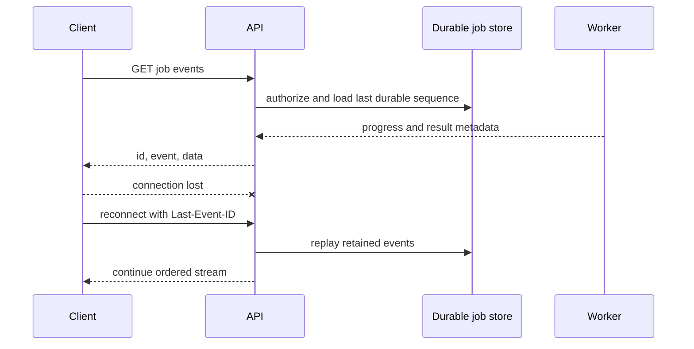
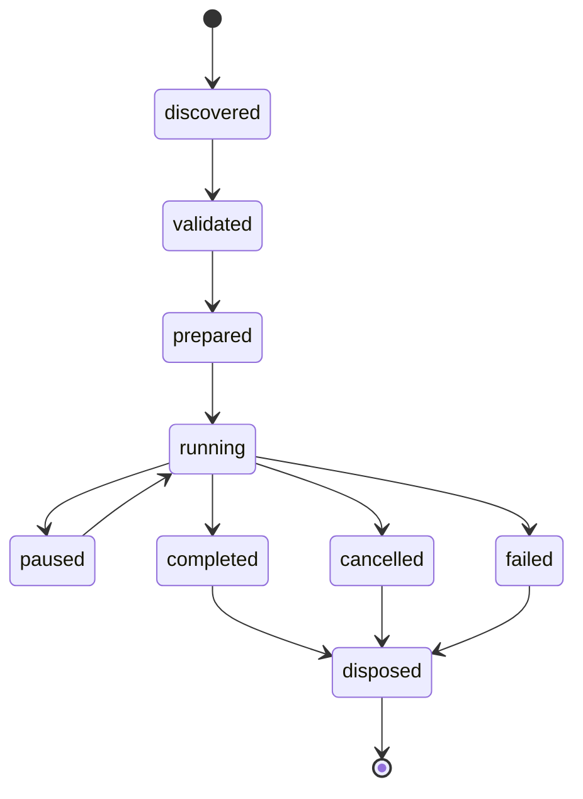

# API and Worker Protocols

Library operations are a distinct versioned domain API defined in [Data-Driven Library and Storage Architecture](./DATA_DRIVEN_LIBRARY_AND_STORAGE_ARCHITECTURE.md). Search, exact-revision retrieval, dependency/reverse-dependency traversal, draft, validate, compare, publish, deprecate, supersede, archive, soft-delete, restore, duplicate, import/export, reference migration, and execution-bundle resolution never expose unrestricted database CRUD. Every mutation enforces authorization, schema/dimensions, dependency closure, provenance/license/trust, publication policy, optimistic concurrency, idempotency where applicable, and audit logging.

The worker `prepare` input contains the resolved immutable execution bundle and digest. A Worker MUST NOT call the Library Service or a storage system during numerical execution to resolve a mutable model alias; missing content is a preparation failure.

Status: Normative  
Related: [Local, Cloud, and Worker Architecture](./LOCAL_CLOUD_AND_WORKER_ARCHITECTURE.md), [Simulation Engine](./SIMULATION_ENGINE.md), [Security, Privacy, and Sandboxing](./SECURITY_PRIVACY_AND_SANDBOXING.md)

## 1. Purpose and protocol split

This document defines the public cloud API, browser-Worker messages, simulation events, waveform transfer, and external-engine adapter lifecycle. The source PDF requires separated browser Workers, a client-server simulation API, server job queues, progress streaming, result storage, and checkpoint/resume. [Source PDF, pp. 23-28, 36]

The transport split is fixed:

| Transport | Use | Prohibited use |
|---|---|---|
| REST over HTTPS | commands, snapshots, job lifecycle, artifact authorization | live cursor fan-out |
| Server-Sent Events | ordered job progress, diagnostics, result availability, terminal state | collaboration edits or bulk waveform bytes |
| WebSocket | CRDT operations, presence, collaboration comments | simulation result authority |
| Object transfer | large project, model, waveform, checkpoint, and export objects | authorization decisions |
| Worker messages | versioned local commands, events, transferable buffers | unbounded object graphs or UI framework state |

## 2. Common envelope

Every cross-process command or event MUST contain:

- protocol version and message kind;
- globally unique message ID;
- correlation ID and, where applicable, causation ID;
- actor/tenant scope or local device scope;
- project ID and immutable revision ID when project-bound;
- job ID and attempt ID when execution-bound;
- monotonically increasing sequence within its stream;
- creation time for audit only; simulation ordering uses simulation ticks;
- schema-declared payload size and content type.

Unknown required message kinds fail closed. Receivers MUST ignore no field that changes authorization, units, fidelity, execution placement, resource limits, or simulation semantics.

## 3. Cloud resource model

The minimum resource paths are:

| Method and path | Purpose |
|---|---|
| POST /v1/projects | create project metadata |
| GET /v1/projects/{projectId} | authorized project snapshot |
| POST /v1/projects/{projectId}/versions | publish immutable project version |
| GET /v1/projects/{projectId}/versions/{versionId} | retrieve immutable version metadata |
| GET /v1/library/search | search authorized system/user records with opaque cursor and kind filters |
| GET /v1/library/{kind}/{logicalId}/revisions/{revisionId} | retrieve one exact immutable library revision and digest |
| GET /v1/library/{kind}/{logicalId}/revisions/{revisionId}/dependencies | traverse exact dependency closure |
| GET /v1/library/{kind}/{logicalId}/revisions/{revisionId}/reverse-dependencies | traverse authorized reverse dependencies |
| POST /v1/library/{kind}/drafts | create a validated private draft |
| POST /v1/library/{kind}/{logicalId}/drafts/{draftId}/validate | run schema, dimensions, dependencies, provenance, license and policy validation |
| POST /v1/library/{kind}/{logicalId}/drafts/{draftId}/publish | publish one immutable revision after authorization and evidence gates |
| POST /v1/library/{kind}/{logicalId}/revisions/{revisionId}/deprecate | deprecate with reason and optional compatible replacement |
| POST /v1/library/{kind}/{logicalId}/revisions/{revisionId}/supersede | link a new immutable revision and compatibility statement |
| POST /v1/library/{kind}/{logicalId}/archive | archive or soft-delete discovery state without breaking exact references |
| POST /v1/library/resolve | resolve project/library references into a hash-locked `ComponentDefinitionPlan` |
| POST /v1/imports | authorize and validate staged archive/model upload |
| POST /v1/packages | create a custom package draft or publish an approved package version |
| GET /v1/packages/{packageId}/versions/{version} | retrieve package definition and digest |
| POST /v1/simulation-jobs | validate and submit an immutable simulation request |
| GET /v1/simulation-jobs/{jobId} | authoritative job snapshot |
| POST /v1/simulation-jobs/{jobId}/cancel | idempotent cancellation request |
| GET /v1/simulation-jobs/{jobId}/events | SSE progress stream |
| GET /v1/simulation-jobs/{jobId}/results | terminal or partial result manifest |
| POST /v1/artifact-authorizations | short-lived, scoped upload/download authorization |

Create and command requests MUST accept an idempotency key scoped to actor, route, and normalized request body. Reusing a key with a different body returns a conflict. Successful replay returns the original resource identity and status.

List endpoints MUST use opaque cursor pagination and stable ordering. Clients MUST NOT infer permissions or object-store keys from identifiers.

## 4. Simulation request

A **SimulationRequest** MUST include:

- request/schema version and immutable project-version digest;
- analysis kind and normalized SI-valued settings;
- selected probes and bounded retention policy;
- requested fidelity policy plus permitted fallbacks and consent state;
- deterministic integer time quantum and stop tick when time-domain;
- root seed and sampling contract when stochastic;
- requested engine capability, not a client-selected server executable;
- placement preference and local capability summary;
- expected scientific-model, component, semantic-profile, parameter, package, pin-profile, device-binding, board/system, and benchmark digests;
- optional checkpoint reference with compatibility requirements;
- client request ID and idempotency key.

The server or local Library Service resolves this into an immutable **ComponentDefinitionPlan/ExecutionPlan**. Validation MUST reject a missing or mutable revision, digest mismatch, dependency cycle, invalid dimension/range, unsupported analysis/fidelity, unresolved semantic model plan, untrusted executable capability, or missing package-pin equivalence when physical/breadboard connections participate in the project snapshot; view artwork itself never affects numerical execution.

## 5. Job, attempt, and result

### 5.1 SimulationJob

A **SimulationJob** owns authorization, immutable input, quota class, aggregate state, and one or more attempts. Job states follow the state machine in [Local, Cloud, and Worker Architecture](./LOCAL_CLOUD_AND_WORKER_ARCHITECTURE.md).

Terminal job states are immutable. A retry creates a new attempt. A job snapshot declares:

- current state and reason;
- authoritative attempt, if any;
- ordered state-transition summary;
- placement, engine capability, and resource profile;
- progress estimate with method and confidence;
- quota/cost class without exposing secrets;
- result or diagnostic link when available;
- retention and deletion times.

### 5.2 SimulationEvent

Events use these stable classes:

- **job.state** for validated, queued, leased, running, cancelling, and terminal transitions;
- **job.progress** for bounded phase and progress information;
- **diagnostic** for structured warnings/errors;
- **result.chunk.available** for immutable chunk metadata;
- **checkpoint.available** for resumable state metadata;
- **worker.heartbeat** for control-plane supervision, not normally user-visible;
- **quota.notice** for approaching or reached limits.

Every event has one job sequence. Duplicate delivery is allowed; sequence and event ID make consumption idempotent. A terminal event MUST be preceded by or contain the final result/diagnostic manifest reference.

### 5.3 WaveformChunk

A **WaveformChunk** declares:

- result ID, probe/channel ID, quantity, SI unit, and value representation;
- first and last integer tick, sample count, sequence, and continuity flags;
- regular sample interval or explicit tick vector;
- min/max summary and non-finite/gap flags;
- compression and byte order;
- content digest and byte length;
- raw, derived, decimated, or event semantics;
- source engine and transformation provenance.

Large chunks are retrieved from object storage. SSE publishes metadata only. Measurements MUST use raw or explicitly qualified source data, never an undisclosed viewport-decimated chunk.

### 5.4 Checkpoint and SimulationResult

A **Checkpoint** records engine/build digests, execution-plan digest, accepted tick, partition states, scheduler state, random-generator state, and compatibility fingerprint.

A **SimulationResult** records terminal status, completeness, immutable input and plan digests, model/engine/package registry versions, determinism class, seed, analysis summary, diagnostics, units, probe map, chunks, and last accepted tick for partial output. A package-renderer version MAY be recorded for visual evidence but MUST NOT be part of numerical-result identity.

## 6. Diagnostics and error responses

API errors use a stable machine code, HTTP status, localized-message key, correlation ID, target references, retryability, and bounded remediation links. They MUST NOT expose stack traces, host paths, credentials, raw SQL, internal object keys, or cross-tenant existence.

Required protocol errors include:

- INVALID_REQUEST, SCHEMA_VERSION_UNSUPPORTED, FEATURE_UNSUPPORTED;
- UNAUTHORIZED, FORBIDDEN, NOT_FOUND, CONFLICT, RATE_LIMITED;
- IDEMPOTENCY_CONFLICT, REVISION_CONFLICT, DIGEST_MISMATCH;
- PACKAGE_PIN_MAP_INVALID, ARCHIVE_UNSAFE, MODEL_UNTRUSTED;
- QUOTA_EXCEEDED, PLACEMENT_UNAVAILABLE, CHECKPOINT_INCOMPATIBLE;
- EVENT_RETENTION_EXPIRED and RESULT_NOT_READY.

Numerical diagnostic codes remain defined by the simulation-engine contract.

## 7. SSE contract

- Event IDs are job-scoped decimal sequences.
- Clients reconnect with **Last-Event-ID** and de-duplicate.
- The server sends keep-alive comments that carry no state.
- Authorization is rechecked on connect and periodically or when membership changes.
- When requested history has expired, the server emits EVENT_RETENTION_EXPIRED and the client fetches the authoritative job snapshot and result manifest.
- Backpressure is handled by coalescing superseded progress events; state, diagnostics, chunk availability, and terminal events cannot be dropped.
- A terminal event closes the logical stream even if the transport remains open briefly.

## 8. Collaboration WebSocket

The collaboration socket carries authenticated CRDT operation batches, acknowledgements, awareness/presence, comments, and resynchronization messages. It MUST NOT carry authoritative simulation progress or large artifacts.

Messages include project ID, branch/draft ID, CRDT document version, actor/session ID, operation IDs, and causal metadata. Presence is ephemeral and cannot change project state. Accepted operations are durably acknowledged before clients may treat them as synchronized.

Project revisions used for simulation are created through REST from a converged durable CRDT snapshot, then become immutable.

## 9. Browser Worker protocol

The main thread communicates with domain, analog, digital, and waveform Workers through a versioned protocol.

Required command classes:

- initialize with capability/build digest and bounded memory policy;
- load immutable snapshot;
- validate and prepare execution;
- start, pause at safe point, checkpoint, resume, cancel, and dispose;
- apply editor command batch to the domain Worker;
- request waveform window, measurement, or accessible summary;
- report renderer/package-registry snapshot when producing visual evidence.

Required event classes:

- ready/capabilities;
- command accepted/rejected;
- validation diagnostics;
- progress and accepted simulation tick;
- transferable waveform/event chunk;
- checkpoint;
- memory-pressure/resource notice;
- crashed/fatal and disposed.

Large ArrayBuffer objects MUST be transferred or use a versioned shared-memory schema. Messages have hard size and frequency limits. Cancellation MUST be observable between bounded work units; the UI MUST never wait synchronously on a Worker.

## 10. EngineAdapter lifecycle

Every native, WASM, or external engine implements the same conceptual lifecycle:

1. **discoverCapabilities** - declare analyses, model kinds, fidelity, checkpoint, determinism, resource, and platform support.
2. **validate** - reject unsupported or unsafe normalized inputs without executing them.
3. **prepare** - create private derived inputs under a bounded workspace.
4. **run** - start from an immutable plan and optional compatible checkpoint.
5. **stream** - emit ordered progress, diagnostics, and result chunks.
6. **pause** - stop only at a declared safe point.
7. **checkpoint** - serialize canonical resumable state where supported.
8. **resume** - verify compatibility before continuing.
9. **cancel** - request bounded cooperative termination, then enforce supervisor timeout.
10. **dispose** - release private state and make further calls invalid.

Adapter output is untrusted until canonical validation and checksum publication complete. External engine stderr is bounded evidence, not a user-facing protocol.

## 11. Worker lease and publication

- Dispatch is at least once; attempt startup and publication are idempotent.
- A lease has a fencing token, expiry, and heartbeat interval.
- Only the current fence may publish an authoritative result.
- Inputs and outputs use temporary object keys until checksums and metadata commit.
- A stale or duplicated worker may upload quarantine objects but cannot change job truth.
- Retryability is declared by error class; invalid input, deterministic model failure, license denial, and quota exhaustion are not automatically retried.

## 12. Compatibility

- REST major version is in the path. Additive fields within a major are permitted unless declared required.
- Worker protocol negotiation selects one common version and capability set before loading project data.
- Event consumers ignore unknown optional event fields but not unknown event classes marked required.
- Engine capability and checkpoint compatibility use immutable build digests, not human-readable versions alone.
- Deprecated fields have a documented replacement and removal release; servers MUST NOT silently reinterpret old units or defaults.

## 13. Security and limits

Every endpoint and connection enforces authentication where required, tenant authorization, schema validation, request/body limits, rate limits, content digests, audit correlation, and safe error redaction. Artifact URLs are short-lived, method-bound, object-bound, and tenant-bound.

Imported custom packages accept declarative records only. Preview requests MUST NOT fetch remote resources or execute scripts. Model/HDL/firmware execution occurs only in the sandbox defined by the security architecture.

## 14. Acceptance criteria

1. Repeating a create request with the same idempotency key returns the same job; a changed body conflicts.
2. SSE reconnect resumes without state loss or duplicated client effects.
3. Duplicate queue delivery cannot publish two authoritative attempts.
4. Cancellation, timeout, crash, quota exhaustion, and expired event history produce canonical terminal or recovery behavior.
5. Local single-threaded and threaded Workers consume the same request contract and produce equivalent logical results.
6. Waveform chunks preserve units, tick continuity, provenance, checksums, and gap markers.
7. An invalid package pin map blocks a physical/breadboard simulation snapshot with PACKAGE_PIN_MAP_INVALID.
8. WebSocket collaboration cannot mutate a published simulation revision.

## 15. Source record

Separate Workers and non-blocking browser execution come from the feasibility source. [Source PDF, pp. 23-24] Scheduler and analog/digital boundary sequencing follow the described co-simulation flow. [Source PDF, pp. 27-28] Server workers, queues, progress, storage, and checkpoint/resume follow the distributed execution plan. [Source PDF, pp. 25-26, 36] Project storage and collaboration follow the project-management plan. [Source PDF, pp. 31-32, 41-42] REST/SSE/WebSocket separation, exact envelopes, package endpoints, idempotency, and fencing semantics are repository architecture decisions.
