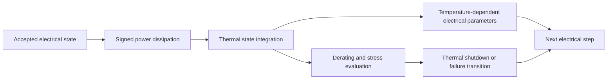

# Applied Physics and Real-World Fidelity

Status: Normative planning contract 1.0  
Release scope: R2, R3, and **R4 — Applied Physics and Real-World Fidelity**  
Related requirements: `REQ-002`, `REQ-009`, `REQ-010`, `REQ-014` through `REQ-024`, `REQ-036`, and `REQ-039` through `REQ-047`  
Related decisions: [ADR-0001](../decisions/ADR-0001.md), [ADR-0002](../decisions/ADR-0002.md), [ADR-0005](../decisions/ADR-0005.md), [ADR-0006](../decisions/ADR-0006.md), [ADR-0008](../decisions/ADR-0008.md), [ADR-0011](../decisions/ADR-0011.md), [ADR-0012](../decisions/ADR-0012.md), and [ADR-0019](../decisions/ADR-0019.md)

## 1. Purpose and decision boundary

EEE Simulator is an Applied Physics-driven, hierarchical, multi-fidelity electronics and computer simulation platform. It transforms validated physical principles into mathematical models, engineering equations, numerical algorithms, reusable component models, realistic circuit simulations, integrated devices, educational processors, and complete computer systems.

This document extends the accepted fidelity, solver, scheduler, and isolation decisions without changing their meanings. It does not make an implementation claim. All models and benchmark records named here remain planned until their lifecycle evidence says otherwise.

**Repository decision — Applied Physics First:** every released simulation capability MUST be traceable to physical principles or to a clearly identified engineering abstraction derived from them. A model MUST explain why behavior occurs, not merely reproduce an output. Each abstraction MUST state what it omits, and the word “realistic” MUST be supported by measurable evidence inside a declared operating envelope.

Physics is not introduced only in R4:

- R2 establishes ideal linear electrical physics, conservation laws, units, and numerical residuals.
- R3 establishes nonlinear semiconductor and compact-model physics, convergence envelopes, and independent-reference comparison.
- R4 applies real-world non-ideal, parasitic, electrothermal, environmental, manufacturing, statistical, aging, degradation, instrument, and failure behavior.
- F5 remains the explicit physical-device, field, TCAD, EM, MEMS, or multiphysics research tier; R4 MUST NOT be presented as full multiphysics.

## 2. Normative physical-principle pipeline

```mermaid
flowchart LR
    P["Physical Principles"] --> M["Mathematical Models"]
    M --> E["Engineering Equations"]
    E --> N["Numerical Algorithms"]
    N --> PM["Primitive Models"]
    PM --> CM["Composite Models"]
    CM --> D["Library Devices"]
    D --> C["Circuits and Boards"]
    C --> S["Complete Systems"]
    S --> V["Experimental Validation"]
    V --> X["Error and uncertainty analysis"]
    X --> M
```



Every transition MUST retain exact input revision IDs, parameter transformations, units, assumptions, validation evidence, licenses, limitations, and content digests when an artifact exists. A downstream entity MUST NOT silently widen the validity or accuracy envelope of a dependency.

The versioned seed inventory is [model-registry.yaml](../catalog/model-registry.yaml). Model counts are independent of component-family, component-variant, package, symbol, and benchmark counts.

## 3. Formal model specification

Every released `physics`, `primitive`, `composite`, `behavioral`, or `external_adapter` model MUST have an immutable specification revision with these fields. `behavioural` is accepted only as an import or display alias for canonical `behavioral`. A field may be explicitly inapplicable with rationale; it may not be omitted or inferred from a display name.

| Field group | Required content |
|---|---|
| Identity | stable model ID, immutable revision ID, name, kind, lifecycle status, deprecation status, and replacement revision when applicable |
| Scientific basis | physical principles, governing equations, engineering equations, equation symbols, assumptions, approximation level, and deliberately omitted effects |
| Interface | typed inputs, outputs, state variables, parameters, canonical units, physical dimensions, accepted prefixes, and storage representation |
| Envelope | allowed parameter ranges, temperature range, frequency range, operating regions, supported analyses, and fidelity levels |
| Numerical behavior | implementation kind, numerical method, discretization or event policy, initialization, convergence expectations, rejection/rollback behavior, and non-finite handling |
| Composition | exact dependency model IDs and revisions, parameter and pin/state transforms, recursion policy, and lineage digest |
| Stress and failure | ratings, failure conditions, accumulated-stress rules, transition outputs, and recovery semantics |
| Scientific traceability | provenance sources, extracted parameters, license, redistribution rules, trust level, and review evidence |
| Validation | validation status, evidence IDs, independent reference, category-specific acceptance criteria, uncertainty budget, and regression owner |
| Communication | known limitations, accuracy or uncertainty envelope, out-of-range diagnostics, and user-visible fidelity statement |

No published model may use an undocumented constant, hidden unit conversion, implicit default equation, or unversioned dependency. Declarative records MAY parameterize approved equation kernels; executable or native kernels require source review, deterministic and resource-bounded execution, security and license review, a versioned deployment artifact, and validation evidence. Arbitrary database-stored code is never a trusted model kernel. This follows [ADR-0019](../decisions/ADR-0019.md) and preserves the process boundary in [ADR-0008](../decisions/ADR-0008.md).

## 4. Model kinds, composition, and lineage

| Kind | Normative role | Dependency rule |
|---|---|---|
| `physics` | Governing physical or mathematical behavior and conserved quantities | May depend only on exact material/property or other physics revisions; cycles require a declared coupled solve, never graph recursion |
| `primitive` | Lowest reusable simulation element at a declared abstraction | Depends on physics models or reviewed kernels; “primitive” does not mean physically indivisible |
| `composite` | Reusable directed graph of primitives or composites | Dependency graph MUST be acyclic unless a solver-recognized feedback connection is represented as circuit topology rather than registry recursion |
| `behavioral` | Functional, event, timing, or transfer abstraction with omissions declared | May depend on exact primitive/composite behavior and must not claim omitted device physics |
| `external_adapter` | Versioned translation and lifecycle boundary for an external engine | Does not own delegated equations; records engine/version, normalized inputs, isolation, provenance, and result semantics |

**Repository decision — immutable lineage:** every resolved execution bundle records exact model/revision IDs, parameter overrides, transformations, compilation steps, validation results, fidelity, licenses, limitations, and artifact hashes. This lineage supports reproducibility, migration, debugging, dependency-impact analysis, AI-assisted design, security review, and license review.

The initial 74HC00 planning lineage is:

```text
MOS-channel physical model
-> NMOS and PMOS primitive models
-> reusable two-input CMOS NAND composite
-> generic 74HC00 quad-NAND behavioral device model
-> future vendor device metadata
-> future DIP or SOIC DevicePackageBinding
```

The same NAND model is reused; ordering codes MUST NOT duplicate its complete internal circuit when parameter overrides and a package binding are sufficient. The seed registry does not assert that a vendor part, package binding, or executable model already exists.

## 5. R4 non-ideal electrical behavior

Every supported mechanism MUST name its equation or reference model, validity range, applicable fidelity, numerical treatment, and validation method. The following table defines the minimum planning surface; family specifications may tighten it.

| Mechanism group | Required mechanisms | Governing treatment | Minimum validation |
|---|---|---|---|
| Series and contact loss | internal resistance, contact resistance, ESR, parasitic resistance, source impedance, voltage drop | Ohmic or frequency/temperature-dependent constitutive relation; matrix stamp or state-dependent residual | DC sweep, four-wire or independent-reference comparison, power balance, limiting cases |
| Leakage and dielectric loss | leakage current, dielectric loss, junction leakage | parallel conductance or validated nonlinear leakage relation; temperature dependency explicit | bias and temperature sweep against declared data |
| Stored parasitics | ESL, parasitic capacitance, parasitic inductance, junction capacitance | explicit lumped branch or validated compact-model contribution; charge/flux state retained | impedance/phase or transient feature comparison across declared frequency range |
| Dynamic semiconductor effects | reverse recovery, saturation, hysteresis, switching loss | charge/state model or documented behavioral approximation; discontinuities scheduled and rollback-safe | switching transient, energy-per-event, loop/hysteresis envelope, reference-engine comparison |
| Frequency dependence | frequency-dependent impedance and frequency limits | rational/table/complex model with interpolation and causality policy | magnitude, phase, interpolation, boundary, and out-of-range tests |
| Sources and protection | current limiting, source impedance, startup/ramp, dropout, short-circuit protection | piecewise-smooth equation, state machine, or coupled compact model with event surfaces | load step, current-limit knee, startup, short, recovery, and energy checks |
| Noise foundations | resistor thermal noise, semiconductor shot/flicker noise, supply noise | declared power spectral density and bandwidth/integration method; deterministic seeded sampling when synthesized | PSD/integrated-noise comparison and deterministic replay |
| Ratings | power, voltage, current, and frequency limits | signed stress measures integrated over declared duration; diagnostic or failure rule | below/at/above threshold and accumulated-duration tests |

An unsupported mechanism is an explicit limitation and capability diagnostic. Absence MUST NOT be rendered as zero physics. F1 ideal models may intentionally omit these mechanisms; an F4 claim requires every applicable omission to be visible.

## 6. Electrical-thermal feedback



The minimum model supports ambient and initial component temperature, junction and case temperature, thermal resistance, thermal capacitance, transient and steady-state heating, cooling, heat-sink parameters, airflow presets, enclosure conditions, temperature-dependent resistance and semiconductor parameters, derating, thermal runaway, thermal shutdown, and thermal failure.

Each thermal network MUST declare nodes, heat-flow sign convention, capacitances, conductances/resistances, ambient boundary, initial conditions, solver method, timestep constraint, and mapping from electrical loss to heat. A simple lumped branch may use:

```text
C_th * dT/dt = P_dissipation - (T - T_ambient) / R_th
```

This equation is an engineering approximation, not a universal package model. Heat sinks, airflow, enclosure, neighboring heat sources, radiation, and spatial gradients are included only when explicitly modeled and validated.

### 6.1 Deterministic scheduler coupling

At each accepted electrical interval the global scheduler defined by [ADR-0006](../decisions/ADR-0006.md) MUST:

1. stop at the earliest electrical, thermal, environmental, or failure boundary tick;
2. commit the electrical state and integrate signed energy or average power over the accepted interval;
3. advance thermal states with the declared staggered, iterated-staggered, or fully coupled method;
4. update temperature-dependent electrical parameters;
5. evaluate derating, shutdown, accumulated stress, and failure event surfaces;
6. enqueue transitions at the canonical integer tick using the accepted deterministic tie-break order;
7. publish probes only after the coupled state is committed.

Rejected analog steps MUST roll back power accumulation, thermal state, random-stream consumption, aging state, and emitted events exactly. The result records coupling method, tolerances, substep count, convergence, environment revision, and energy residual.

## 7. Environmental state

The initial environment contract contains ambient temperature, initial component temperature, airflow level, enclosure type, cooling condition, duty cycle, operating duration, humidity metadata, altitude or air-pressure preset, and external heat-source metadata. Each value has a unit, source, timestamp scope, uncertainty, and model applicability.

Humidity and altitude metadata do not alter results unless a selected model declares a validated dependency. Corrosion, vibration, mechanical stress, dust, radiation, liquid exposure, complex electromagnetic coupling, material deformation, and chemical degradation are staged or F5 research effects until an explicit model and benchmark exist. The UI MUST distinguish “recorded environment metadata” from “active modeled effect.”

## 8. Manufacturing variation and statistics

Each variable parameter distinguishes `nominal`, `minimum`, `maximum`, percentage or absolute tolerance, distribution, environmental dependency, manufacturing grade, measured variation, and assumed variation. Supported planning distributions are uniform, Gaussian, and log-normal where the parameter's domain and evidence justify them.

- Independence is never inferred when a correlation group is declared.
- Correlation matrices MUST be dimensionally valid, symmetric, and positive semidefinite within the declared numeric tolerance.
- Lot variation, within-lot variation, process corners, and device mismatch are separate random sources.
- Worst-case, corner, sensitivity, and Monte Carlo analyses record the exact parameter basis and aggregation policy.
- A root seed, generator algorithm and revision, sample index, derived seed, sampling order, and rejected-sample policy are persisted.
- Parallel scheduling MUST NOT change sample values or aggregation order.
- Assumed distributions are labeled as assumptions and cannot be represented as measured manufacturing data.

## 9. Aging and degradation

R4 defines staged contracts for capacitor ESR increase and capacitance reduction, resistor drift, LED brightness degradation, battery capacity loss and internal-resistance increase, relay contact wear, connector resistance increase, semiconductor thermal stress, insulation degradation, and repeated-overload stress.

Every aging model declares accumulated stress variables, update equation, acceleration assumptions, environment dependency, reversible/irreversible state, calibration data, validity duration, uncertainty, and one evidence class:

- `qualitative` — direction or state only;
- `comparative` — ranks scenarios without a calibrated lifetime;
- `bounded_estimate` — publishes an interval under stated conditions;
- `calibrated_engineering_approximation` — fitted to declared evidence;
- `validated_predictive` — independently validated inside a stated envelope.

No class implies exact lifetime prediction. Only `validated_predictive` may publish a predictive lifetime, and it MUST include confidence/uncertainty and laboratory evidence.

## 10. Failure-state architecture

Every rule contains stable rule/revision IDs, physical trigger, threshold, trigger duration, accumulated stress when applicable, reversible/irreversible status, resulting electrical and thermal models, state transition, diagnostic, visual indication, provenance, validation status, fidelity, seed policy, and recovery behavior.

Initial categories are open circuit, short circuit, degraded operation, overcurrent, overvoltage, overpower, thermal breakdown, dielectric breakdown, reverse-voltage damage, semiconductor junction failure, applicable avalanche failure, fuse operation, intermittent connection, parameter drift, leakage increase, and connector failure.

Failure transitions are driven by declared physical thresholds and time/stress conditions. Manual fault injection remains a separate educational/test stimulus; it MUST be labeled `manual_injection` and cannot serve as evidence for threshold-driven failure physics. A transition never mutates the saved design unless the user explicitly commits a scenario.

## 11. Interconnection physics

F4 interconnections may model wire, contact, connector, breadboard, PCB-trace, via, ground, and cable effects. A resolved interconnection record includes conductor material, length, cross-section, temperature, contact count, return path, and applicable geometry assumptions.

- Wire/trace/via resistance uses a documented resistivity relation and temperature coefficient.
- Wire/trace/breadboard inductance and capacitance use declared lumped estimates only inside their geometry and frequency envelope.
- Connector and breadboard contacts use explicit resistance distributions where evidence exists.
- Ground impedance is a modeled network, never an unexplained scalar correction.
- Cable length, conductor, shield, reference impedance, propagation delay, and loss are explicit when frequency behavior matters.

This is not a PCB CAD, field solver, manufacturable footprint, or signal-integrity certification. PCB integration and detailed EM remain separate future or F5 work.

## 12. Power-source physics

Realistic source models may include internal resistance, source impedance, startup and ramp behavior, current limiting, short-circuit protection, ripple, dropout, regulation, battery discharge curve, state of charge, temperature dependency, source noise, supply sag, recovery, and brownout behavior.

State of charge and stored energy use explicit sign conventions and conservation checks. A source MUST declare whether a limit is foldback, constant-current, hiccup, latch-off, thermal shutdown, or another reviewed state machine. At F4, a source MUST NOT silently behave as an ideal source when a selected binding promises these effects.

## 13. Instrument physics

Instrument/probe models declare input impedance, probe capacitance, bandwidth, sampling rate, aperture, quantization, resolution, offset and gain error, noise, circuit loading, aliasing, trigger behavior, measurement uncertainty, and calibration metadata.

At realistic fidelity, the instrument is part of the netlist or a coupled measurement model and may affect the circuit. An ideal observer is allowed only when visibly selected. Validation compares both the uninstrumented quantity and the loaded measured quantity; decimated display data is never validation evidence.

## 14. Units and dimensional validation

Every physical quantity record defines canonical unprefixed SI unit, physical dimension vector, accepted prefixes, display conversion, binary64 or declared storage representation, allowed range, precision policy, and diagnostic behavior. Absolute temperature is kelvin internally; Celsius is an input/display transform.

The validator MUST reject incompatible dimensions, invalid or missing units, unsupported parameter ranges, invalid temperature or frequency regions, ambiguous constants, non-finite values, and expressions whose result dimension differs from the parameter definition. Equations MUST identify every symbol's dimension. Logarithmic quantities declare their reference and ratio semantics; counts, states, probabilities, and coefficients declare dimensionless semantics explicitly.

## 15. Provenance, license, and trust

Each scientific source record supports source type, title, author or organization, manufacturer when applicable, document revision, publication date, location or stable identifier, license, redistribution restrictions, extracted parameters, trust level, validation status, and review evidence.

Allowed source types include textbook, academic paper, industry standard, manufacturer datasheet, vendor SPICE, IBIS, Touchstone, HDL, laboratory measurement, trusted reference simulator, and repository-defined engineering approximation. Repository-created relations MUST be labeled `repository_decision` or `engineering_approximation`; they are not silently presented as standards or measured truth.

Trust is orthogonal to accuracy. The baseline levels are `unreviewed`, `source_identified`, `reviewed`, `correlated`, and `release_approved`. Imported executable artifacts remain untrusted workloads even when their scientific source is reputable. Redistribution permission is reviewed independently of scientific validity.

## 16. Accuracy, uncertainty, and validity

Results MUST NOT display precision unsupported by their uncertainty budget. Each realistic result reports active model/revision, fidelity, validity status, operating envelope, model uncertainty, component-tolerance contribution, environmental sensitivity, measurement uncertainty, combined uncertainty method, and limitations.

Category-specific acceptance replaces a universal threshold:

| Category | Primary comparison | Required uncertainty treatment |
|---|---|---|
| Linear passive | analytical DC/transient/AC and conservation residuals | parameter tolerance, source and meter uncertainty |
| Nonlinear semiconductor | DC curve, switching features, temperature trend | reference-model/measurement uncertainty and region-dependent error |
| Electrothermal | steady-state rise, time constant, energy balance | sensor placement, ambient drift, thermal-property uncertainty |
| Power source/regulator | line/load regulation, transient, limit/recovery | source, load, bandwidth, and timing uncertainty |
| Interconnection | resistance/impedance/delay across geometry envelope | dimensional, material, fixture, and frequency uncertainty |
| Instrument | loading, bandwidth, quantization, calibration | calibration certificate/status, resolution, noise, and probe uncertainty |
| Statistical/aging/failure | distribution, transition threshold/time, state outcome | sample-size/confidence, assumed-vs-measured data, censoring and repeatability |

Pass/fail uses the category contract and fixture evidence. “Within supported range” and “validated” are independent fields; a run can be in range for an unvalidated model and MUST say so.

## 17. Physical correlation loop


Raw observations are immutable. A model adjustment creates a new revision and records training/calibration evidence separately from holdout validation evidence. The simulation model MUST NOT be used as its own independent reference. The 12 initial planned fixtures and their evidence schema are defined in [Physical Benchmark and Correlation Contract](../quality/PHYSICAL_BENCHMARK_AND_CORRELATION_CONTRACT.md).

## 18. Category-specific validation and R4 gate

Minimum evidence by capability is:

| Capability | Required positive evidence | Required boundary/failure evidence |
|---|---|---|
| Non-ideal passive/parasitic | analytical and frequency/transient comparison | zero/extreme parasitic, envelope edge, out-of-range diagnostic |
| Semiconductor | independent curve and switching comparison | cutoff/saturation/breakdown boundary and convergence failure |
| Electrothermal | power/energy balance and measured temperature transient | derating, runaway/shutdown, step rollback |
| Environment | controlled preset comparison | metadata-only effect remains inactive; unsupported condition diagnostic |
| Variation/statistics | distribution moments/corners and seeded replay | invalid distribution/correlation and rejected sample accounting |
| Aging/failure | accumulated-stress evolution and declared transition | below/at/above threshold, duration, reversibility, manual-injection separation |
| Interconnection/source | impedance/load/startup/recovery comparison | short, current limit, geometry/frequency envelope edge |
| Instrument | loading and measured-versus-true comparison | alias, overrange, bandwidth, missing calibration |

R4 is complete only when all of the following are evidenced for its release profile:

1. governing equations are documented;
2. assumptions and omitted effects are documented;
3. validity ranges are defined;
4. units and dimensions validate;
5. provenance and license records exist;
6. category-specific accuracy or uncertainty envelopes are published;
7. tolerance changes produce observable, validated differences;
8. deterministic Monte Carlo seeds and sampling revisions are recorded;
9. electrothermal feedback is defined and validated;
10. failure transitions use declared physical thresholds and duration/stress rules;
11. instrument loading is represented and validated;
12. physical benchmark evidence exists under the benchmark contract;
13. limitations are published;
14. immutable regression evidence is captured;
15. all existing thermal, tolerance, non-ideal, and failure obligations remain satisfied;
16. R5 and R6 do not bypass R4 where their realistic behavior depends on it.

R4 acceptance also retains `GRC-021` through `GRC-026` as required legacy evidence and requires all 12 initial physical lineages, `PBC-001` through `PBC-012`, with mapped acceptance fixtures/tests `GRC-055` through `GRC-066`, to reach `Accepted` under [ADR-0012](../decisions/ADR-0012.md). An inapplicable assertion inside a fixture requires an explicit reviewed rationale rather than silent omission; removing a fixture from the gate requires release-scope change control. R4 is a mandatory predecessor of the Realistic Electronics MVP. A model, circuit, or later release may use F1-F3 behavior where appropriate, but it cannot claim R4 realism without this evidence.

## 19. Explicit limitations and unresolved inputs

- This contract specifies planned behavior; it does not claim that any R4 model, physical fixture, engine, or measurement dataset is implemented.
- Material-property datasets, manufacturer-specific parameters, calibration records, exact physical BOMs, laboratory procedures, and release acceptance values remain evidence to be selected and reviewed.
- Detailed fluid, structural, chemical, radiative, corrosion, deformation, EM, MEMS, and TCAD effects remain staged or F5 research unless separately validated.
- The seed model registry intentionally contains a small planning set. Registry growth requires coverage analysis, dependency review, provenance, and benchmark evidence; component counts are not model counts.
- Any change to accepted fidelity meanings, deterministic event order, Worker boundaries, or external-engine isolation requires a superseding ADR.
