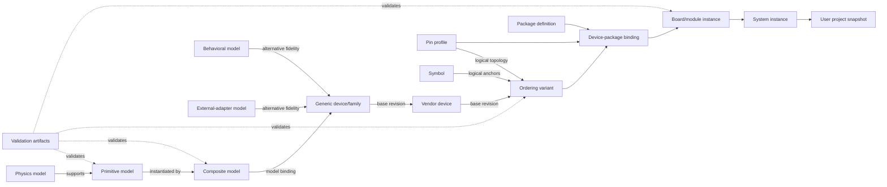

# Hierarchical Model and Library Architecture

Status: **Normative baseline 1.0**  
Requirements: **REQ-048, REQ-049, REQ-050, REQ-051, REQ-052, REQ-053**  
Accepted decisions: [ADR-0013](../decisions/ADR-0013.md), [ADR-0014](../decisions/ADR-0014.md), and [ADR-0020](../decisions/ADR-0020.md)

Related contracts: [Component Model Contract](../catalog/COMPONENT_MODEL_CONTRACT.md), [Variant Semantic Profile Contract](../catalog/VARIANT_SEMANTIC_PROFILE_CONTRACT.md), [Pin Profile Catalog](../catalog/PIN_PROFILE_CATALOG.md), [Package and Physical Appearance Contract](../catalog/PACKAGE_AND_PHYSICAL_APPEARANCE.md), [Device Package Binding Contract](../catalog/DEVICE_PACKAGE_BINDING_CONTRACT.md), [Project File Format](PROJECT_FILE_FORMAT.md), and [Multi-Fidelity and Co-Simulation](MULTI_FIDELITY_AND_CO_SIMULATION.md)

## 1. Purpose

This document defines how physical principles become reusable simulation models, placeable devices, orderable parts, boards, systems, and reproducible user projects without duplicating one complete internal circuit for every commercial ordering code. It establishes the canonical entity taxonomy, dependency rules, immutable-reference rules, inheritance boundaries, model lineage, and model-coverage discovery process.

The source brief requires a staged hierarchy from physical and circuit models through logic, processors, computers, and architecture-scale systems, with reusable libraries and abstraction changes as scale grows. [Source PDF, pp. 13-21, 31-32, 41-44] This contract makes that hierarchy precise while preserving the F0-F5 meanings in [ADR-0005](../decisions/ADR-0005.md) and the hierarchical product decision in [ADR-0001](../decisions/ADR-0001.md).

This is a documentation and architecture contract. It does not claim that a model, vendor catalog, package binding, board, adapter, or validation artifact has been implemented merely because its entity kind is specified here.

## 2. Normative language and core principles

The key words **MUST**, **MUST NOT**, **REQUIRED**, **SHOULD**, **SHOULD NOT**, and **MAY** are normative.

1. **Separate identity from presentation.** Stable IDs and exact revisions define entities; names, aliases, ordering-code text, and UI labels do not.
2. **Separate reuse from composition.** A model dependency, device inheritance edge, package binding, board instance, and system instance are different typed relationships.
3. **Reuse before duplication.** A vendor or ordering variant MUST reference a generic model and typed overrides when those records fully describe the difference. It MUST NOT copy a complete internal circuit merely to change manufacturer metadata, grade, marking, package, or pin map.
4. **Package orthogonality.** A package is reusable physical geometry. It is neither a simulation model nor a device, board, module, or system.
5. **Exact reproducibility.** Execution, publication, validation, migration, and retained results use exact immutable revisions and content digests, never floating selectors such as `latest`.
6. **Declared fidelity.** Every executable model declares its supported F0-F5 levels, analyses, validity envelope, limitations, and evidence. Visual realism and package detail never raise simulation fidelity.
7. **No silent inference.** Consumers MUST NOT infer behavior, topology, model selection, package selection, pin mapping, grade, or accuracy from an ID suffix, display name, neighboring record, or package contact count.
8. **Evidence remains separate.** A golden result, measurement, compiled artifact, or reference-engine output supports a claim but is not itself the source model or device definition.

## 3. Two orthogonal taxonomies

The platform uses two related but non-interchangeable classifications.

### 3.1 Model kinds

| Canonical kind | Meaning | May be executable? | Typical dependency |
|---|---|---:|---|
| `physics` | Governing physical or mathematical behavior, equations, assumptions, quantities, and validity. | not necessarily | physical principles and reference data |
| `primitive` | Lowest reusable simulation element at one declared abstraction and fidelity. | yes | physics models and numerical kernels |
| `composite` | Reusable, typed graph of primitive or other composite model instances. | yes | exact model revisions |
| `behavioral` | Direct equation, transfer, state-machine, timing, or functional abstraction that need not expose an internal structural graph. | yes | physics, data, or other declared models |
| `external_adapter` | Versioned binding to an isolated external engine, imported artifact, entry point, and adapter capability contract. | yes, through an adapter | artifact, engine, toolchain, and boundary models |

`behavioral` is the canonical registry and API spelling. Importers MAY accept `behavioural` as a display or source alias, but normalization MUST store `behavioral` and MUST NOT create a second model kind.

A model has exactly one primary kind. It MAY reference records of other kinds. `implementationKind`, engine placement, and F-level are separate dimensions; for example, a primitive may execute in Rust/WASM at F1, while a behavioral model may execute through an external adapter at F2.

### 3.2 Library entity kinds

| Entity | Owns | Does not own implicitly |
|---|---|---|
| Generic device or family | Placeable electrical/functional identity and model choices by fidelity | manufacturer SKU, package geometry, or vendor accuracy |
| Vendor device | Manufacturer-specific electrical identity derived from one generic device revision | one mandatory ordering code or package |
| Ordering variant | Exact orderable identity, grades, package binding, and vendor metadata | a duplicated internal circuit |
| Symbol | Schematic presentation and logical-pin anchors | package contacts, model equations, or board identity |
| Package | Reusable body, contacts, numbering, orientation, and physical rendering metadata | electrical function, internal circuit, board, or system |
| Pin profile | Exact ordered logical topology for one device variant | package numbering or model-terminal order |
| Device-package binding | Exact logical-pin-to-package-contact map for one device and package revision | a PCB footprint certificate or a new electrical device |
| Board or module | Reusable assembly graph of exact device/binding instances, nets, connectors, and metadata | package identity or hidden replacement of child revisions |
| System | Higher-level composition of exact boards, modules, devices, buses, software, firmware, interfaces, and environment | a claim that every child uses the same fidelity |
| User project | Mutable user-owned design referencing immutable library revisions | authority to mutate published library records |
| Validation or simulation artifact | Evidence or derived output bound to exact inputs and tools | source-definition authority |

An entity may participate in several typed relationships, but its kind and ownership boundary remain fixed.

## 4. Canonical entity contracts

### 4.1 PhysicsModel

A `PhysicsModel` represents governing physical or mathematical behavior such as Ohmic conduction, a semiconductor junction, a MOSFET compact formulation, dielectric loss, a thermal network, or battery discharge.

It MUST identify the physical principles, governing and engineering equations, quantities and canonical units, assumptions, approximation level, input/output/state variables, parameters and ranges, applicable fidelity, operating envelope, numerical treatment where applicable, provenance, validation state, uncertainty or accuracy envelope, and limitations. A physics record MAY be explanatory and non-executable. Executability is supplied by a primitive, behavioral model, composite, or external adapter that cites the exact physics revision.

### 4.2 PrimitiveModel

A `PrimitiveModel` is the lowest reusable simulation element **at its declared simulator abstraction and fidelity**. It is not claimed to be indivisible in physical science.

Examples include resistor, capacitor, inductor, diode, NMOS, PMOS, BJT, controlled source, thermal resistor, and thermal capacitor models. A primitive MUST declare typed ports, parameters, state, analyses, numerical method or kernel binding, dependencies, F-levels, validity, deterministic behavior, and validation evidence. Two primitives representing the same named component at different equations or fidelities remain different exact model revisions or model IDs; the name alone does not establish equivalence.

### 4.3 CompositeModel

A `CompositeModel` is a reusable directed graph whose nodes reference exact primitive or composite model revisions and whose edges connect compatible typed ports. Examples include a NAND gate, NOR gate, flip-flop, differential pair, current mirror, register, counter, ALU block, or an op-amp stage.

A composite MUST define:

- stable external ports, domains, units, directions, and ordering;
- exact child model references and immutable instance IDs;
- explicit child-parameter bindings and allowed composite parameters;
- internal nets and boundary mappings;
- supported analyses, fidelity, validity envelope, and limitations;
- initialization, state exposure, and state-transfer rules where applicable;
- dependency closure digest and validation evidence.

The same composite revision MAY be instantiated repeatedly. Four gates in a quad NAND device are four instances of one validated NAND composite revision unless evidence requires a distinct implementation. Copying four independent model definitions is not reuse.

### 4.4 BehavioralModel

A `BehavioralModel` directly specifies an equation, transfer function, state machine, event/timing relation, protocol behavior, firmware-execution abstraction, or other functional contract. It may intentionally omit an internal primitive graph.

It MUST declare what physical or structural behavior it preserves, what it omits, its inputs, outputs, state, timing semantics, numerical or event treatment, fidelity, supported analyses, validity, deterministic policy, and validation evidence. A functional model MUST NOT be described as transistor-level merely because it produces realistic-looking output.

### 4.5 ExternalAdapterModel

An `ExternalAdapterModel` joins an exact model or imported artifact to the versioned `EngineAdapter` boundary accepted in [ADR-0008](../decisions/ADR-0008.md). It MUST pin the adapter contract and engine/toolchain versions, artifact digest, format and version, entry point, logical terminal mapping, parameter mapping, supported analyses and fidelity, determinism class, resource/isolation policy, provenance, license, validation evidence, and limitations.

An adapter is not a trust shortcut. Imported or executable artifacts remain quarantined until format, provenance, license, security, capability, and validation checks pass. Process isolation does not by itself establish accuracy or license compatibility.

### 4.6 GenericDevice and DeviceFamily

A generic device or device family is a reusable definition that users can place in a schematic. It owns stable functional identity, a logical pin-role vocabulary, declared parameters, analysis claims, and one or more exact model choices by fidelity. Examples include a generic 74HC00 family, generic LM358 family, generic 555 timer, or generic ATmega328P functional device.

The exact topology of a placeable variant comes from a `PinProfile`, not from the family display label. A generic device MAY have ideal, behavioral, compact, electrothermal, or research bindings, but each is independently versioned and validated. The word “generic” MUST NOT be presented as manufacturer-specific accuracy.

### 4.7 VendorDevice and OrderingVariant

A `VendorDevice` represents manufacturer-specific behavior and metadata derived from exactly one generic device revision. An `OrderingVariant` represents one exact orderable code derived from one vendor-device revision. The ordering record also pins the resolved exact generic-device tuple; it MUST match the vendor device's generic base, so the chain has one unambiguous generic root rather than two competing parents.

A vendor or ordering record MAY narrow or override only declared fields, including:

- manufacturer, ordering code, package code, aliases, and datasheet revision;
- voltage, current, power, frequency, temperature, speed, and memory grades;
- leakage, timing, tolerance, and other declared electrical parameters;
- exact pin profile and `DevicePackageBinding` references;
- lifecycle, availability observations, replacement relationships, trust, and validation status;
- imported model artifacts, model revision selection, license, and redistribution restrictions.

An ordering variant MUST NOT change topology by editing inherited pins; it selects an exact pin profile. It MUST NOT change package semantics by patching a package; it selects an exact binding. It MUST NOT change equations through arbitrary constants; it selects a different exact model revision or a schema-valid parameter override with evidence.

Availability is time-varying market data. A timestamped availability observation MAY change without mutating the immutable electrical ordering-variant revision. A replacement-device relationship is advisory until compatibility has separate electrical, pin, package, fidelity, and validation evidence.

### 4.8 SymbolDefinition

A symbol represents schematic appearance and anchors that map to exact logical pins. It is independent of simulation equations, device identity, physical package, footprint, physical illustration, internal circuit, and board identity.

A symbol revision MUST declare its logical-pin reference, unit/part structure, hidden-pin behavior, orientation, original artwork provenance, accessibility metadata, and mapping from symbol anchors to logical pin IDs. Symbol order is not model-terminal order or package numbering. Changing artwork without changing logical meaning MAY produce a new artwork revision; changing a logical anchor's identity requires compatibility and migration review.

### 4.9 PackageDefinition

A package represents reusable physical packaging such as DIP, SOIC, TQFP, QFN, BGA, TO-220, or SOT-23. Its complete geometry, contact, numbering, orientation, provenance, and accuracy requirements are governed by the [Package and Physical Appearance Contract](../catalog/PACKAGE_AND_PHYSICAL_APPEARANCE.md).

A package owns body geometry, dimensions, leads/pads/balls, contact IDs, numbering, orientation and pin-one/A1 cues, marking zones, physical rendering metadata, and optional separately governed footprint or 3D references. It does not own logical electrical meaning.

A package is **not** an IC model, MCU, board, module, circuit, or system. Package containment MUST NOT be used to represent a board. Reusing a package across devices does not create model inheritance between those devices.

### 4.10 PinProfile and mapping chain

A `PinProfile` owns one variant's exact ordered logical pins, buses and bounded groups, directions, electrical types, domains, required/optional state, power-domain roles, and alternate or multiplexed functions. It is governed by the [Component Model Contract](../catalog/COMPONENT_MODEL_CONTRACT.md) and the machine-readable profile registry described by the [Pin Profile Catalog](../catalog/PIN_PROFILE_CATALOG.md).

Four mappings remain explicit and separate:

| Mapping | From | To | Authority |
|---|---|---|---|
| Symbol pin map | logical pin ID | symbol anchor/unit | schematic presentation only |
| Model terminal map | logical pin ID | model boundary terminal or declared internal boundary node | simulation model binding |
| Alternate-function map | logical pin ID plus mode/state | peripheral or power-domain role | device semantics |
| Device-package map | logical pin ID | resolved package contact ID | [Device Package Binding Contract](../catalog/DEVICE_PACKAGE_BINDING_CONTRACT.md) |

One ordinal MUST NOT be reused as all four mappings. Internal model nodes that are not public logical pins MUST remain internal and MUST NOT acquire package contacts through inference.

The same device family MAY bind to multiple packages with different exact contact mappings. Each binding pins the variant revision, pin-profile revision/digest, package revision and parameters, explicit contact map, appearance, provenance, and evidence. Candidate `package_refs` are discovery metadata only and never satisfy this rule.

### 4.11 BoardDefinition and ModuleDefinition

A board or module is a reusable physical or logical circuit assembly. It contains device or sub-board instances that reference exact revisions, resolved package bindings where physical placement matters, nets, connectors, hierarchy ports, board metadata, and optional firmware or mechanical metadata.

A board definition MUST declare:

- stable ID, immutable revision, digest, lifecycle, provenance, license, and limitations;
- exact child definition references and stable instance IDs;
- electrical nets, typed ports, connectors, buses, power domains, and boundary rules;
- exact component variant, pin profile, and device-package binding per applicable child instance;
- optional firmware/model artifacts by exact digest and compatible target;
- physical outline or mechanical references separately from package geometry;
- supported simulation views, F-level policies, analyses, initialization, and validation evidence.

A board or module is **not a package**. It may contain package instances, but a package cannot contain the board's electrical graph. Arduino Uno, an ESP32 development board, a sensor module, a motor-driver module, and a power-supply module are board/module entities.

### 4.12 SystemDefinition

A system is a higher-level composition of exact board, module, device, bus, software, firmware, external-interface, and environmental-configuration revisions. Examples include an educational computer, embedded controller, robot, laboratory instrument, or communication system.

Every boundary MUST declare ports, domains, units, timing, protocol, fidelity, state exchange, and unsupported behavior. A system MAY mix fidelity levels under an immutable execution plan. It MUST NOT imply transistor-level accuracy for abstract children, and it MUST NOT silently replace a child revision because a newer library item exists.

### 4.13 UserProject

A user project is a mutable user-owned design that references immutable library revisions. Working edits MAY add, remove, or replace instances and local definitions, but they never mutate a published system-library revision.

Before simulation, publication, collaboration release, or retained validation, the project MUST resolve every referenced library tuple, freeze a catalog snapshot and dependency closure, and produce an immutable project revision as required by the [Project File Format](PROJECT_FILE_FORMAT.md). Project-local models, packages, bindings, boards, or systems remain explicitly local until their own publication review succeeds.

### 4.14 ValidationArtifact and SimulationArtifact

Artifacts include golden results, physical measurements, waveforms, reference-engine outputs, error reports, compiled models, cached bundles, and reproducibility manifests. Each artifact MUST identify its kind, immutable digest, exact source revisions, tool/engine/build identity, configuration, environment, units, seed where applicable, result status, provenance, license, trust, and limitations.

A compiled model is derived from a source model and toolchain; it does not replace either. A cache may accelerate resolution but is never authoritative. Validation evidence supports only its declared model, parameter and operating envelope, fidelity, analyses, engine versions, and acceptance criteria.

## 5. Typed relationship graph



The diagram shows typed references, not one inheritance chain. In particular, the package-to-binding edge is orthogonal to model derivation, and evidence edges do not transfer ownership.

### 5.1 Relationship types

| Edge | Meaning | Cardinality rule | Participates in cycle checks |
|---|---|---|---:|
| `depends_on` | model implementation reuses another model | many exact revisions | yes |
| `contains_instance_of` | composite, board, or system contains a child instance | many exact revisions | yes, at definition level |
| `derives_from` | immutable lineage from a source revision | many exact revisions | yes |
| `extends` | typed inheritance for vendor or ordering data | exactly one direct base | yes |
| `binds_to` | orthogonal symbol, pin, model-terminal, package, or artifact association | contract-specific | referential checks; no ownership inheritance |
| `validates` | evidence supports a bounded claim | many | evidence must not depend on the claim it validates through a circular authority path |

Edges MUST state source kind, source ID/revision/digest, target kind, target ID/revision/digest, relationship type, and any transformation or instance parameters. Untyped generic references are prohibited in published records.

## 6. Dependency DAG and cycle rejection

Model definitions, inheritance, board/module definitions, system definitions, and lineage MUST form validated directed acyclic graphs over exact revisions.

The validator MUST:

1. resolve every typed reference to one exact kind, ID, revision, and digest;
2. reject self-dependencies before graph traversal;
3. build the definition graph separately from instance electrical nets;
4. detect cycles across direct and transitive dependencies;
5. return the complete shortest known cycle path with edge types and source locations;
6. topologically order the accepted dependency closure;
7. bind the ordered closure and its digest to publication, project snapshots, execution plans, and validation manifests.

Baseline publication rejects recursive composite models, circular vendor inheritance, a board that directly or transitively contains its own definition, a self-containing system, and circular source lineage. A future recursive solver feature would require a new explicit contract; it MUST NOT be accepted as an implementation convenience.

Electrical feedback is different from definition recursion. A legal oscillator or feedback amplifier may contain cyclic **net connectivity** among instances while its model-definition dependency graph remains acyclic. Validators MUST NOT reject a circuit merely because the electrical graph contains feedback, and MUST NOT permit definition recursion merely because electrical feedback is valid.

Cycle checks run on draft validation, publication, import, migration, dependency replacement, project snapshot creation, and execution-plan creation. Cached results never bypass a fresh digest and closure check.

## 7. Exact immutable revisions

Every published or execution-relevant reference is the tuple:

| Field | Rule |
|---|---|
| `kind` | Expected entity kind; prevents cross-kind ID substitution. |
| `id` | Opaque stable identity; display names are not accepted. |
| `revision` | Exact semantic revision; ranges and `latest` are prohibited in reproducible records. |
| `digest` | Content digest over canonical semantic bytes; mismatch is a hard error. |

Published revisions are immutable. Corrections produce a new revision and migration guidance. Deprecation or withdrawal adds status and replacement metadata without deleting the historical content required by projects, results, licenses, or evidence.

A catalog query MAY use a range or “recommended” selector for discovery. Before placement, publication, execution, validation, or persistence, the selector MUST resolve to the four-field tuple and be recorded. A project reopened later uses its locked tuple until the user accepts an explicit, validated migration.

The dependency-closure digest covers every reachable definition revision, typed edge, override record, imported artifact, and required build or adapter identity. A change anywhere in the closure yields a different digest even when the root display name is unchanged.

## 8. Deterministic inheritance and overrides

### 8.1 Market-scale derivation pattern

```text
Vendor Device
= Generic Device Revision
+ Typed Parameter Overrides
+ Exact Model Selections
+ Pin Profile
+ Device-Package Binding
+ Manufacturer and Datasheet Metadata
+ Validation Evidence
```

The scalable path is:

```text
Primitive model revisions
-> reusable composite revisions
-> generic device revision
-> vendor device revision
-> ordering variant revision
-> exact package binding
```

One ordering variant has one direct vendor base; one vendor device has one direct generic base. Shared submodels are referenced, not copied. Multiple inheritance is prohibited in the baseline because conflicting overrides would make normalization order-dependent.

### 8.2 Override classes

| Field class | Override policy |
|---|---|
| Manufacturer, ordering code, aliases, datasheet, grade, lifecycle | typed vendor/ordering metadata override permitted |
| Declared numerical parameters | permitted only within type/unit/range and model-validity rules, with provenance |
| Supported analyses or fidelity | may narrow inherited support; widening requires a separately validated model revision |
| Logical topology | select an exact `PinProfile`; do not patch pin arrays |
| Package/contact map | select an exact `DevicePackageBinding`; do not patch package geometry or infer pin order |
| Governing behavior/equations | select a different exact model revision; undocumented constants are prohibited |
| Provenance, license, limitations | append or narrow; inherited restrictions cannot be erased |
| Validation status | variant-owned evidence only; parent validation does not automatically validate the child |

### 8.3 Normalization

Materialization is deterministic:

1. resolve the exact generic base and its dependency closure;
2. resolve the exact vendor base for an ordering variant;
3. reject inheritance cycles or kind mismatches;
4. apply schema-allowed overrides in the fixed generic-to-vendor-to-ordering order;
5. validate types, SI units, ranges, model envelopes, and inherited restrictions;
6. resolve exact model, pin-profile, symbol, package-binding, artifact, and evidence references;
7. preserve inherited provenance, licenses, limitations, and unsupported behavior;
8. emit the fully materialized record, override log, base/closure digests, and normalized digest.

Missing data remains unresolved. A normalizer MUST NOT derive fields from an ordering-code suffix, package name, alias, or another sibling. If a vendor part genuinely uses a different internal implementation, it references a vendor-specific model or composite revision with its own lineage and validation; it still reuses all unchanged dependencies.

## 9. Market-scale ingestion workflow

Large vendor catalogs are ingested as structured differences over shared definitions, not as independent circuit copies.

### 9.1 Required vendor and ordering metadata

The ingestion record includes manufacturer, device family, base generic revision, ordering code, package code, temperature/voltage/speed grades, memory capacity where applicable, electrical limits, timing parameters, datasheet revision, lifecycle, timestamped availability metadata, aliases, replacement candidates, imported artifacts, artifact license and redistribution restrictions, trust level, validation state, and supported fidelity.

### 9.2 Pipeline

```mermaid
flowchart LR
    Source["Vendor source or imported artifact"] --> Quarantine["Quarantine and hash"]
    Quarantine --> Parse["Bounded parse and metadata extraction"]
    Parse --> Match["Propose generic base and typed differences"]
    Match --> Normalize["Normalize exact revisions and overrides"]
    Normalize --> Validate["Electrical, pin, package, model, license, and evidence validation"]
    Validate --> Review["Engineering and provenance review"]
    Review --> Publish["Immutable vendor/order revision"]
```



The pipeline MUST preserve source identity, retrieval record, content hash, exact revision, format/version, license, redistribution status, trust, validation state, and compatibility metadata for SPICE, Verilog, SystemVerilog, Verilog-A, IBIS, Touchstone, CSV/PWL, HEX/ELF, VCD/FST, or any later supported format. Import capability does not grant redistribution rights.

Matching MAY propose a base device, pin map, or override set, including AI-assisted proposals. Publication requires deterministic schema validation and human-review evidence; an automated proposal never becomes authoritative by confidence score alone.

Duplicates are detected by source identity, ordering code plus manufacturer, artifact digest, normalized electrical content, and exact dependency closure. Apparent duplicates with different source revisions are retained as related revisions, not silently merged.

## 10. Model lineage

Every derived model, device, binding, board, system, compiled artifact, project snapshot, and validation artifact MUST expose complete typed lineage.

Required lineage fields include:

- exact source kind, ID, revision, and digest;
- relationship type and ordered transformation or override set;
- parameter values and units changed from each base;
- compilation, conversion, normalization, or import steps and tool versions;
- dependency-closure and output content hashes;
- selected fidelity levels, analyses, and validity envelopes;
- validation results and evidence digests;
- provenance, licenses, redistribution restrictions, and trust transitions;
- inherited and introduced limitations;
- deprecation and replacement links where applicable.

```mermaid
flowchart LR
    Principles["Physical principles"] --> Devices["NMOS/PMOS model revisions"]
    Devices --> NAND["NAND composite revision"]
    NAND --> Family["74HC00 family revision"]
    Family --> Vendor["Vendor device revision"]
    Vendor --> Variant["Ordering variant revision"]
    Variant --> Binding["Package-binding revision"]
    Binding --> Board["Board instance in exact board revision"]
    Board --> System["System instance in exact system revision"]
```



The package binding in this broader provenance path remains an orthogonal typed edge; it does not become an ancestor of the electrical model.

Lineage supports reproducibility, debugging, migration, validation, dependency impact analysis, AI-assisted design review, security review, and license review. Impact analysis traverses reverse edges from a changed or withdrawn revision and reports affected models, devices, bindings, boards, systems, projects, results, and evidence without modifying them.

No transformation may raise trust, fidelity, license permission, or validation status implicitly. Every such change needs explicit evidence and a new derived revision.

## 11. Normative hierarchy examples

These examples define entity separation and reuse. They do not claim that the named records, vendor data, internal circuits, or validations currently exist in the repository.

### 11.1 74HC00 family and ordering variants

```text
Ohmic and semiconductor-junction physics
-> NMOS and PMOS primitive model revisions
-> reusable NAND composite revision
-> generic 74HC00 quad-NAND device revision
-> vendor SN74HC00 device revision
-> SN74HC00N ordering variant + exact DIP binding
-> SN74HC00DR ordering variant + exact SOIC binding
```

The quad device instantiates one NAND composite revision four times with explicit port maps; vendor/order records reuse that graph and apply only supported differences. They do not carry independent copies of the same transistor or NAND circuit.

An F2 74HC00 model may implement validated four-state logic and timing without exposing transistors. An F3 transistor or macro-model may be selected only when its topology, operating envelope, engine, and comparison evidence exist. An F4 claim additionally requires applicable non-ideal, power, thermal, tolerance, or failure evidence. Neither the family name nor an illustrative NMOS/PMOS lineage proves the actual vendor die topology. The example ordering-code/package relationships MUST be verified against a cited manufacturer datasheet revision before publication.

### 11.2 ATmega328P device and packages

```text
CPU + Flash + SRAM + EEPROM
+ GPIO + UART + SPI + I2C + ADC
+ timers + interrupt controller + clock + reset
-> generic ATmega328P functional device revision
-> vendor device and ordering revisions
-> exact DIP-28, TQFP-32, or QFN pin profiles and package bindings
```

The reusable child blocks may be behavioral, RTL, external-adapter, or selected detailed models at declared fidelities. A practical whole-device model may provide F2 firmware execution, register behavior, peripheral function, and declared timing. Selected analog peripherals or I/O electrical behavior may use separately validated F3/F4 models. This structure does **not** claim full-transistor MCU simulation, die-layout fidelity, undocumented peripheral behavior, or cycle accuracy beyond the selected model's evidence.

Different packages can expose different pin counts, power contacts, alternate functions, and contact maps. They therefore resolve exact pin profiles and `DevicePackageBinding` revisions; the family name or package contact count cannot generate the map.

### 11.3 Arduino Uno board/module

```text
ATmega328P device instance
+ USB-interface device
+ voltage regulator + crystal
+ LEDs + resistors + capacitors
+ connectors and exact package bindings
-> Arduino Uno board/module revision
```

Arduino Uno is a board/module, not a package, primitive model, or single device. A board revision references exact child device, binding, firmware, net, connector, and optional mechanical revisions. Its simulation may mix an F2 MCU with F1/F3/F4 support circuitry, and its result is only as accurate as those selected models and boundary contracts. The name alone does not prove a particular Arduino board revision, schematic, clone compatibility, bootloader, or measured behavior; each claim requires source and validation evidence.

## 12. Model-coverage discovery without speculative counts

Model inventory counts are independent from component-family, component-variant, package, binding, board, and artifact counts. One model revision may serve many variants; one variant may select several model revisions by fidelity and analysis. Therefore component counts MUST NOT be presented as model counts, and package counts MUST NOT be added to either.

The platform MUST derive coverage from exact registry snapshots rather than planned ranges or exploratory estimates.

### 12.1 Discovery inputs

- exact model registry snapshot and schema version;
- [component-registry.yaml](../catalog/component-registry.yaml) family/variant demand and planned fidelity/analysis claims;
- variant semantic and pin-profile snapshots;
- exact package and concrete binding snapshots where physical release is in scope;
- external-adapter capability manifests and imported-artifact inventory;
- test registry, golden fixtures, evidence records, release target, and deprecation state.

### 12.2 Coverage key and states

Every coverage cell is keyed by exact subject revision, model revision when resolved, fidelity, analysis, parameter/operating envelope, engine/build, release target, and validation-contract version.

Allowed coverage states are:

- `not-inventoried`;
- `planned`;
- `unresolved`;
- `implemented-unvalidated`;
- `validated`;
- `blocked`;
- `deprecated`.

Only `validated` with resolvable evidence is a supported claim. A listed analysis, task, model-plan ID, or imported filename is not implementation or validation evidence.

### 12.3 Discovery procedure

1. freeze and digest every input registry and evidence snapshot;
2. enumerate demanded subject/fidelity/analysis/envelope cells without inferring omitted support;
3. resolve exact model references and their complete dependency closures;
4. validate kinds, revisions, digests, engine capability, provenance, license, trust, and operating envelopes;
5. join each cell to current validation evidence and release criteria;
6. classify unresolved, blocked, unvalidated, deprecated, and validated cells;
7. report gaps and reverse dependency impact by stable ID;
8. publish the query/version, snapshot digests, generation time, and separate exact counts by entity kind.

Reports MUST distinguish unique model IDs, immutable model revisions, reuse instances, covered component revisions, packages, bindings, boards, and artifacts. They MUST state whether deprecated records are included. They MUST NOT use undocumented estimates, extrapolate from catalog size, count aliases as models, count the same revision once per consumer, or claim that a planned dependency exists.

Registry-growth planning starts from uncovered demanded cells, user/release priority, reusable dependency impact, validation cost, license/security constraints, and fidelity need. It does not begin from a speculative target number of primitives or composites.

## 13. Validation and publication invariants

Publication or execution MUST fail when any applicable condition is true:

1. an exact kind/ID/revision/digest reference is unresolved or mismatched;
2. a dependency, containment, inheritance, or lineage cycle exists;
3. a composite has incompatible or unmapped ports;
4. an override is undeclared, dimensionally invalid, outside its model envelope, or erases inherited restrictions;
5. an ordering variant duplicates a complete base circuit without a documented distinct-model rationale;
6. symbol order, model-terminal order, logical-pin order, and package numbering are conflated;
7. a package candidate is used as a concrete binding;
8. a package is represented as a device, board, module, or system, or a board is represented as a package;
9. a board or system uses floating child revisions;
10. lineage, provenance, license, trust, or required evidence is incomplete;
11. a behavioral or external model is presented at unsupported fidelity;
12. a coverage report claims support from plans, names, counts, or files without exact validated evidence.

Minimum validation fixtures cover a legal reused composite DAG, direct and transitive cycle rejection, exact-revision mismatch, vendor override normalization, invalid inherited-limit widening, multiple package bindings for one device, symbol/model/package-order independence, board-versus-package kind rejection, board and system snapshot locking, artifact lineage, reverse impact analysis, and evidence-backed coverage classification.

## 14. Stable diagnostics

| Diagnostic | Meaning |
|---|---|
| `HLIB_REFERENCE_UNRESOLVED` | Exact kind, ID, revision, or digest cannot be resolved. |
| `HLIB_KIND_MISMATCH` | A reference resolves to the wrong entity kind. |
| `HLIB_DEPENDENCY_CYCLE` | Model, containment, inheritance, or lineage closure contains a cycle. |
| `HLIB_OVERRIDE_INVALID` | An override is unknown, invalid, unsupported, or erases an inherited restriction. |
| `HLIB_MODEL_DUPLICATION_UNJUSTIFIED` | A vendor/order record copies a complete base model without distinct-model evidence. |
| `HLIB_PIN_MAPPING_AMBIGUOUS` | Logical, symbol, model-terminal, alternate-function, or package mappings are conflated or incomplete. |
| `HLIB_PACKAGE_ORTHOGONALITY_VIOLATION` | Package identity is used as a model, device, board, module, or system identity. |
| `HLIB_BOARD_CHILD_FLOATING` | A board or system child uses a range, alias, or latest selector instead of an exact revision. |
| `HLIB_LINEAGE_INCOMPLETE` | Required source, transformation, override, tool, digest, license, limitation, or evidence lineage is absent. |
| `HLIB_COVERAGE_UNPROVEN` | A coverage claim has no exact validated model/evidence resolution. |

Every diagnostic identifies the root entity, affected edge or field, exact expected and actual references, source location, severity, and remediation. A consumer MUST NOT silently choose a sibling, newer revision, default package, or lower fidelity.

## 15. Compatibility and change control

- Adding an optional metadata field is compatible only when older consumers can preserve it losslessly.
- Changing an entity's kind, logical-pin meaning, dependency semantics, governing behavior, package contact meaning, board net, or system boundary requires a new revision and migration review.
- Replacing a dependency creates a new dependent revision even when the public display name is unchanged.
- A published system-library revision is never destructively edited or deleted. Deprecation keeps its exact content, provenance, license, reverse references, and migration path resolvable.
- Project-local drafts MAY be deleted according to project policy when no retained revision or evidence depends on them; publication history remains immutable.
- Any architecture change that makes package geometry own device behavior, permits floating execution dependencies, or permits untracked vendor-circuit duplication requires a superseding ADR.

## 16. Source record

The hierarchy from device and circuit physics through gates, processors, computers, and architecture-scale systems follows the feasibility brief's multi-level simulation and staged delivery. [Source PDF, pp. 3-4, 13-21, 32-44] Reusable project libraries, hierarchy, collaboration, and public sharing follow the brief's editor and platform scope. [Source PDF, pp. 29, 31-32, 41-42]

The exact model/library taxonomy, immutable typed revision tuple, vendor/order inheritance normalization, package orthogonality, board-versus-package boundary, lineage schema, and evidence-derived coverage process are repository decisions formalized by REQ-048 through REQ-053 and ADR-0013, ADR-0014, and ADR-0020.
