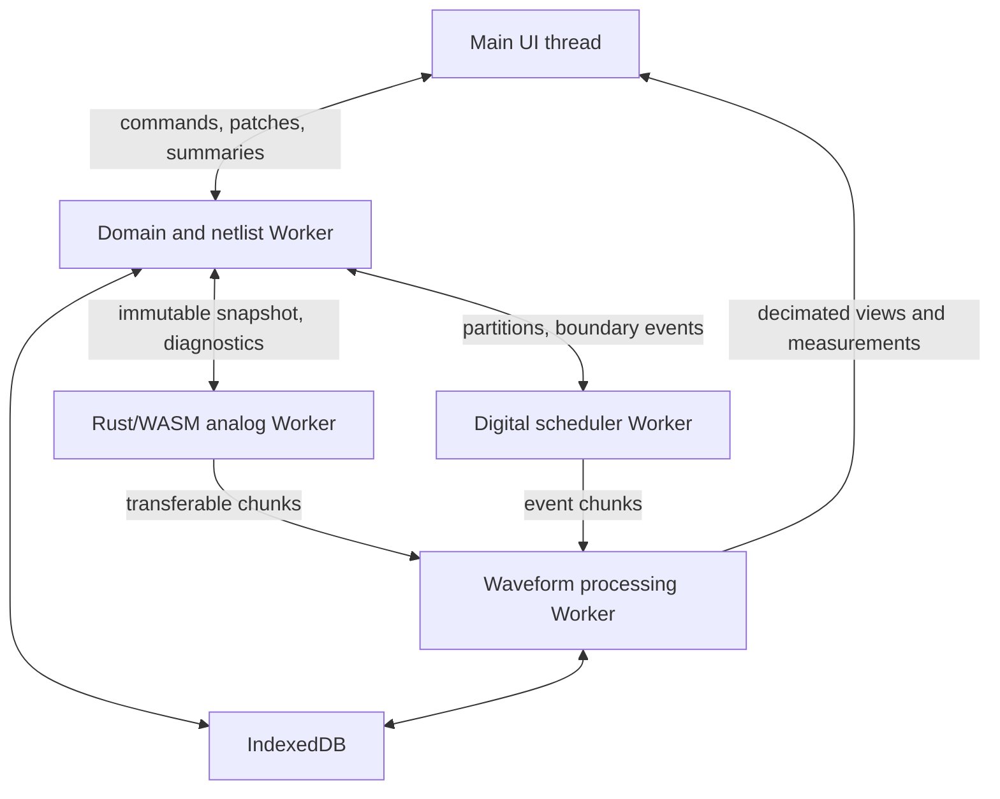
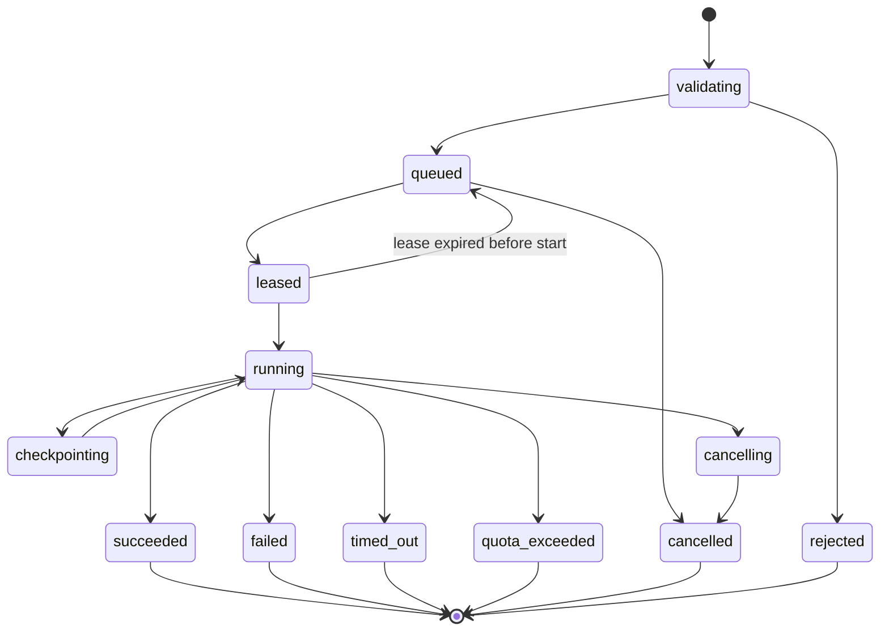

# Local, Cloud, and Worker Architecture

Status: Normative  
Related: [System Architecture](./SYSTEM_ARCHITECTURE.md), [Security, Privacy, and Sandboxing](./SECURITY_PRIVACY_AND_SANDBOXING.md)

## 1. Goals

The platform MUST provide immediate, offline-capable editing and bounded simulation in the browser while moving heavy, long-running, toolchain-dependent, or untrusted native workloads to isolated server workers. This follows the feasibility brief's explicit split between small browser simulations and large SPICE, RTL, architecture, GPU, Monte Carlo, and thermal jobs on server/HPC infrastructure. [Source PDF, pp. 25-26, 36, 44]

## 2. Placement decision

Placement is computed from the immutable `ExecutionPlan`, not from UI labels such as "small" or "advanced."

### 2.1 Local eligibility

A run MAY execute locally only when all are true:

- every selected model and engine is available as an approved browser artifact;
- no F5 model, server-only external engine, native toolchain compilation, secret, or organization policy requires cloud execution;
- estimated memory, operation count, waveform retention, and runtime are within local limits;
- project input is already local or the user has authorized required downloads;
- requested collaboration semantics do not require a single server-authoritative run;
- the browser supports the required Worker/WASM capabilities;
- no model license prohibits browser distribution.

Local eligibility MUST be determined before starting, then enforced by runtime resource guards. If a local run exceeds a guard, it stops with a portable cloud-retry offer; it MUST NOT upload automatically.

### 2.2 Mandatory cloud execution

Cloud execution is mandatory for:

- Xyce, gem5, QEMU, Accel-Sim/GPGPU-Sim, and other server-only adapters;
- server-side Verilator compilation or untrusted native/custom model compilation;
- F5 physical-device, TCAD, detailed EM/MEMS, or comparable research workloads;
- requested resources above local policy;
- long Monte Carlo, large thermal grids, or large analog jobs beyond the local threshold;
- workloads requiring checkpoint/resume across browser closure;
- organization policy that disallows local processing for a project.

The browser MUST show the placement reason, estimated quota/cost class, input upload size, and cancellation behavior before submission.

## 3. Browser process model

- The main thread owns interaction and accessible presentation only.
- Domain/netlist preparation, analog solving, digital scheduling, and waveform processing use separate Workers. Analog, digital, and waveform responsibilities MUST NOT be merged into one Worker; a constrained device uses the documented reduced-capability or cloud-routing path instead of weakening this boundary. Netlist preparation may share the domain Worker only when benchmarks justify it, as allowed by ADR-0002.
- Messages MUST be versioned and size-bounded. Large buffers SHOULD be transferred, not copied.
- Shared memory MAY be used only by the threaded WASM build with cross-origin isolation and an explicit buffer schema.
- Cancellation MUST be available without waiting for a long synchronous call to return.

The source PDF explicitly assigns UI, netlist generation, analog solving, digital events, and waveform work to separate threads and warns against running simulation on the main UI thread. [Source PDF, pp. 23-24]

## 4. Rust/WASM build matrix

Two local artifacts are required:

| Artifact | Required environment | Behavior |
|---|---|---|
| single-threaded | baseline WebAssembly and Worker | mandatory fallback; one solver Worker; deterministic cancellation polling |
| threaded | `SharedArrayBuffer`, Workers, cross-origin isolation | optional acceleration; same canonical contracts and result semantics |

- Thread capability is build-time, not only runtime. The loader selects an artifact after capability and header checks.
- Threaded pages MUST be served with appropriate `Cross-Origin-Opener-Policy` and `Cross-Origin-Embedder-Policy` headers, and every embedded cross-origin resource MUST satisfy the resulting policy.
- The application MUST NOT block the browser main thread with a futex or synchronous wait.
- If cross-origin isolation is unavailable, the application MUST explain the reduced capability and use the single-threaded build.
- Correctness tests MUST run against both artifacts.

The deployment constraint is described by the [official Emscripten pthreads documentation](https://emscripten.org/docs/porting/pthreads.html). The brief identifies the same SharedArrayBuffer, Worker, COOP, and COEP requirements. [Source PDF, p. 24]

## 5. Local persistence and offline behavior

- IndexedDB stores working project drafts, immutable catalog/model assets, pending synchronization operations, and optionally bounded result chunks. [Source PDF, pp. 31-32]
- A service worker MAY cache the application shell and approved immutable assets. It MUST NOT cache private API responses in a shared cache.
- Local drafts MUST be recoverable after refresh or Worker crash through an append-only command journal plus periodic compact snapshots.
- Storage quota pressure MUST trigger proactive warnings and explicit choices: delete cached results, export a project, reduce retention, or stop a run.
- Offline creation never invents cloud authorization. On reconnect, synchronization follows the conflict policy in [Storage, Versioning, and Collaboration](./STORAGE_VERSIONING_AND_COLLABORATION.md).
- Local-only projects use a device-scoped opaque identity until the user chooses cloud synchronization.

## 6. Cloud control plane

The control plane provides authentication, authorization, project/version metadata, job submission, quota reservation, state transitions, event fan-out, result publication, and audit records. It MUST NOT execute imported models or external engines in-process.

### 6.1 PostgreSQL

PostgreSQL is authoritative for:

- users, organizations, memberships, roles, and project ACLs;
- project metadata, immutable version records, branches, comments, and share links;
- simulation jobs, attempts, state transitions, quotas, and billing-class records;
- object manifests and reference indexes;
- collaboration durable operations and audit indexes.

Large archives, model binaries, waveforms, logs, and checkpoints MUST NOT be stored as ordinary relational rows.

### 6.2 S3-compatible object storage

Object storage contains:

- `.eesim` packages and unpacked immutable project blobs;
- imported model/firmware/HDL assets;
- normalized engine inputs and compiled artifacts;
- waveform/result chunks and manifests;
- checkpoints, bounded worker logs, and exports.

Objects SHOULD be content-addressed by a cryptographic digest inside a tenant-scoped namespace. Uploads use a temporary key and become visible only after checksum verification and metadata commit. Encryption at rest, short-lived signed URLs, server-side content disposition, and tenant authorization are mandatory.

### 6.3 Redis Streams

Redis Streams is the dispatch transport, not the source of truth. A stream entry contains only a job/attempt ID, tenant routing class, execution profile, priority, and a signed reference to durable inputs.

- The API writes the durable job record before publishing a queue entry.
- Workers use consumer groups and bounded leases.
- Delivery is at least once; execution and completion publication are idempotent.
- Stream trimming MUST never delete the only durable history because history belongs in PostgreSQL.
- Priority MAY use separate streams; starvation limits are mandatory.

The brief names PostgreSQL and object storage for cloud projects and requires a server job queue, result storage, progress streaming, and checkpoint/resume. Redis Streams is the project decision for the queue implementation. [Source PDF, pp. 31-32, 36]

## 7. Job state machine

Terminal states are immutable. Retries create a new attempt under the same job; they do not return a terminal attempt to `queued`. Only one attempt may publish the authoritative completion manifest. A lease uses fencing tokens so a stale worker cannot publish after reassignment.

## 8. Cloud worker lifecycle

1. Lease a queued attempt using a fencing token.
2. Start a fresh container from a digest-pinned, engine-specific image.
3. Fetch checksum-verified immutable inputs using short-lived credentials.
4. Validate the execution plan and resource profile again.
5. Run with no outbound network, read-only root filesystem, private scratch volume, non-root identity, capability removal, and CPU/memory/process/time limits.
6. Emit bounded progress, diagnostics, and heartbeats.
7. Upload result chunks and checkpoints to temporary object keys.
8. Produce a signed/checksummed completion manifest.
9. Atomically publish metadata if the lease fence is current.
10. Destroy the container and scrub scratch storage.

External engines are always wrapped by this lifecycle. The worker supervisor translates kill signals, timeouts, and exit states into canonical job events.

## 9. Progress and result transport

- REST is used for job creation, cancellation, snapshot reads, and artifact URL requests.
- SSE is used for ordered simulation progress, diagnostics, result availability, and terminal state.
- WebSocket is reserved for interactive collaboration and presence, not bulk waveform transfer.
- Large result chunks move through object storage using authorized URLs; SSE carries metadata and sequence, not multi-megabyte payloads.

The exact protocol is defined in [API and Worker Protocols](./API_AND_WORKER_PROTOCOLS.md).

## 10. Resource profiles and scheduling

Every job selects a server-defined profile with hard and soft limits:

- CPU count and CPU time;
- memory and swap policy;
- wall time;
- process/file descriptor count;
- scratch and result bytes;
- maximum event, sample, and diagnostic counts;
- GPU/HPC capability and engine allowlist;
- checkpoint interval and retry policy.

Client-provided estimates are hints only. The server computes the enforceable profile from project complexity, fidelity, engine, tenant quota, and current policy. A worker MUST fail closed if the required profile is unavailable.

## 11. Data transfer and privacy

- Before cloud submission, the UI MUST list the project version, models, firmware/HDL, and other assets to be uploaded.
- Secrets MUST never be embedded in an execution package. Model retrieval occurs before packaging through an authorized import process.
- Organization data residency and retention policy MUST participate in worker-region and storage placement.
- Workers receive only the minimum scoped object credentials and job metadata.
- Telemetry MUST avoid schematic payloads, source code, firmware contents, and waveform values by default.

## 12. Failure and recovery

| Failure | Required behavior |
|---|---|
| Worker crash before checkpoint | expire lease; retry only if retryable and quota permits |
| Worker crash after checkpoint | verify global checkpoint compatibility before new attempt resumes |
| Queue unavailable | job remains durably `validating`/`queued_pending_dispatch`; reconciliation publishes later |
| Duplicate delivery | fencing and idempotent attempt startup prevent duplicate authority |
| SSE interruption | client reconnects with `Last-Event-ID`; snapshot is fallback |
| Object store unavailable | do not publish completion; retry bounded uploads or fail attempt |
| PostgreSQL unavailable | stop cloud mutations and new dispatch; local editing remains usable |
| Browser closes | local run ends unless background capability is explicitly supported; cloud job continues under its policy |
| Local memory pressure | stop safely with partial result marker and offer explicit cloud retry |
| Cross-origin isolation lost | terminate/reload threaded Worker safely; single-thread build becomes next-run fallback |

## 13. Acceptance criteria

1. The application edits projects offline and can run the eligible MVP reference suite without contacting the server.
2. The UI remains responsive while analog, digital, and waveform Workers are active.
3. Single-thread and threaded WASM builds produce the declared deterministic-equivalence result.
4. A duplicate Redis delivery cannot create two authoritative result manifests.
5. Killing a cloud worker either resumes from a compatible checkpoint or creates a clear failed attempt.
6. No isolated execution container can reach the public network or write its root filesystem.
7. Large result payloads bypass SSE and retain ordered manifest references.
8. An outage of the cloud control plane does not prevent local draft access.

## 14. Source record

Browser/WASM/Worker constraints derive from the feasibility source. [Source PDF, pp. 22-24] Local versus server placement follows its hybrid-execution plan. [Source PDF, pp. 25-26] Local and cloud persistence follows its project-management plan. [Source PDF, pp. 31-32] Cloud queues, progress, storage, and checkpoints follow its distributed-computing plan. [Source PDF, p. 36] Browser-memory and Worker-isolation refinements are project decisions needed to address the recorded risks. [Source PDF, pp. 39-40]
