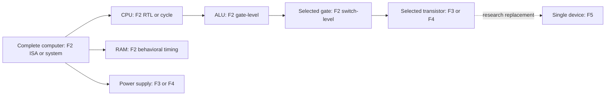
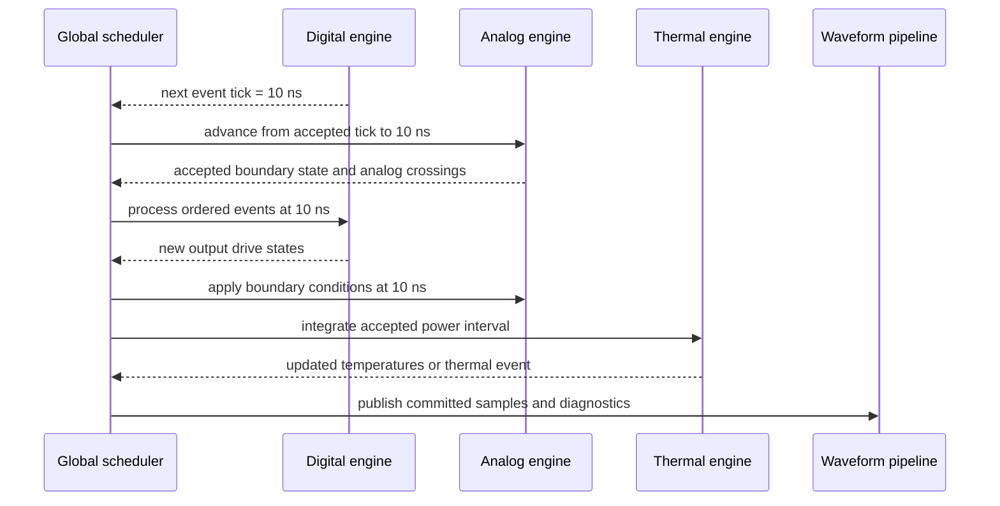

# Multi-Fidelity and Co-Simulation

Status: Normative  
Related: [Simulation Engine](./SIMULATION_ENGINE.md), [API and Worker Protocols](./API_AND_WORKER_PROTOCOLS.md)

## 1. Architectural intent

No single solver can economically represent a complete computer with full device physics. The platform therefore composes multiple fidelity levels and makes every boundary explicit. Small electrical circuits may use SPICE-level models; selected transistor networks may use detailed or switch-level models; large digital circuits use event-driven or RTL models; CPUs/GPUs use RTL or cycle models; complete computers use architecture or ISA models; and large jobs move to cloud/HPC workers. [Source brief, pp. 12-21, 43-44]

The platform MUST never describe a functional or behavioral result as transistor-accurate. Fidelity is part of the project, execution plan, diagnostics, and result provenance.

## 2. Canonical fidelity levels

| Level | Name | Semantics | Representative uses | Default placement |
|---:|---|---|---|---|
| F0 | connectivity | topology, pin/domain compatibility, no dynamic behavior | schematic validation, harness and connector planning | browser |
| F1 | ideal/equation | ideal continuous equations without non-ideal device physics | ideal RLC, sources, simple educational blocks | browser Rust/WASM |
| F2 | behavioral/timing | state machines, four-state logic, switch-level or timing behavior | gates, registers, large RAM, functional devices | browser or server |
| F3 | compact/macro | nonlinear electrical compact or macro-model | diode, BJT, MOSFET, op-amp, analog subsystem | browser when bounded; server otherwise |
| F4 | electrothermal/failure | tolerance, parasitics, leakage, heat, stress, degradation, failure | realistic electronics validation | browser when bounded; server otherwise |
| F5 | physical/research | semiconductor, field, material, detailed EM/MEMS or TCAD | individual research devices | server/HPC only |

The brief describes comparable physical-device, SPICE, switch, gate-event, RTL, microarchitecture, and ISA tiers. This project collapses them into the registry-wide F0-F5 contract while preserving an engine-specific `modelKind`. [Source brief, pp. 13-16]

## 3. Fidelity selection and execution plan

Every component instance resolves a model through this ordered input:

1. explicit instance override;
2. hierarchy-instance binding;
3. simulation scenario binding;
4. project fidelity policy;
5. component variant default.

The resolver produces an immutable `ExecutionPlan` containing:

- project and catalog snapshot digests;
- requested and resolved fidelity for every component or hierarchy block;
- selected engine adapter and build digest;
- boundary adapters and their parameters;
- partition graph and placement, local or cloud;
- deterministic timebase, event ordering policy, and seed;
- expected capabilities, resource estimate, and limitations;
- every permitted fallback and whether consent has already been granted.

Resolution MUST fail before execution when no compatible model exists, a required cross-domain adapter is absent, or two engines cannot share a supported checkpoint/time contract.

## 4. Hierarchical abstraction switching

- A reusable block MUST define stable ports, parameter mapping, state mapping where possible, and conserved quantities at each fidelity representation.
- Switching representation before a run is deterministic and recorded in the execution plan.
- Switching during a run is permitted only at a declared safe point and only when a `StateTransfer` contract exists.
- `StateTransfer` MUST define source/target model versions, mapped variables, initialization of unmapped state, energy/charge/state conservation rules, uncertainty introduced, and reversibility.
- If exact state transfer is impossible, the operation MUST restart from a declared checkpoint or be refused. Silent state reset is forbidden.
- A zoom action in the UI is not automatically a simulation fidelity change.

The brief proposes zooming from an ALU functional view through gate and transistor representations while the surrounding system remains abstract. [Source brief, pp. 16-17]

## 5. Partition contract

A co-simulation partition is a directed graph of engine instances connected by typed ports.

Each partition declares:

- `partitionId`, engine adapter/build, fidelity, local/cloud placement;
- owned component IDs and hierarchy paths;
- input/output ports with domain, quantity, unit, sample semantics, and latency;
- rollback, checkpoint, lookahead, and interpolation capabilities;
- earliest next event and maximum safe advance;
- convergence participation and failure policy.

Cross-partition direct memory sharing is prohibited except between trusted Workers of the same local engine build using an explicitly versioned shared buffer. All other communication uses versioned messages.

## 6. Global time and scheduler

Simulation time is a signed 64-bit integer count of `timeQuantumSeconds` declared in the request. The quantum MUST be small enough for every configured timing requirement and large enough to avoid overflow through `stopTick`. It is immutable for a run.

The scheduler MUST use conservative synchronization for the baseline. It never advances a partition beyond the earliest known boundary that could affect it. Optimistic execution and rollback MAY be researched later but MUST use a separate compatibility capability. [Source brief, pp. 27-28, 40]

### 6.1 Deterministic event order

Events at the same tick are ordered by:

1. cancellation and hard resource-limit events;
2. external stimuli and clock source transitions;
3. analog threshold crossings;
4. digital primitive updates;
5. resolved-net updates and contention;
6. digital-to-analog driver updates;
7. thermal/failure transitions;
8. probe sampling and waveform publication.

Within a class, order is stable by partition ID, origin component ID, port ID, and source sequence. Processing continues in delta cycles until quiescence. Exceeding `maxDeltaCycles` produces `ZERO_TIME_OSCILLATION`; the scheduler MUST NOT choose an arbitrary final state.

## 7. Digital semantics

The minimum logic alphabet is `0`, `1`, `X`, and `Z`.

- Every driver declares strength and timing characteristics. A net resolver combines all active drivers deterministically.
- Conflicting strong `0` and `1` resolve to `X` plus a `CONTENTION` diagnostic.
- No active drive resolves to `Z`; consumer behavior for `Z` is model-specific and may result in `X`.
- Gates and sequential elements declare minimum/typical/maximum or selected deterministic delay.
- Setup, hold, recovery, removal, pulse-width, and clock-domain checks produce timestamped violations.
- Metastability MAY be represented as deterministic `X` duration or seeded stochastic behavior, but the chosen policy MUST be explicit.
- Inertial versus transport delay is declared per model.

This satisfies the brief's requirements for event queues, propagation delay, setup/hold violations, unknown/high-impedance states, buses, and logic analysis. [Source brief, pp. 33-35]

## 8. Analog-to-digital boundary

An `AnalogToDigitalAdapter` declares:

- input quantity and reference domain;
- low and high thresholds;
- hysteresis and prior state;
- minimum pulse width and optional debounce;
- sampling/continuous-crossing mode;
- aperture, delay, and output strength;
- behavior for non-finite input and missing reference.

For a common example, voltage below 0.8 V may resolve to `0`, above 2.0 V to `1`, and the interval between to `X`; these values are illustrative, never universal defaults. [Source brief, p. 28]

Continuous mode requires the analog engine to locate a threshold crossing within its declared time tolerance. The crossing becomes a timestamped boundary event. An adapter MUST use hysteresis or an equivalent stabilization policy to prevent infinite chatter.

## 9. Digital-to-analog boundary

A `DigitalToAnalogDriver` MUST represent more than an ideal voltage source when the selected fidelity requires loading effects. It declares:

- supply and reference pins;
- output high/low targets as functions of supply;
- source and sink output resistance or current curves;
- rise/fall transition model;
- maximum current and clamp behavior;
- state mapping for `X`, `Z`, and contention;
- temperature and failure dependencies where supported.

`Z` becomes a high-impedance electrical model. `X` MUST use an explicit pessimistic, interval, midpoint, or disconnect policy; the choice is recorded. [Source brief, p. 28]

## 10. Other domain coupling

- ADC and DAC models use the same analog/digital boundary rules plus resolution, reference, quantization, latency, and saturation.
- Electrothermal coupling transfers accepted average or integrated power and returns temperature-dependent state.
- Sensor/actuator models declare electrical and environmental ports; cross-domain units and conservation rules are explicit.
- RF S-parameter blocks declare port reference impedance and frequency validity; time-domain substitution requires a validated transform model.
- Architecture/ISA partitions exchange functional I/O, interrupts, clocks, and modeled timing; they do not receive analog nodes unless an explicit peripheral bridge exists.

## 11. RTL, architecture, and emulation adapters

- Verilator compiles Verilog/SystemVerilog into executable C++ or SystemC models; it is the planned RTL adapter for CPU, pipeline, cache-controller, bus, and accelerator blocks. See the [official Verilator overview](https://verilator.org/guide/latest/overview.html). [Source brief, pp. 15, 18, 35]
- gem5 is the planned modular microarchitecture/full-system research adapter for pipelines, caches, DRAM, and system timing. See the [official gem5 documentation](https://www.gem5.org/documentation/). [Source brief, pp. 15-18, 36]
- QEMU is a functional machine emulator, not a transistor simulator. It may provide fast ISA/system execution behind an isolated adapter. See [QEMU licensing](https://www.qemu.org/docs/master/about/license.html). [Source brief, pp. 16, 21, 36]

Server-side RTL compilation MUST treat source and generated artifacts as untrusted. Compiled artifacts are content-addressed by source, toolchain image, flags, target, and declared dependencies.

## 12. Checkpoint and resume

A global checkpoint is valid only when every active partition is at the same accepted tick and no message is in flight.

The checkpoint manifest contains:

- run, attempt, project, execution-plan, and engine-build digests;
- accepted tick and scheduler sequence;
- each partition's versioned state object digest;
- event queues and delta-cycle state;
- random stream state;
- waveform publication cursor;
- external model and toolchain digests;
- compatibility policy and checksum.

Resume MUST reject a changed engine/model build unless a documented migration exists. A partial set of partition checkpoints cannot be presented as globally resumable.

## 13. Cancellation and backpressure

- Cancellation is cooperative within a bounded polling interval and becomes terminal after all partitions stop or the supervisor kills them.
- Only committed samples before the last accepted tick may be retained.
- The scheduler MUST bound queued events, diagnostics, and unconsumed waveform chunks.
- Backpressure first reduces display publication or spills result chunks; it MUST NOT change solver timesteps or drop electrically meaningful events without an explicit approximation policy.

## 14. Failure modes

| Failure | Required response |
|---|---|
| threshold chatter | apply declared hysteresis/minimum interval; fail with diagnostic if bound is exceeded |
| zero-time digital oscillation | stop at the tick with cycle participants and `ZERO_TIME_OSCILLATION` |
| partition advances past boundary | invalidate attempt as an engine protocol violation |
| state-transfer incompatibility | reject switch; retain prior accepted model state |
| engine crash | fail or retry entire compatible checkpointed attempt; no mixed-attempt result |
| late/duplicate message | deduplicate by partition sequence; late state-changing messages are protocol errors |
| non-finite boundary value | stop affected coupling with `NON_FINITE_VALUE` |
| checkpoint mismatch | fail resume with exact incompatible digest/version |
| unsupported fidelity | fail planning; never silently downgrade |

## 15. Validation scenarios

The co-simulation corpus MUST include:

1. CMOS inverter with analog input ramp and logic threshold crossings.
2. Digital PWM driving a non-ideal analog load.
3. ADC and DAC loopback with quantization and latency.
4. Simultaneous analog crossing and clock edge to prove tie ordering.
5. `X/Z` propagation, contention, and setup/hold violations.
6. Thermal event changing a device parameter and triggering failure.
7. Hierarchical ALU substitution with preserved port mapping.
8. Deterministic identical results under different Worker scheduling.
9. Checkpoint before a boundary event and identical resumed result.
10. Zero-time oscillator and threshold-chatter containment.

## 16. Source record

The model hierarchy and abstraction-switching requirements come from the brief, pp. 13-21. Scheduling and electrical/digital adapters come from pp. 27-28. Digital and mixed-signal roadmap behavior comes from pp. 33-35. Synchronization risk and deterministic boundary events come from p. 40. The F0-F5 names, integer timebase, exact tie order, state-transfer contract, and conservative baseline are project decisions required to make those requirements executable.
