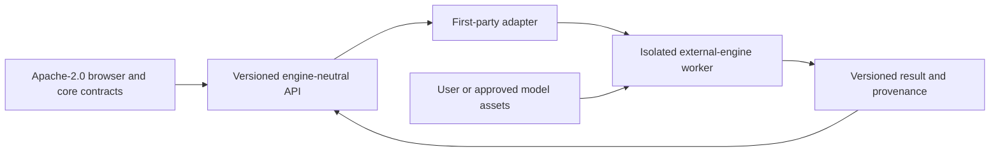

# Open Source and Third-Party Licenses

Status: Normative  
Related: [System Architecture](./SYSTEM_ARCHITECTURE.md), [Security, Privacy, and Sandboxing](./SECURITY_PRIVACY_AND_SANDBOXING.md), [Deployment, Operations, and Observability](./DEPLOYMENT_OPERATIONS_AND_OBSERVABILITY.md), [Dependency and License Matrix](../planning/DEPENDENCY_AND_LICENSE_MATRIX.md)

## 1. Purpose

This document defines the licensing, provenance, attribution, and isolation rules for the Apache-2.0 public core, hosted services, external simulation engines, imported models, standards references, symbols, physical component artwork, and reusable IC packages. The source brief recommends integrating ngspice, Xyce, Verilator, gem5, QEMU, and GPU research engines rather than attempting to replace every simulator (Source brief, pp. 21-26, 35-36, 43). That integration must not blur license or trust boundaries.

This is an engineering policy, not legal advice. A qualified legal review is required before distributing any third-party binary, model library, standards-derived asset, or dataset whose rights are not already confirmed.

## 2. Public-core policy

- The public repository is licensed under [Apache License 2.0](../../LICENSE).
- Project-authored documentation, schemas, registry metadata, original schematic symbols, original physical component artwork, original package geometry, and first-party source intended for the core use Apache-2.0 unless a file clearly states another approved license.
- Contributions are submitted under the repository license unless a separately accepted contribution agreement says otherwise.
- A hosted service may contain separately deployed modules, but public/core contracts must remain usable without a proprietary engine or provider.
- No task may change the core license, contribution terms, or public/private boundary without a superseding ADR.

## 3. Boundary model

An executable or process boundary is mandatory for GPL, mixed-license, vendor-restricted, or otherwise non-core engines. The API and result formats remain engine-neutral. Process isolation is a risk-control and architectural rule; it is not, by itself, a legal conclusion about derivative works or distribution rights.

The core MUST NOT:

- statically or dynamically link an unapproved copyleft/restricted engine into a distributed core artifact;
- embed third-party engine source, runtime libraries, model files, firmware, disk images, traces, or test data without recorded permission;
- imply that access to an API changes the license of the external engine or user workload;
- silently download or execute an engine/model whose source, digest, license, and policy are unknown.

## 4. Dependency record

Every dependency or external engine record includes:

- canonical name, upstream URL, exact version and immutable source/binary digest;
- license expression and included license/notice files;
- distribution mode: source, binary, optional user installation, hosted-only, or reference-only;
- linking/execution boundary and generated-output considerations;
- included models, code models, resources, plugins, firmware, images, traces, and datasets;
- known export, patent, trademark, attribution, or usage restrictions;
- security-support and end-of-life status;
- owner, review date, legal/security decision, and replacement/export path.

The release SBOM and [`NOTICE.md`](../../NOTICE.md) are generated from approved pinned dependencies, not from an aspirational roadmap list.

## 5. External-engine policy

| Engine/tool | Planned role | Required boundary | Policy before release |
|---|---|---|---|
| ngspice | SPICE-compatible reference and heavy analog simulation | Separate adapter or approved isolated library worker | Verify exact source/build license, bundled code models, model libraries, callbacks, and redistribution rights |
| Verilator | Verilog/SystemVerilog lint and compiled models | Sandboxed compiler/runtime worker | Preserve tool notices; review generated runtime and user HDL rights; pin compiler and build image |
| Xyce | Large parallel SPICE-compatible jobs | Separate GPL worker/service | Do not link into Apache core; distribute only after explicit legal/license approval |
| gem5 | CPU/cache/DRAM and full-system research | Separate research worker | Preserve BSD-style and source-specific notices; separately review resources/workloads |
| QEMU | Functional ISA/machine execution | Separate worker | Review the exact component/build license matrix, firmware, ROMs, device models, and guest images |
| Accel-Sim/GPGPU-Sim | GPU/accelerator research | Separate research worker | Review every repository/component, trace tool, CUDA/NVIDIA dependency, workload, and dataset |

Official upstream references are maintained in the [Dependency and License Matrix](../planning/DEPENDENCY_AND_LICENSE_MATRIX.md). A roadmap entry is not permission to ship an engine.

## 6. Imported and vendor models

SPICE, Verilog/SystemVerilog, Verilog-A/AMS, IBIS, Touchstone, firmware, waveform, and dataset assets are untrusted and license-bearing content.

Every imported asset stores:

- content digest and immutable original bytes;
- format and declared version;
- source/author/vendor and acquisition URL or artifact reference;
- SPDX expression where known, original license text/notice, redistribution permission, and review state;
- normalized logical-pin map and package binding;
- supported analyses, fidelity, operating envelope, validation evidence, and limitations;
- visibility and sharing policy independent of the containing project.

Default policy:

- user-provided assets remain private to authorized users and are not redistributed by the public library;
- an unknown, encrypted, click-through, or redistribution-restricted model cannot be published as a built-in asset;
- a vendor name or part number does not imply endorsement, accuracy, or redistribution permission;
- deleting a model removes authorized references according to retention policy but does not rewrite immutable historical evidence required by law/security policy;
- results retain model digests and provenance without exposing private model contents.

## 7. Standards, symbols, and physical packages

- IEC 60617, IEEE 315, JEDEC package terminology, manufacturer drawings, and similar standards/datasheets may guide naming, orientation, and verification only within their access and license terms.
- IEC/vendor artwork, protected package drawings, logos, trademarks, or copied product photography MUST NOT be committed as project artwork without explicit permission.
- Schematic symbols and realistic physical views are original scalable/procedural project assets with provenance records.
- Generic package dimensions are labeled illustrative. Dimensional or manufacturing claims require a cited, permitted source and independent verification.
- Device function, electrical model, schematic symbol, physical package, optional footprint, and vendor identity remain separate records.
- Package markings use generic/user-supplied text by default; protected vendor marks require explicit rights.
- Every symbol/package binding has an explicit logical-to-physical pin map. Appearance never overrides electrical identity.

## 8. Data, examples, and documentation

- Example circuits, reference programs, firmware, disk images, waveforms, screenshots, and benchmark datasets require the same provenance/license review as source code.
- A citation or public URL does not grant redistribution rights.
- Documentation may link to an authoritative external source while excluding its protected text/artwork.
- Verbatim copied material remains within applicable license and quotation limits; project documentation should explain behavior in original words.
- Public tutorial projects list all third-party assets and licenses in their project manifest.

## 9. Contribution and review workflow

1. The contributor declares source, authorship, license, and any generated/vendor content.
2. Automated checks inventory new packages/files and flag missing SPDX/notice/provenance fields.
3. Security review determines trust and execution boundaries.
4. License review determines whether the artifact may be linked, hosted, redistributed, referenced only, or rejected.
5. Validation review confirms the artifact does not create an unsupported accuracy claim.
6. Approved attribution, SBOM, registry, dependency matrix, and notices are updated in the same change.

Contributions with unclear rights remain quarantined and cannot become `Released`.

## 10. Release and runtime enforcement

Before release:

- every shipped artifact has an immutable digest, license record, source location, notice, and approval;
- the dependency/license matrix matches the SBOM and actual container/browser artifacts;
- worker images contain only approved engines and resources;
- public examples and component/package assets pass attribution and provenance audits;
- license texts and attributions are accessible in source and distribution forms as required;
- hosted-only artifacts are not accidentally included in public-core packages;
- export/download behavior respects each asset's visibility and redistribution policy.

At runtime, the platform exposes engine/model/package identity and limitations with results. It does not hide a license restriction behind a generic component name.

## 11. Incident and revocation

If ownership, license, provenance, or redistribution permission is disputed:

1. quarantine the affected version/digest from new use or publication;
2. preserve security/audit evidence without continuing public distribution;
3. identify impacted projects, results, examples, and releases by immutable digest;
4. follow the approved legal/takedown and user-notification process;
5. replace the artifact through a new version rather than rewriting published project history;
6. record the decision, remediation, and migration path.

## 12. Acceptance criteria

1. The public core and every shipped artifact have machine-readable license/provenance records.
2. GPL/mixed/restricted engines remain outside core artifacts and behind documented process/API boundaries unless a later legal decision explicitly approves another arrangement.
3. Every imported/built-in model and dataset has source, digest, license, pin map, fidelity, validation, visibility, and limitation metadata.
4. Original symbols, physical component bodies, and IC packages contain no copied protected IEC/vendor artwork or marks.
5. The SBOM, dependency matrix, license files, `NOTICE.md`, container contents, and release manifest agree.
6. Unknown-rights content cannot be published, bundled, or silently executed.
7. Quarantine and replacement preserve auditability and project/result provenance.

## 13. Source and decision record

The external-engine strategy is grounded in the source brief, pp. 21-26, 35-36, and 43. Component-model provenance and accuracy risks are grounded in pp. 31-32 and 39-40. Apache-2.0, process isolation, package/artwork separation, SBOM, and asset-publication rules are repository decisions recorded by ADR-0008 and ADR-0010.
