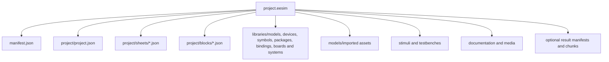

# Project File Format

Project portability includes exact scientific-model, generic/vendor-device, symbol, package, pin-profile, device-package binding, board/module, system, benchmark, and dependency revision IDs plus content hashes. Mutable aliases may be retained for display/search, but save and simulation manifests resolve them to immutable revisions. See [Hierarchical Model and Library Architecture](./HIERARCHICAL_MODEL_AND_LIBRARY_ARCHITECTURE.md).

Cloud ownership, guest migration, and sync metadata are not required to open a portable `.eesim` archive. Account migration creates a cloud-owned revision/reference record without rewriting the archive's scientific identity, and retains the local copy until acknowledgement. Credentials, OIDC tokens, database keys, and private object URLs are prohibited from the archive.

Status: Normative  
Related: [System Architecture](./SYSTEM_ARCHITECTURE.md), [Storage, Versioning, and Collaboration](./STORAGE_VERSIONING_AND_COLLABORATION.md), [Component Model Contract](../catalog/COMPONENT_MODEL_CONTRACT.md)

## 1. Purpose

The portable project format is a versioned, self-describing archive with the extension **.eesim**. It preserves the electrical design, hierarchy, selected component and package definitions, simulation configuration, stimuli, tests, measurements, documentation, and referenced assets needed to reopen or reproduce a supported project. The unverified source brief proposes preserving schematic, hierarchy, models, configurations, waveforms, measurements, testbenches, version history, comments, and documentation across local and cloud workflows. [Source PDF, pp. 31-32] The repository format contract independently makes the adopted behavior normative and requires current conformance evidence.

An archive is a transport artifact, not a live database and not an executable program. Opening an archive MUST NOT execute an imported model, firmware image, HDL source, custom equation, or script.

## 2. Container and canonical layout

The .eesim container MUST be ZIP-compatible and MUST contain exactly one root manifest named **manifest.json**. Paths use UTF-8, forward slashes, no leading slash, and no parent traversal.

Normative members are:

| Path | Purpose | Required |
|---|---|---|
| manifest.json | format version, identity, member digests, feature declarations, provenance | yes |
| project/project.json | project metadata, root hierarchy, settings, active catalog locks | yes |
| project/sheets/*.json | schematic entities, geometry, annotations, and view state | at least one |
| project/blocks/*.json | reusable hierarchical block definitions and port maps | when referenced |
| libraries/components/*.json | embedded custom or frozen component definitions | when not available by immutable built-in digest |
| libraries/scientific-models/*.json | declarative custom or frozen scientific-model revisions and dependency metadata | when not available by immutable built-in digest |
| libraries/devices/*.json | frozen generic or vendor device revisions and bounded overrides | when referenced and not available by immutable built-in digest |
| libraries/symbols/*.json | frozen schematic-symbol revisions | when not available by immutable built-in digest |
| libraries/packages/*.json | embedded reusable physical and IC package definitions | when not available by immutable built-in digest |
| libraries/pin-profiles/*.json | exact logical topology revisions | when not available by immutable built-in digest |
| libraries/device-package-bindings/*.json | exact device/pin-profile-to-package contact equivalence records | when a package is bound |
| libraries/boards/*.json | exact board/module composition revisions | when referenced and not available by immutable built-in digest |
| libraries/systems/*.json | exact complete-system composition revisions | when referenced and not available by immutable built-in digest |
| libraries/benchmarks/*.json | benchmark/evidence manifest revisions; raw evidence remains content-addressed | when referenced or retained with results |
| models/* | imported SPICE, HDL, IBIS, Touchstone, firmware, data, or other declared model assets | when referenced |
| stimuli/*.json | named deterministic stimuli and environment profiles | optional |
| testbenches/*.json | test topology, assertions, probes, and expected envelopes | optional |
| documentation/* | project notes and safe media | optional |
| results/manifests/*.json | immutable result provenance and chunk index | optional |
| results/chunks/* | optional retained waveform or event data | optional and bounded |

Cloud-only ACLs, presence, transient cursors, signed object URLs, worker leases, secrets, billing records, and access tokens MUST NOT be embedded.

## 3. Manifest contract

The manifest MUST declare:

- format name and semantic format version;
- project ID, portable revision ID, creation time, and producing application version;
- canonical project-member path;
- ordered member list with media type, byte length, and SHA-256 digest;
- required and optional feature identifiers;
- scientific-model, component, semantic-profile, parameter-definition, symbol, package, pin-profile, device-binding, board/system, and benchmark snapshot digests;
- minimum reader version and migration requirements;
- archive normalization profile;
- source/provenance notices and license summary;
- whether optional results, imported models, firmware, HDL, or custom packages exist;
- archive safety counters: total members, expanded bytes, maximum member bytes, and nesting declaration.

Unknown required features MUST make the archive unsupported. Unknown optional features MAY be preserved opaquely only when save/export can retain their bytes and digests without interpretation; otherwise the application MUST open read-only or refuse the round trip.

## 4. Stable identity and references

- Project, sheet, block, component instance, generic/vendor device, pin, net, scientific model, dependency edge, symbol, package, package contact, pin profile, device-package binding, board, system, benchmark, stimulus, testbench, probe, and result IDs are opaque stable identifiers.
- Display names are never identity.
- Every reference MUST include the expected object kind. Cross-kind ID reuse is invalid even if strings match.
- Built-in definitions are addressed by stable ID, version, and immutable digest.
- Embedded definitions use archive-scoped stable IDs and content digests. A later import MUST NOT silently replace them with a same-named built-in definition.
- References MUST be acyclic except for permitted electrical feedback inside a sheet. Hierarchy definition cycles are invalid.
- Mutable search/display aliases MUST resolve to an exact immutable revision ID and content hash before save, publication, or simulation; a later library revision cannot silently alter an archived project.

## 5. Schematic and physical representation

The electrical project owns one component instance and one net graph. Schematic, realistic physical, and breadboard views are projections of that same identity; they are not parallel circuits.

Each component instance MAY contain:

- a schematic symbol binding and transform;
- a physical representation binding and physical transform;
- an optional breadboard placement and lead-routing record;
- a reusable package binding;
- a pin-map binding that resolves every physical electrical connection back to the canonical component pin.

Changing view MUST NOT change the component definition, electrical model, parameters, hierarchy, nets, or simulation result. A view-specific annotation MAY differ, but any edit that changes connectivity is a domain command applied to the shared net graph.

Physical dimensions are stored in SI base units. Display in millimetres, inches, or grid units is presentation-only. When a drawing uses deliberate visual exaggeration for legibility, the definition MUST keep separate **physicalDimensions** and **renderExaggeration** records so the exaggerated art is never treated as manufacturing geometry.

This dual-view requirement refines the brief's visual editor, beginner-component, visualization, and reusable-subcircuit goals. [Source PDF, pp. 22-23, 30-32, 37; REQ-037]

## 6. Reusable package definitions

A **PackageDefinition** is independent of an electrical component model and MUST include:

- stable package ID, semantic version, aliases, package family, lifecycle, provenance, and license;
- body dimensions, body outline, height, material/color presentation, and allowed dimension ranges;
- package-pin IDs, displayed numbers/names, electrical or mechanical role, positions, lead/land/ball geometry, and side or grid location;
- pin-numbering traversal and a deterministic orientation origin;
- pin-1, polarity, notch, chamfer, tab, exposed-pad, key, or ball-A1 markings as applicable;
- body label and marking zones that cannot obscure orientation or pins;
- physical scale, placement courtyard, collision bounds, and breadboard anchors where applicable;
- supported renderer versions and golden visual fixtures;
- known limits and whether the geometry is illustrative, nominal, or manufacturer-derived.

A component variant may support multiple packages, and one package definition may be reused by many component variants. Selecting a package creates or changes only a package binding unless the selected variant also explicitly changes the electrical model.

The baseline package system MUST support axial and radial through-hole bodies, LED and diode bodies, common transistor and power-device bodies, SIP/DIP, SOIC/TSSOP, SOT, TO, QFP, QFN/DFN, and BGA-style geometry through reusable definitions or constrained parametric families. This is a project requirement derived from the user's physical-component and individually designable IC-package direction; it complements the brief's component, schematic, and reusable-library scope. [Source PDF, pp. 22-23, 30-32; REQ-038]

## 7. Pin-map equivalence

A **PinMap** binds canonical component pins to package pins without changing model semantics.

Required rules:

1. Every required canonical electrical pin maps to at least one package electrical pin.
2. Every package electrical pin maps to a canonical pin or has an explicit no-connect/reserved declaration.
3. Duplicate mappings are invalid unless the relation explicitly declares equivalent parallel pads, internally connected pins, or multiple physical contacts for one electrical terminal.
4. Mechanical pins, shields, thermal pads, and keys MUST declare whether they are electrically modeled, optionally connected, or non-electrical.
5. Symbol units and hidden power pins MUST remain discoverable in the mapping; hidden rendering does not remove electrical identity.
6. Package numbering, model pin order, and schematic display order MUST remain distinct fields.
7. A mapping change invalidates affected connectivity caches and visual equivalence evidence, but MUST NOT mutate a published version.

Import, save, migration, view switching, and simulation snapshot creation MUST run the equivalence validator. A blocking mismatch produces a structured diagnostic and prevents simulation or package-aware breadboard routing.

## 8. Parametric custom-package records

The custom-package designer stores declarative geometry only. It MUST NOT store executable drawing scripts, remote image URLs, shader source, or unrestricted SVG.

A custom definition records:

- base package family and designer-schema version;
- body length, width, height, pitch, row/side/grid counts, lead dimensions, and permitted family-specific parameters;
- deterministic numbering rule and orientation mark;
- explicit overrides for allowed labels, omitted positions, exposed pads, keys, or mechanical features;
- validation results, author/source, license, revision, and immutable digest;
- an associated pin map or an explicit unbound state.

The designer MUST enforce finite values, family-specific dimension ranges, non-overlapping pins, unique pin numbers, valid body clearance, supported pin counts, deterministic geometry, and accessible orientation. Invalid definitions may be saved as drafts but cannot become released library assets or participate in simulation wiring.

## 9. Project and simulation records

The project record MUST capture:

- root sheets and hierarchy instances;
- model/fidelity policy and per-instance overrides;
- SI-valued parameters and presentation preferences separately;
- deterministic time quantum and stochastic root seed where configured;
- local/cloud placement preferences that do not override server policy;
- named analyses, probes, retention policy, stimuli, and testbenches;
- view bindings, package bindings, pin maps, and renderer-version locks needed for deterministic visual fixtures.
- exact scientific-model/device/symbol/pin-profile/package/binding/board/system/benchmark revisions, content hashes, and complete dependency/lineage manifest.

A retained result MUST reference the exact project-member digest set, execution-plan digest, engine/model versions, determinism class, seed, units, probe mapping, completeness, and chunk checksums. A result never serves as the authoritative project state.

## 10. Deterministic serialization

The canonical unpacked representation is Git-friendly:

- one semantic object per predictably named JSON file where practical;
- UTF-8, LF line endings, no byte-order mark;
- object keys in lexical order;
- arrays sorted only when their contract is set-like; order-significant arrays retain semantic order;
- finite decimal numbers in the canonical numeric form; NaN and infinity are forbidden;
- timestamps in UTC RFC 3339 form;
- no editor-generated whitespace or volatile timestamps in semantic files;
- media and imported binaries stored by content digest.

The packed archive sorts members lexically, uses fixed metadata values defined by the normalization profile, and excludes transient caches. Two exports of the same canonical snapshot under the same format version MUST have identical semantic member digests; byte-identical archive output is REQUIRED for the canonical export profile.

## 11. Versioning and migration

- **formatVersion** changes according to semantic compatibility: patch for clarifications that do not alter bytes, minor for backward-readable additions, major for incompatible structure.
- Readers MUST preserve the original archive until a migration succeeds.
- Migrations are forward-only, deterministic, ordered, and idempotent at their target version.
- Every migration emits a report of changed objects, defaults materialized, unsupported data, warnings, and before/after digests.
- No migration may guess an electrical pin map, silently merge nets, reinterpret units, or fabricate package geometry.
- A migrated project is a new working revision. The source archive and published versions remain immutable.
- A future-version archive opens read-only only if every required feature is understood and a lossless export remains possible.

## 12. Archive safety

Before extraction, the reader MUST enforce:

- maximum member count, per-member bytes, expanded bytes, compression ratio, path length, and nesting depth;
- rejection of absolute paths, parent traversal, duplicate normalized paths, links, devices, and case-collision ambiguity;
- media-type verification by content rather than extension alone;
- checksums before semantic use;
- JSON depth, string length, collection size, and numeric bounds;
- safe media decoding and sanitized documentation rendering;
- quarantine of executable/imported content until explicit model validation.

Archives MUST be parsed in a bounded Worker locally or an isolated import service in cloud mode. Failure is atomic: an invalid archive MUST NOT partially merge into the current project.

## 13. Round-trip and acceptance criteria

1. Pack, unpack, and repack preserve all canonical semantic digests.
2. A project produces the same netlist and simulation request before and after switching schematic, physical, and breadboard views.
3. DIP, SOIC, QFP/QFN, BGA, axial, radial, LED, diode, transistor, and power-package fixtures preserve scale, orientation, numbering, and pin-map equivalence.
4. A valid custom package regenerates identical geometry from its parameters; invalid dimensions or duplicate pins are rejected.
5. Unknown required features, corrupt members, traversal paths, decompression bombs, non-finite values, and mismatched digests fail atomically.
6. Supported older fixtures migrate deterministically with recorded before/after digests.
7. Published versions and their retained results remain immutable after migration or package editing.

## 14. Source record

Project contents, browser storage, cloud versioning, collaboration, public libraries, and documentation are grounded in the feasibility source. [Source PDF, pp. 31-32, 41-42] Hierarchy and reusable subcircuits follow its circuit-to-computer scope and staged examples. [Source PDF, pp. 2, 16, 29, 34-37] The `.eesim` container, exact normalization, dual visual projections, reusable package records, custom-package designer, and pin-map rules are repository decisions supporting REQ-006, REQ-037, and REQ-038.
