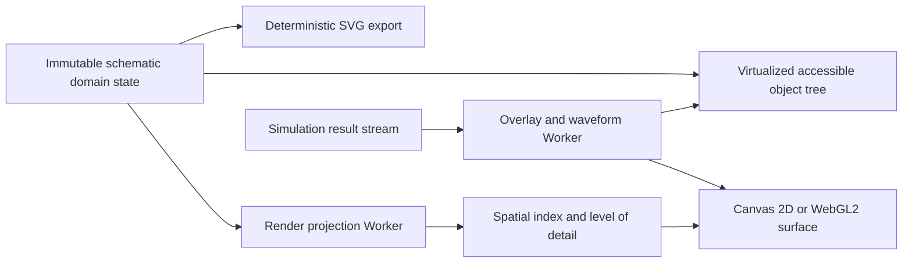
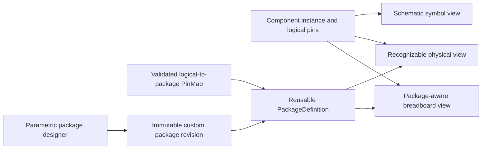
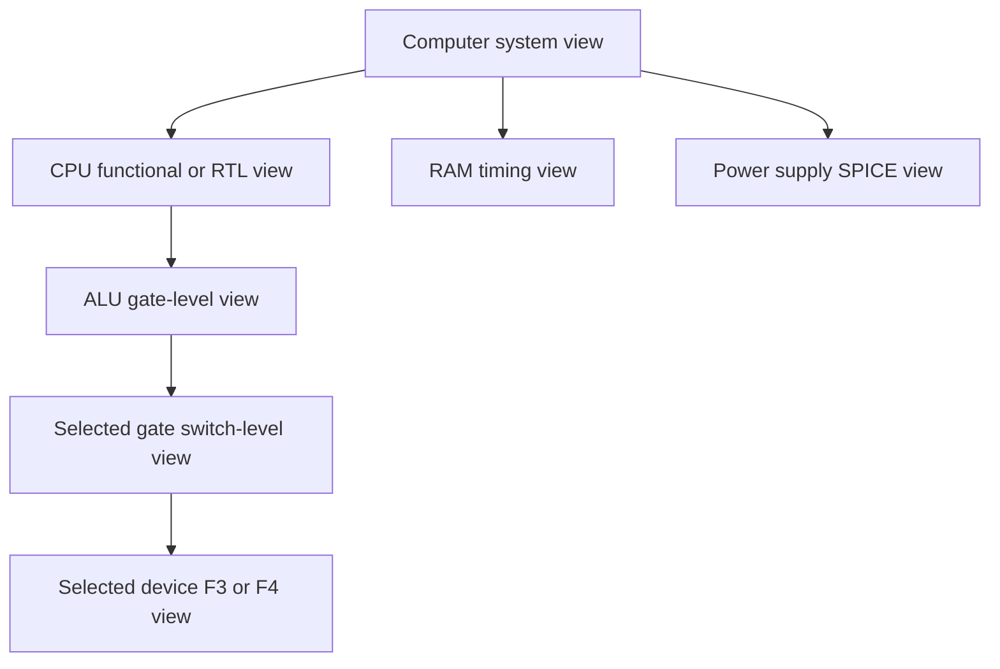

# Schematic Editor and Visualization

Status: Normative  
Related: [System Architecture](./SYSTEM_ARCHITECTURE.md), [Project File Format](./PROJECT_FILE_FORMAT.md), [Performance, Browser, Accessibility, and Internationalization](./PERFORMANCE_BROWSER_ACCESSIBILITY_AND_I18N.md), [Physical Appearance and Packages](../catalog/PACKAGE_AND_PHYSICAL_APPEARANCE.md)

## 1. Scope

This document defines the browser schematic editor, symbol and net interaction, hierarchy navigation, waveform and state visualization, export behavior, and accessibility representation. The editor MUST support beginner through research workflows without changing the electrical meaning of a project. The source PDF calls for drag-and-drop schematic capture, wire routing, property editing, waveform display, heat and signal overlays, hierarchy navigation, and guided diagnostics. [Source PDF, pp. 22-23, 30-32]

## 2. Rendering architecture

The primary design surface MUST use retained domain state with an immediate-mode Canvas 2D or WebGL2 renderer. React owns the application shell and panels, not one DOM node per schematic primitive.

- Canvas 2D is the compatibility baseline. WebGL2 MAY be selected for large projects after feature detection.
- WebGPU MAY accelerate visualization or independent batch processing only after benchmark evidence. It MUST NOT be required for file correctness or basic editing. Sparse, branch-heavy circuit solves are not presumed to benefit. [Source PDF, pp. 24-25]
- SVG MUST be produced for export, printing, clipboard interoperability, and accessible static views. It MUST NOT be the required interactive renderer for large projects because excessive DOM/SVG nodes are an identified performance risk. [Source PDF, pp. 22, 39-40]
- Rendering MUST be deterministic for the same project, viewport, theme, font metrics, and renderer version.

## 3. Coordinate and geometry model

- Project geometry uses integer **schematic units**. One grid step is `1000` schematic units; fractional display coordinates are never persisted.
- The default placement grid is one grid step. Pins MUST lie on half-grid increments or finer only when a symbol definition explicitly declares that grid.
- Positions are stored in project space; zoom, pan, and device pixel ratio are view state.
- Rotation is one of `0`, `90`, `180`, or `270` degrees. Reflection is represented independently as `mirrorX` or `mirrorY`.
- Wire segments use orthogonal routing by default. Explicit diagonal or curved graphical annotations are permitted but MUST NOT become electrical wires.
- Hit testing MUST use a screen-space tolerance that does not change stored geometry.

## 4. Domain projection

The editor consumes the canonical project entities rather than owning a separate electrical model:

| Entity | Required editor projection |
|---|---|
| Component instance | stable instance ID, definition/version reference, position, transform, variant, parameters, model selection |
| Pin | stable pin ID, electrical role, direction, domain, net attachment point |
| Net | stable net ID, segments, junctions, labels, connected endpoints, domain and optional parasitics |
| Hierarchy instance | stable instance path, referenced sheet or reusable block, parameter bindings |
| Probe/instrument | target reference, channel configuration, display placement |
| Annotation | text/shape/image reference, language, accessibility description; no electrical effect |
| Diagnostic | code, severity, target references, localized message key, suggested actions |

Every command MUST address entities by stable ID. Screen coordinates or array indexes MUST NOT be used as identity.

## 5. Schematic, physical, and package-design views

The editor exposes different projections of one electrical component instance; it MUST NOT create a second circuit when a user changes view.

### 5.1 View invariants

- Switching among schematic, physical, and breadboard views MUST preserve instance ID, net connectivity, logical pins, parameters, selected model and fidelity, simulation state, selection, collaboration references, and undo/redo history.
- Physical lead or contact positions are render and placement projections of validated logical-to-package mappings. Moving a visual lead MUST NOT silently rename, reorder, merge, or disconnect an electrical pin.
- Selecting another compatible package changes only the package binding and physical projection. Any package-parasitic model change requires a separate, explicit, user-visible model binding recorded in result provenance.
- The editor MUST show whether package dimensions are illustrative, verified from a cited source, or intentionally exaggerated for legibility. A realistic view MUST NOT be represented as a PCB footprint or manufacturing certificate.

### 5.2 Recognizable basic-component appearance

Every released `basic-component` variant MUST offer an original scalable physical representation consistent with its common real-world form. At applicable zoom levels the representation shows body silhouette, leads or contacts, orientation or polarity, value or device marking, and material regions. Required examples include axial and SMD resistors, radial and polarized capacitors, diodes and LEDs, switches, relays, sensors, connectors, transistor/power packages, and common IC bodies.

The inspector MUST expose the component family, variant, selected package, orientation, polarity or pin-one cue, logical pin, package pin, value/marking, accuracy status, and applicable limitation in text. Shape, numbering, labels, and accessible descriptions MUST carry every meaning that color communicates. [Source PDF, pp. 22-23, 30-31; REQ-037 is a repository decision.]

### 5.3 Reusable IC package selection

- Package selection MUST use versioned `PackageDefinition` records from the built-in, project-local, or approved shared library.
- IC function, schematic symbol, electrical model, package, pin map, and optional footprint metadata remain separately selectable records.
- The package chooser MUST preview body style, mounting style, pin count, pitch, numbering direction, orientation marker, exposed pad, dimensions, provenance, accuracy status, and compatibility diagnostics before applying a binding.
- DIP, SIP/ZIP, SOIC/SSOP/TSSOP, QFP, QFN/DFN, PLCC, LGA, BGA/CSP, SOT, TO, power, and constrained custom forms MUST use distinct package geometry rather than a generic rectangle with renamed pins.
- A device may offer several compatible packages and a package may serve several devices. Compatibility never authorizes an inferred pin map.

### 5.4 Parametric custom-package designer

The package designer is a constrained metadata editor, not an arbitrary script or PCB-layout surface. It MUST allow a user to create a distinct immutable package revision by configuring supported body, lead/pad/ball, pin-count, pitch, numbering, orientation, exposed-pad, label, material, color, dimension, limit, and logical pin-map fields.

The designer MUST provide a live scalable preview, logical and physical pin tables, rotation previews, textual geometry summary, unit-aware fields, keyboard operation, and structured validation. It MUST reject non-finite or out-of-range dimensions, unsupported pin counts, duplicate or missing pin numbers, collisions, invisible orientation cues, unmapped required logical pins, unexplained package pins, and invalid exposed-pad mappings. Saving a revision MUST NOT modify prior project versions or silently rebind existing component instances. [Source PDF, pp. 26-27, 29-32; REQ-038 is a repository decision.]

## 6. Command and history model

Editor changes MUST be expressed as typed commands such as `placeComponent`, `setParameter`, `connectPins`, `splitNet`, `deleteSelection`, `moveSelection`, `createHierarchy`, and `attachProbe`.

Each command MUST contain:

- `commandId`, `actorId`, `baseRevision`, and client timestamp;
- explicit target IDs and normalized payload;
- a deterministic validation result;
- an invertible operation or a recorded prior value for local undo;
- an idempotency key when sent to the cloud.

Undo and redo are local intent histories. They create new operations and MUST NOT rewrite published project versions. Collaborative undo MUST compensate only the requesting actor's eligible operation; it MUST NOT roll back unrelated remote edits.

## 7. Placement, wiring, and electrical rules

### 7.1 Placement

- The component palette MUST be searchable by stable ID, display name, aliases, category, domain, and analysis support.
- A placed component MUST resolve to an exact component definition version and variant.
- Default parameters are materialized at simulation snapshot time; the UI MAY display inherited defaults but MUST distinguish them from user overrides.
- A symbol may be placed only if its definition passes catalog validation.

### 7.2 Wiring

- Connecting two compatible pins creates or merges a net.
- Wire crossings do not connect unless a junction exists or the routing operation explicitly joins them.
- Deleting a junction MUST deterministically split the net when electrical continuity is removed.
- Net labels connect only within their declared scope: sheet, hierarchy, or project-global.
- Ground and reference symbols carry explicit domain semantics; visual similarity MUST NOT merge analog, digital, chassis, earth, thermal, optical, fluid, or mechanical references.
- Domain adapters are required for cross-domain coupling. The editor MUST reject or diagnose direct incompatible-domain connections.
- Net ties and jumpers MUST preserve separate logical nets and record their physical or conditional connection semantics.

### 7.3 Incremental validation

Validation runs in a Worker after every committed command batch. It MUST detect at least dangling required pins, floating analog nodes, missing reference nodes, incompatible domains, output contention, direct source shorts, illegal parameter units, unresolved models, hierarchy cycles, duplicate stable IDs, and unsupported analysis/model combinations. Invalid circuits may be saved, but simulation MUST be blocked only by diagnostics classified as blocking for the requested analysis. [Source PDF, pp. 9-11, 32, 39-40]

## 8. Hierarchy and abstraction navigation

- A hierarchy instance path is a sequence of stable instance IDs, never display names.
- Opening a lower-fidelity or higher-fidelity view MUST preserve port mapping and parameter bindings.
- Cross-probing MUST map a result to every valid abstraction view through declared `portMap` and `stateMap` metadata.
- Expanding a model MUST create an explicit project change or a temporary inspection view; the UI MUST state which one.
- Unsupported abstraction transitions MUST be disabled with an explanation rather than synthesized silently.

This navigation implements the brief's central concept: a system may use functional CPU and RAM models while selected gates or power sections use detailed electrical models. [Source PDF, pp. 16-20]

## 9. Visualization layers

The renderer uses ordered layers:

1. background and grid;
2. sheet frame and annotations;
3. wires, buses, and junctions;
4. component symbols and pin labels;
5. selection, handles, and editing previews;
6. diagnostics;
7. simulation state overlays;
8. collaboration cursors and comments.

The following result overlays are supported where data exists: voltage, current direction and magnitude, power, temperature, logic `0/1/X/Z`, component state, failure state, timing violations, memory-cell state, CPU pipeline state, cache hit/miss, and GPU warp state. [Source PDF, p. 31]

### 9.1 Truthfulness rules

- Animated current particles represent conventional current direction and relative magnitude only. They MUST NOT be labeled or implied as electron drift speed. [Source PDF, p. 31]
- Color MUST never be the only carrier of voltage, temperature, logic, warning, or failure information.
- Heat maps MUST show units, scale, range, and whether values are instantaneous, averaged, estimated, or measured by the model.
- Failure effects such as smoke are optional educational decoration. They MUST be accompanied by a textual failure code and MUST NOT obscure the circuit or imply unsupported physical accuracy.
- Any interpolated, decimated, or estimated value MUST be distinguishable from a solver sample in inspection and export.

## 10. Waveform and instrument views

- Waveforms MUST render from chunked, multiresolution data and request only the level needed for the viewport.
- Raw retained samples remain immutable; viewport decimation MUST NOT alter measurements or exported raw data.
- Every axis MUST display quantity, unit, scale type, and timebase.
- Cursors, delta measurements, derived traces, FFTs, and protocol decoding MUST record their calculation configuration.
- A waveform gap, dropped chunk, non-finite sample, or incomplete run MUST be visible and MUST NOT be connected by a misleading line.
- Logic analyzer views MUST display `X`, `Z`, contention, and setup/hold diagnostics explicitly.
- Screen-reader summaries MUST provide trace names, extrema, transition counts, selected cursor values, and diagnostic events.

## 11. Interaction modes

The platform MAY tailor default panels and guidance by mode, but mode MUST NOT alter project semantics:

| Mode | Default experience |
|---|---|
| Beginner | guided component set, automatic orthogonal routing, plain-language diagnostics, animated but truthful overlays |
| Intermediate | instruments, BJT/MOSFET/op-amp, AC analysis, tolerance and heat |
| Advanced | custom models, mixed-signal, Verilog import, Monte Carlo, CPU and memory timing |
| Research | solver controls, custom devices, parameter sweeps, cluster execution, detailed provenance |

These modes reflect the brief's proposed user progression. [Source PDF, pp. 30-31]

## 12. Accessibility

- The schematic MUST expose a virtualized semantic tree organized as sheet, hierarchy block, component, pin, net, instrument, and diagnostic.
- All commands MUST be available through keyboard navigation and command search.
- Keyboard users MUST be able to place, move, rotate, configure, connect, disconnect, inspect, simulate, and measure without pointer input.
- Focus MUST persist by stable entity ID across rerenders and remote updates.
- Spatial relations MUST have textual forms, for example, "R1 pin 2 connected to net OUT with C1 pin 1."
- Motion and flashing overlays MUST honor reduced-motion preferences and safe flash thresholds.
- Zoom MUST not be required to read critical diagnostics; panels and text scale independently.

The required target is WCAG 2.2 AA; detailed acceptance criteria are defined in the performance and accessibility document.

## 13. Export and interoperability

- SVG export MUST include stable element IDs, a textual title and description, component labels, net labels, and optional simulation overlays with legend metadata.
- PNG export MUST allow scale and background selection and MUST embed project/version identity when metadata is supported.
- Print/PDF output MUST paginate intentionally and include continuation references for split schematics.
- Clipboard copy of selected domain objects MUST use a versioned platform MIME payload plus a plain-text fallback.
- Exported diagrams MUST use original project artwork or compatible generated symbols; licensed IEC artwork MUST NOT be copied from the subscription database.

## 14. Performance and failure behavior

- Viewport culling, spatial indexing, level of detail, cached glyphs, and virtualized inspectors are mandatory for large projects. [Source PDF, pp. 29-30, 39-40]
- Layout and expensive render projection SHOULD run in a Worker. If `OffscreenCanvas` or a GPU path is unavailable, the application MUST fall back to Canvas 2D with reduced effects.
- Loss of a WebGL context MUST preserve domain state and restore with Canvas 2D or a recreated context.
- A render error MUST NOT corrupt the project or simulation state.
- If a remote collaborator deletes the focused entity, the editor MUST announce the deletion, move focus to a deterministic neighbor, and preserve unsent local text as a recoverable draft.

## 15. Acceptance criteria

1. A keyboard-only user can build, validate, simulate, and inspect the MVP LED and RC circuits.
2. Crossing wires remain distinct until an explicit junction is added.
3. Editing one hierarchical instance does not accidentally mutate another unless the shared definition is deliberately edited.
4. Pan and zoom meet the reference 50 FPS target for 500 components and 1,000 nets.
5. Voltage, heat, and logic overlays remain understandable with color disabled.
6. Raw waveform measurements are identical before and after viewport decimation.
7. A WebGL context loss falls back without losing unsaved work.
8. SVG export is deterministic and includes accessible labels.
9. Switching a mixed resistor/LED/IC project among schematic, physical, and breadboard views leaves its electrical graph, parameters, active model, and simulation results unchanged.
10. DIP, SOIC, QFN, and BGA package fixtures have distinct geometry, correct orientation and numbering, and explicit validated logical-to-package pin maps.
11. A custom IC package can be created, validated, versioned, reopened, and bound without changing an earlier package revision or inferring any electrical pin mapping.

## 16. Source record

The unverified feasibility brief discusses frontend and Worker architecture [Source PDF, pp. 22-24], reusable component/model records [Source PDF, pp. 26-27], performance optimization [Source PDF, pp. 29-30], user experience and visualization [Source PDF, pp. 30-31], project hierarchy and storage [Source PDF, pp. 31-32], MVP behavior [Source PDF, pp. 32-37], and UI/browser risks [Source PDF, pp. 39-40]. These citations preserve planning lineage only. Canvas/WebGL2, React/Next.js, integer geometry, SVG export behavior, dual schematic/physical projection, reusable package records, and the constrained custom-package designer are repository decisions whose technical acceptance requires independent evidence.
