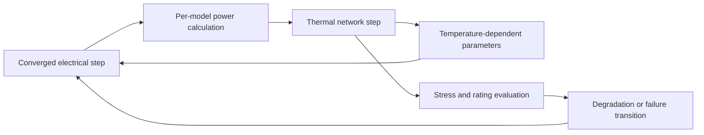

# Simulation Engine

Status: Normative  
Primary implementation target: Rust compiled to WebAssembly for eligible local jobs; the same domain contracts apply to server-native builds.

## 1. Purpose

This document defines the analog, electrical, thermal, tolerance, and failure simulation engine. It establishes numerical behavior, engine-facing component contracts, deterministic execution, diagnostics, and result integrity. Digital and cross-engine scheduling are defined in [Multi-Fidelity and Co-Simulation](./MULTI_FIDELITY_AND_CO_SIMULATION.md).

The brief requires netlist generation, Modified Nodal Analysis (MNA), nonlinear device equations, iterative solution, transient stepping, convergence checks, and waveform retention. [Source PDF, pp. 9-11]

## 2. Solver scope by release

| Capability | Minimum fidelity | Production sequence |
|---|---:|---|
| connectivity and topology checks | F0 | foundation |
| ideal R, L, C, independent and controlled sources | F1 | linear MVP |
| DC operating point and transient | F1 | linear MVP |
| diode, BJT, MOSFET, op-amp nonlinear models | F3 | semiconductor stage |
| AC small-signal analysis | F1/F3 | semiconductor stage |
| parasitics, tolerance, leakage, and power ratings | F4 | non-ideal stage |
| noise, Monte Carlo, parameter sweep | F3/F4 | non-ideal stage |
| electrothermal feedback and failure transitions | F4 | realistic electronics gate |
| physical device/TCAD model | F5 | deferred research/HPC |

The engine is not initially a complete SPICE replacement. The platform begins with a small educational solver, stabilizes UI/netlist/component architecture, and later adds compatible external backends. [Source PDF, pp. 32-33, 43]

## 3. Canonical quantities and units

- Internal numerical values MUST use SI base or coherent derived units: volt, ampere, ohm, farad, henry, watt, joule, kelvin, second, hertz, siemens, coulomb, and dimensionless ratios.
- Display prefixes and user-entered prefixes are presentation concerns. Parsed values MUST retain the original lexical form for editing but simulation uses normalized values.
- Absolute temperature is stored in kelvin; Celsius is a display/input transform.
- Simulation time uses an integer tick in the scheduler and floating-point seconds only within an analog engine step. Conversion MUST be checked for overflow and rounding.
- `NaN`, positive infinity, and negative infinity are never valid persisted parameter values or successful samples. They produce structured diagnostics.
- Parameter expressions MUST be evaluated in a bounded, deterministic expression language; arbitrary host-language execution is forbidden.

## 4. Engine-facing model contracts

### 4.1 `SimulationModel`

Every executable model binding MUST expose the following logical operations:

| Operation | Input | Output/obligation |
|---|---|---|
| `capabilities` | model and engine build | supported analyses, fidelity, limits, state/checkpoint compatibility |
| `validate` | normalized parameters, pin/domain context | zero or more structured diagnostics; no state mutation |
| `initialize` | immutable execution context and initial conditions | deterministic model state |
| `stamp` | analysis context, iterate, time, temperature | contributions to residual/Jacobian or linear matrix and source vector |
| `evaluate` | candidate state | currents, charges, fluxes, derivatives, events, and local error estimates |
| `acceptStep` | converged state and time | committed next state; irreversible within an accepted branch |
| `rejectStep` | attempted step | restore pre-step state exactly |
| `power` | accepted electrical state | signed power terms and heat source contribution |
| `thermalUpdate` | accepted thermal state | temperature-dependent parameter state |
| `failureUpdate` | stress history and policy | unchanged, degraded, open, short, intermittent, or permanent failure state |
| `checkpoint` | accepted state | versioned, endian-neutral serializable state |
| `restore` | compatible checkpoint | identical accepted state or an explicit incompatibility error |

A model MUST NOT read wall-clock time, random system entropy, network state, locale, or mutable global state. Stochastic behavior MUST consume the job's deterministic random stream.

### 4.2 `ModelBinding`

A model binding identifies:

- component definition and variant IDs;
- fidelity `F0` through `F5`;
- model kind: native equation, behavioral, digital, SPICE compact, SPICE subcircuit, external adapter, or physical research;
- model version and content digest;
- supported analyses and required engine capabilities;
- normalized parameter mapping and pin mapping;
- provenance, license, validation status, and limitations;
- deterministic fallback policy, if any.

No binding may be selected by display name or file name alone.

## 5. Netlist and topology preparation

The netlist projection MUST:

1. freeze an immutable project version and resolved catalog snapshot;
2. flatten only the hierarchy required by the selected engine while preserving an origin map;
3. resolve net labels, domain references, parameter expressions, and model bindings;
4. assign deterministic node and branch order by stable IDs;
5. retain a bidirectional origin map from solver row/column/device to project entities;
6. detect topology errors before allocation of large solver structures;
7. hash the normalized netlist and execution configuration.

The origin map is mandatory for diagnostics and result cross-probing. A flattened external netlist MUST NOT become the project's canonical representation.

## 6. Linear system and sparse representation

The baseline electrical formulation is MNA:

```text
A(x, t, T) * x = z(x, t, T)
```

where `x` contains node voltages and selected branch currents. The engine MUST use sparse storage and SHOULD support compressed sparse row/column forms, sparse LU factorization, symbolic factorization reuse, and incremental restamping. Dense solvers MAY be used only below a measured threshold. [Source PDF, pp. 9-10, 29]

Topology changes invalidate the symbolic structure. Parameter or source changes invalidate only affected numeric entries when a model declares incremental safety.

## 7. DC operating point

DC analysis MUST:

- remove or transform time derivatives according to each model contract;
- honor explicit initial conditions and source states;
- use Newton-Raphson or an equivalently documented nonlinear method;
- support configurable iteration limits, absolute and relative tolerances, and residual checks;
- try declared convergence aids in deterministic order: initial condition, source stepping, conductance stepping, damping/line search, and limited model-specific continuation;
- stop with `NON_CONVERGENCE` rather than return the last iterate as a successful result.

A successful result requires both update convergence and residual convergence. The result manifest records tolerances, iteration count, convergence aids used, and engine build. [Source PDF, pp. 9-10, 39]

## 8. Transient analysis

- The baseline integrator MUST include at least backward Euler for startup/robustness and trapezoidal or a documented higher-order method for accuracy.
- The engine MUST support adaptive timestep based on local truncation error, device breakpoints, source discontinuities, and the next scheduler boundary event. [Source PDF, pp. 10, 29-30]
- A proposed step is either fully accepted or fully rejected. Model states, thermal states, and emitted events MUST roll back on rejection.
- The engine MUST land exactly on mandatory event ticks within conversion tolerance.
- Minimum and maximum timestep, stop time, maximum accepted steps, and maximum rejected steps are explicit request limits.
- `TIMESTEP_UNDERFLOW` is terminal unless a user-selected fallback policy permits reduced fidelity or a server retry.
- Waveform production MUST be chunked and independent of viewport sampling. Selective probing is the default for large projects.

## 9. AC, noise, and sweep analyses

### 9.1 AC small signal

AC analysis MUST linearize nonlinear devices around a converged DC operating point. It MUST record that operating point identity and fail if no valid point exists. Frequency lists are normalized, strictly ordered, finite, and bounded.

### 9.2 Noise

Noise analysis MUST include resistor thermal noise, semiconductor shot noise, flicker noise, and supply noise whenever the selected models declare those contributors supported. Unsupported contributors MUST be listed; the UI MUST NOT imply a complete noise result. [Source PDF, pp. 10-11]

### 9.3 Parameter sweep and Monte Carlo

- A sweep is an ordered set of immutable child runs sharing a parent request.
- A stochastic run MUST store a root seed, sampling algorithm/version, distribution parameters, sample index, and derived child seed.
- Parallel execution MUST NOT change generated samples or aggregation order.
- Invalid samples are recorded with diagnostics and included in yield statistics according to the declared policy; they MUST NOT disappear silently.
- Tolerance correlations require an explicit correlation group and matrix; independence is the default only when documented by the component model.

## 10. Thermal and failure coupling

The minimum lumped thermal relationship is derived from power, ambient temperature, thermal resistance, and thermal capacitance. Detailed models MAY add networks and neighboring heat sources. [Source PDF, pp. 5-9, 11]



- Electrical and thermal coupling policy MUST declare its timestep and convergence method: staggered, iterated staggered, or fully coupled.
- Power sign conventions MUST be documented per domain; heat generation cannot be inferred from unsigned current alone.
- Failure policies support `warn-only`, `stop-before-transition`, `inject-deterministic`, and `inject-stochastic`.
- Supported failure states include open circuit, short circuit, resistance increase, leakage increase, intermittent failure, and permanent breakdown. [Source PDF, pp. 8-9]
- A failure transition MUST be timestamped, attributed to a rule/model, and included in the result. It MUST NOT mutate the saved project unless the user explicitly applies it as a scenario.

## 11. Determinism

For an identical input snapshot, model assets, engine build digest, execution configuration, platform determinism class, and seed, the engine MUST produce logically identical results.

Determinism classes are:

| Class | Guarantee |
|---|---|
| D0 | same engine build and hardware target, bitwise-identical result objects |
| D1 | same engine build across supported hardware, identical event order and values within declared numeric tolerance |
| D2 | external engine result; deterministic inputs and ordering, numeric tolerance declared by adapter |

Every result declares one class. Parallel reductions MUST use a deterministic order. Hash maps or work stealing MUST NOT alter event ordering or random-number consumption.

## 12. Diagnostics

Every diagnostic contains:

- stable `code` and severity `info`, `warning`, `error`, or `fatal`;
- analysis phase and timestamp/iteration when relevant;
- project targets and solver-origin references;
- message key plus machine-readable numeric/context fields;
- whether the run can continue and whether the result is complete;
- one or more bounded suggested actions;
- engine and model versions.

Mandatory codes include `FLOATING_NODE`, `SOURCE_SHORT`, `SINGULAR_MATRIX`, `NON_CONVERGENCE`, `TIMESTEP_UNDERFLOW`, `NON_FINITE_VALUE`, `MODEL_UNSUPPORTED`, `MODEL_TIMEOUT`, `THERMAL_RUNAWAY`, `RATING_EXCEEDED`, `CHECKPOINT_INCOMPATIBLE`, and `RESOURCE_LIMIT`.

Diagnostics MUST identify likely causes without claiming certainty where the solver cannot prove causation.

## 13. Result integrity

A `SimulationResult` is successful only when:

- the immutable input and execution plan digests are present;
- terminal status is `succeeded` or explicitly `succeeded_with_warnings`;
- all referenced chunks pass checksums;
- analysis summary and completeness are declared;
- units and probe mappings are available;
- engine/model provenance and determinism class are recorded.

Partial results from cancellation, timeout, or failure MAY be retained, but MUST be marked `partial`, include an exact last accepted tick, and never satisfy a release validation test unless that test explicitly expects partial behavior.

## 14. WebAssembly execution

- Local production builds MUST provide both single-threaded and threaded Rust/WASM artifacts with identical public contracts and result semantics.
- Threaded execution requires cross-origin isolation and MUST be feature-detected. The deployment requirements are described by the [Emscripten pthreads documentation](https://emscripten.org/docs/porting/pthreads.html), even when the core is compiled with Rust tooling.
- A local run MUST execute in a dedicated Worker. The main thread MUST NOT perform blocking waits.
- Memory growth, maximum pages, transfer buffers, and cancellation polling are explicit build capabilities.
- A threaded artifact MUST NOT be silently used when COOP/COEP is absent; the single-threaded build is the required fallback.

## 15. External solver adapters

The native core owns the documented baseline. External solvers are optional adapters:

- [ngspice shared-library interface](https://ngspice.sourceforge.io/shared.html) can support application-controlled SPICE execution.
- Xyce is intended for large server/HPC analog work, not local browser execution; its GPLv3 terms require isolation and distribution review. See [Xyce licensing](https://xyce.sandia.gov/about-xyce/).
- An adapter MUST normalize inputs, capture version/build identity, constrain resources, translate diagnostics, and convert results to canonical chunks.
- Engine-specific settings MUST be namespaced. Portable project behavior MUST not depend on an undocumented native command.

## 16. Numerical acceptance targets

| Fidelity | Default validation target |
|---|---|
| F1 analytical circuits | relative error at most `1e-6` against the declared analytical reference |
| F2 digital truth tables | exact logical state; exact configured integer ticks |
| F3 compact/macro models | at most `1%` DC and `2%` transient/AC deviation within the declared ngspice/reference envelope |
| F4 electrothermal models | at most `5%` against declared reference data unless a stricter model contract applies |

Targets apply only inside the documented parameter, temperature, frequency, and timestep envelope. A model outside that envelope MUST produce a limitation diagnostic rather than inherit the same accuracy claim.

## 17. Required validation scenarios

The engine test corpus MUST cover at least: open and short circuits, voltage divider, RC and RL transient, RLC resonance, diode rectifier, BJT switch, CMOS inverter, ring oscillator, op-amp linear/saturation cases, ideal versus non-ideal passive comparison, tolerance yield, noise source accounting, thermal rise, thermal runaway, deterministic failure injection, floating node, singular matrix, nonlinear non-convergence, timestep underflow, non-finite model value, cancellation, checkpoint/restore, and memory quota behavior.

The underlying component and solver behaviors are motivated by the brief's model and failure sections. [Source PDF, pp. 3-11, 32-37]
