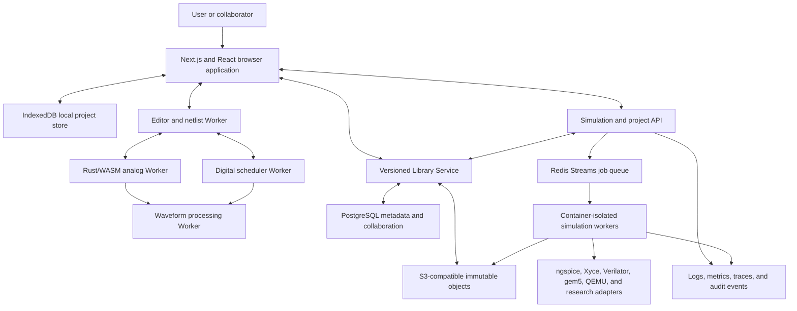
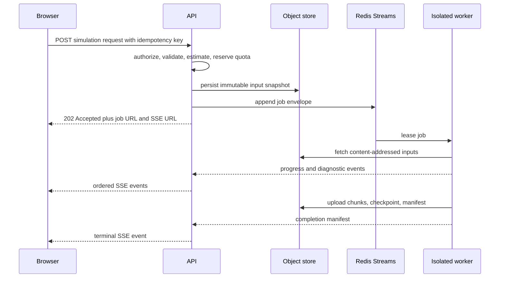

# System Architecture

Status: Normative architecture baseline  
Audience: product, frontend, simulation, backend, security, infrastructure, and verification teams

## 1. Purpose and normative language

This document defines the system boundaries, major runtime processes, ownership of data, and allowed dependency directions for the Web-Based Electronics and Computer Simulation Platform. `MUST`, `MUST NOT`, `SHOULD`, `SHOULD NOT`, and `MAY` are normative.

The platform is a browser-based, Applied Physics-driven, hierarchical, multi-fidelity environment. It follows physical principles through equations, numerical algorithms, reusable model/device revisions, circuits/boards, systems, and experimental validation while combining circuit physics, switch-level behavior, event-driven logic, RTL, microarchitecture, and full-system emulation. It does not claim that a modern computer can be simulated transistor-by-transistor in a browser. [Source PDF, pp. 1-21, 43-44]

## 2. Architectural drivers

1. **Realistic electronics first.** The first production gate is a non-ideal electronics simulator with a visual editor, measurement, waveforms, heating, tolerance, leakage, failure indication, basic logic, reusable subcircuits, WebAssembly, and Worker execution. CPU, GPU, and full-system work is gated behind that foundation. [Source PDF, pp. 32-37]
2. **Local-first interaction.** Editing and eligible small simulations MUST work without a cloud round trip. Heavy or untrusted workloads MUST use isolated server workers. [Source PDF, pp. 25-26, 31-32]
3. **Deterministic multi-engine execution.** Analog, digital, thermal, RTL, and architecture engines MUST exchange timestamped events through a scheduler with an integer timebase. [Source PDF, pp. 27-28, 40]
4. **Main-thread responsiveness.** Simulation, layout, and waveform processing MUST NOT block the browser UI thread. [Source PDF, pp. 23-24]
5. **Explicit fidelity.** Every model and result MUST declare its fidelity, analysis capability, provenance, limitations, and deterministic seed when stochastic behavior is used. [Source PDF, pp. 3-4, 13-20, 27, 40]
6. **Open-core license safety.** Apache-2.0 core code MUST remain separable from GPL or mixed-license engines. Such engines MUST execute behind a process or service boundary unless legal review explicitly approves another distribution pattern.
7. **Applied Physics lineage.** Every released scientific model and physical claim MUST retain governing basis, dimensions, validity, provenance, dependencies, accuracy/uncertainty, limitations, and evidence. See [Applied Physics and Real-World Fidelity](./APPLIED_PHYSICS_AND_REAL_WORLD_FIDELITY.md).
8. **Data is not the engine.** A versioned Library Service MUST resolve immutable model/device/package/board/system revisions into a validated execution bundle. The numerical engine MUST NOT query PostgreSQL, JSONB, object storage, or IndexedDB. See [Data-Driven Library and Storage Architecture](./DATA_DRIVEN_LIBRARY_AND_STORAGE_ARCHITECTURE.md).

## 3. Context and topology



The frontend stack is Next.js, React, and TypeScript. The schematic surface uses Canvas 2D or WebGL2; SVG is an export and accessibility representation, not the primary renderer for large designs. WebGPU is optional and MUST be enabled only for benchmark-proven workloads. The simulation core is Rust compiled to WebAssembly. [Source PDF, pp. 22-24, 29-31, 38-40]

## 4. System decomposition

| Subsystem | Owns | Must not own |
|---|---|---|
| Browser shell | routing, session UI, commands, panels, accessibility tree | numerical solving, persistent authoritative cloud state |
| Schematic domain | components, pins, nets, hierarchy, validation, netlist projection | solver-specific mutable state |
| Local project store | offline drafts, cached immutable assets, pending sync operations | organization authorization or cloud version authority |
| Analog engine | MNA stamping, nonlinear iteration, transient integration, AC/noise/thermal coupling | collaboration or UI state |
| Digital engine | four-state logic, event queue, timing and contention | analog matrix internals |
| Global scheduler | integer timestamps, boundary events, checkpoints, deterministic ordering | engine-specific numerical algorithms |
| Waveform pipeline | chunking, decimation, derived measurements, display-ready levels | source project mutation |
| Project service | authorization, project metadata, versions, branches, comments, sharing | executing untrusted models in-process |
| Library Service | exact revision retrieval, schema/dimensional validation, dependency DAG, publication, provenance/license/trust, resolution into `ComponentDefinitionPlan` | numerical solving, direct client database CRUD, arbitrary stored execution |
| Job service | validation, quotas, idempotency, state transitions, dispatch | engine implementation |
| Worker runtime | isolated execution, checkpointing, result upload | permanent metadata authority |
| Object store | immutable project packages, model assets, result chunks, checkpoints | relational permissions or mutable job state |
| PostgreSQL | users, organizations, projects, versions, ACLs, job metadata, audit indexes | large waveforms and binary archives |
| Redis Streams | transient dispatch, leases, retry delivery | canonical job history or durable result storage |

## 5. Dependency rules

The dependency direction is:

```text
Presentation -> Application commands -> Domain contracts -> Engine ports
Infrastructure adapters -------------------------------> Engine ports
```

- Domain contracts MUST be independent of React, database clients, cloud SDKs, and external engine APIs.
- Engine ports accept only a self-contained validated `ComponentDefinitionPlan` or equivalent immutable execution bundle; an unresolved alias, dependency, dimension, trust state, or executable capability fails before solver preparation.
- UI components MUST use application commands and read models; they MUST NOT mutate project persistence directly.
- The canonical project model MUST be engine-neutral. Engine adapters create private derived netlists or binaries.
- External engines MUST implement the `EngineAdapter` contract defined in [API and Worker Protocols](./API_AND_WORKER_PROTOCOLS.md).
- Storage identifiers MUST be opaque. S3 keys and database primary keys MUST NOT be embedded as portable project identity.
- PostgreSQL, S3-compatible object storage, and Redis Streams are the canonical hosted implementations. Replacing any of them requires a superseding ADR, a compatibility analysis, and a migration plan; preserving similar semantics alone is not sufficient authorization.

## 6. Primary data flow

### 6.1 Local edit and simulation

1. A command updates an immutable in-memory project revision.
2. A local semantic Library Service resolves exact cached component/model/device/package/board/system revisions and validates dimensions, dependency closure, and hashes.
3. Schematic validation produces diagnostics and a deterministic netlist plus `ComponentDefinitionPlan` snapshot.
4. The snapshot and `SimulationRequest` are transferred to the appropriate Workers.
5. The scheduler coordinates analog, digital, thermal, environment, and external boundaries.
6. Waveform chunks are transferred to the waveform Worker, decimated, and streamed to the UI.
7. The project draft and optional result summary are committed to IndexedDB.

No server is authoritative in this flow. Local simulation eligibility is defined in [Local, Cloud, and Worker Architecture](./LOCAL_CLOUD_AND_WORKER_ARCHITECTURE.md).

### 6.2 Cloud simulation



Cloud result publication MUST be transactional at the metadata level: a job may reference only uploaded, checksum-verified objects. A partially uploaded result MUST never appear as complete.

## 7. Multi-fidelity execution boundary

Fidelity is defined consistently across the platform:

| Level | Meaning | Typical runtime |
|---|---|---|
| F0 | connectivity and schematic-only | browser domain Worker |
| F1 | ideal equations | Rust/WASM analog Worker |
| F2 | behavioral or digital timing | browser digital Worker or server |
| F3 | SPICE compact or macro-model | Rust/WASM where supported; otherwise isolated server adapter |
| F4 | electrothermal, tolerance, parasitic, and failure behavior | browser for bounded cases; otherwise server |
| F5 | physical device or TCAD research | server/HPC only |

The project may mix levels at explicit boundaries. It MUST NOT silently substitute a lower-fidelity model. Any substitution requires a diagnostic, a recorded execution plan, and user consent unless an already selected policy explicitly permits it. [Source PDF, pp. 13-20, 27-28, 43-44]

## 8. Failure domains and degradation

| Failure | Containment | Required outcome |
|---|---|---|
| Browser Worker crash | one Worker and current run | UI remains usable; run becomes failed or restartable; unsaved edit state retained |
| Numerical non-convergence | one analysis | structured diagnostic with node/device context and attempted remedies; no fabricated result |
| Waveform memory pressure | waveform pipeline | decimate/spill/stop retention according to policy; never crash the editor silently |
| SSE disconnect | event transport | reconnect using `Last-Event-ID`; fetch job snapshot if retention expired |
| Redis delivery duplication | dispatch | idempotent lease and attempt records prevent concurrent authoritative completion |
| Worker timeout or loss | one attempt | lease expires; retry only if policy allows; checkpoint compatibility verified |
| Object upload interruption | temporary objects | unreferenced objects remain quarantined and are later collected |
| External engine exploit | isolated container | no outbound network, no host access, bounded resources, worker discarded |
| PostgreSQL outage | cloud control plane | local work continues; cloud writes fail closed; no queue dispatch without durable job record |
| Collaboration conflict | one project branch | preserve both edits, surface conflict, never overwrite silently |

The source PDF explicitly identifies convergence, browser memory, UI performance, synchronization, model accuracy, and excess scope as primary risks. [Source PDF, pp. 39-41]

## 9. Quality attribute budgets

- Main-thread simulation stalls MUST remain below 100 ms; interactive pan and zoom target at least 50 FPS for the MVP reference project.
- The MVP reference capacity is 500 components, 1,000 nets, and 100,000 retained waveform samples.
- Reference DC analysis targets less than one second and the reference transient suite less than five seconds on the documented reference desktop.
- Results MUST be reproducible for an identical project snapshot, engine build, configuration, and seed.
- The browser support baseline is the latest two stable desktop releases of Chrome, Edge, Firefox, and Safari.
- User-facing paths MUST conform to WCAG 2.2 AA and remain usable by keyboard without relying on color alone.

Detailed measurement rules are in [Performance, Browser, Accessibility, and Internationalization](./PERFORMANCE_BROWSER_ACCESSIBILITY_AND_I18N.md).

## 10. Security and trust zones

There are four trust zones:

1. **Untrusted browser input:** projects, comments, imported models, waveforms, firmware, and HDL.
2. **Authenticated control plane:** authorization and metadata services; no untrusted native execution.
3. **Isolated execution plane:** disposable containers with no outbound network and strict CPU, memory, time, file, and process limits.
4. **Trusted storage and operations plane:** databases, object storage, secrets, audit logs, and deployment control.

Cross-zone messages MUST be authenticated, schema-validated, size-limited, and traceable. See [Security, Privacy, and Sandboxing](./SECURITY_PRIVACY_AND_SANDBOXING.md).

## 11. Architecture invariants

The following are release-blocking invariants:

- The UI thread never runs a solver or waits synchronously for a simulation Worker.
- A project version is immutable after publication.
- Every simulation references an immutable input version and an engine build digest.
- Every stochastic result records its seed and distribution configuration.
- A terminal job state is monotonic and cannot return to a non-terminal state.
- Untrusted model execution never occurs inside the API process.
- GPL or mixed-license engines never become linked dependencies of the Apache-2.0 core without written license approval.
- Collaboration uses WebSocket; simulation progress and results use SSE; commands and snapshots use REST.
- WebGPU is an optional optimization, never a correctness dependency.
- Full modern CPU/GPU simulation uses RTL, cycle, architecture, or ISA abstraction rather than full-transistor analog simulation.

## 12. Decision and source record

| Decision | Basis |
|---|---|
| Hierarchical multi-fidelity architecture | [Source PDF, pp. 13-21, 43-44] |
| Rust/WASM core and separate Workers | [Source PDF, pp. 22-24]; project decision selects Rust |
| Local/browser and server/HPC split | [Source PDF, pp. 25-26, 36, 44] |
| PostgreSQL and object storage for cloud projects | [Source PDF, pp. 31-32] |
| Redis Streams for dispatch | Project decision; persistent job truth remains in PostgreSQL |
| Canvas/WebGL primary rendering and benchmark-gated WebGPU | [Source PDF, pp. 22-24, 39-40] |
| Apache-2.0 core and process-isolated external engines | Project distribution decision; see licensing document |

Official implementation constraints are maintained in the linked architecture documents. In particular, threaded WebAssembly depends on cross-origin isolation as documented by [Emscripten's pthreads guide](https://emscripten.org/docs/porting/pthreads.html).
