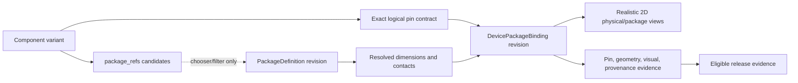

# Device Package Binding Contract

Status: **Normative baseline 1.0**

Requirements: **REQ-023, REQ-037, and REQ-038**

Related registries: [component-registry.yaml](component-registry.yaml) and [package-registry.yaml](package-registry.yaml)

Related visual contract: [Package and Physical Appearance Contract](PACKAGE_AND_PHYSICAL_APPEARANCE.md)

## Purpose

This contract defines the exact bridge between a component variant's logical pins and one immutable physical-package realization. It prevents a compatible-looking package, a candidate package ID, or a realistic illustration from being mistaken for a verified device pinout.

The contract is documentation-only. It defines records, validation, evidence, and release behavior; it does not provide executable geometry, a PCB footprint, or a manufacturer-certified mechanical model.

## Normative terms

The key words **MUST**, **MUST NOT**, **REQUIRED**, **SHOULD**, **SHOULD NOT**, and **MAY** are normative.

| Term | Meaning | Release authority |
|---|---|---|
| Package candidate | A reusable package ID listed as electrically and geometrically plausible for a family or variant. | None. |
| `package_refs` | The component registry's ordered set of package candidates for a variant. | None. It is never a pin map or concrete binding. |
| `package_compatibility` | Family-level package candidates used for discovery, filtering, and task planning. | None. |
| `PackageDefinition` | A versioned body/contact geometry definition from the package registry, a reviewed shared library, or a project-local custom revision. | Defines geometry only; it does not assign device functions to contacts. |
| Resolved package | One exact `PackageDefinition` revision plus all required parameter values, such as pin count, pitch, body dimensions, and excluded contacts. | Defines a reproducible physical form, but not a device pinout. |
| Logical pin contract | The exact component-variant pin profile or other canonical logical-pin record selected by the component instance. | Defines electrical identity independently of package numbering. |
| `DevicePackageBinding` | A versioned record joining one component variant and logical pin contract to one resolved package, exact logical-to-contact mappings, appearance data, provenance, and validation evidence. | The only package record that can satisfy a released device's package-map requirement. |
| Footprint binding | An optional, separately sourced mapping from package contacts to PCB pads and manufacturing rules. | Outside this contract; a `DevicePackageBinding` never proves footprint correctness. |

## Candidate versus concrete binding

Candidate metadata answers **which package templates may be worth offering**. A concrete binding answers **exactly how this device uses one resolved package revision**.



The following rules are absolute:

1. A `package_refs` or `package_compatibility` entry MUST NOT be interpreted as a selected package, a default package, a pin map, a package revision, or validation evidence.
2. A renderer, export snapshot, package-aware breadboard view, or release record MUST resolve a concrete `DevicePackageBinding`; it MUST NOT infer contact functions from list order, pin names, symbol order, model order, or a manufacturer convention.
3. A candidate may become a concrete binding only after exact package resolution, explicit pin mapping, validation, provenance review, and immutable revision assignment.
4. A concrete binding for a package not present in the variant's current candidate set MUST remain project-local and non-releaseable until compatibility metadata and review evidence are updated together.
5. Importing a model, choosing a visual body, or creating a custom package MUST NOT create an implicit binding.

## Identity and versioning

A published binding uses the stable ID form `dpb-<variant-slug>-<package-slug>` and an independent semantic revision. The stable ID describes the relationship; the revision identifies its immutable content.

A binding MUST pin:

- component family ID and component variant ID;
- exact logical pin-contract ID and revision or immutable digest;
- package ID, package revision, and package-registry schema version;
- every resolved package parameter and the deterministic resolved-package digest;
- appearance-profile ID and revision;
- mapping, provenance, license, validation report, and evidence digests;
- binding schema version and binding content digest.

Changing any logical pin, package contact, resolved dimension, numbering rule, orientation rule, appearance geometry, mapping, package parasitic selection, or accuracy claim creates a new binding revision. Published revisions are never edited in place. A component instance and simulation result retain the exact binding revision even when a newer revision exists.

Labels, localized descriptions, and non-semantic catalog aliases MAY change without a new binding revision only when they do not change markings, geometry, accessibility output, mapping, or provenance meaning.

## Required `DevicePackageBinding` fields

| Field group | Required content |
|---|---|
| Identity | Schema version, binding ID, semantic revision, lifecycle, immutable digest. |
| Device | Family ID, variant ID, logical pin-contract reference, and exact variant revision/digest. |
| Package | Package ID, exact revision, registry schema version, resolved parameters, and resolved-package digest. |
| Contact map | Every logical pin, every physical contact, multiplicity, package-contact disposition, and any modeled shield/thermal relation. |
| Orientation | Package coordinate system, zero rotation, pin-one/A1/polarity cue, numbering traversal, allowed rotations, and mirror policy. |
| Dimensions | Body and contact geometry in metres, dimensional source/accuracy, tolerances where verified, and separate render exaggeration. |
| Views and artwork | Required 2D views, geometry/artwork revision, LOD contract, marking zones, material hints, state overlays, accessibility description, and render fixtures. |
| Electrical separation | Explicit statement that geometry does not change the component model; optional package parasitics use a separately selected model binding. |
| Provenance | Authors/source, geometry and pinout sources, license/SPDX expression, redistribution status, accuracy claim, and protected-mark review. |
| Validation | Validator contract version, timestamped evidence reference, diagnostics, golden fixtures, reviewer disposition, and limitations. |

Unknown optional fields MAY be preserved for forward compatibility. Missing required fields, unsupported required fields, or an unknown major schema version are hard errors.

## Logical-pin to package-contact mapping

The map is directional and explicit: logical electrical identity is canonical; package contacts are its physical projection.

### Coverage rules

- Every required logical pin MUST map to at least one existing electrical package contact.
- Every package contact MUST be either mapped or assigned exactly one explicit disposition: `no-connect`, `reserved`, `mechanical-only`, `shield`, `thermal-only`, or `omitted`.
- One package contact MUST NOT map to multiple unrelated logical pins.
- One logical pin MAY map to multiple contacts only when `multiplicity: parallel-contacts` is explicit and the logical contract permits internally common contacts.
- An exposed or thermal pad that is electrically connected MUST map to the declared logical pin and use `contact_role: exposed-pad` or `contact_role: thermal-pad`. A thermal-only pad MUST NOT be silently attached to ground.
- Hidden schematic power pins, alternate symbol units, bus bits, and stacked contacts remain explicit in the mapping.
- Logical pin order, schematic display order, model terminal order, package numbering, grid coordinate, and footprint pad order remain separate fields.
- `NC`, `DNC`, `reserved`, and `mechanical-only` are distinct. The validator MUST NOT normalize one into another.

### Contact identifiers

Perimeter and through-hole packages use their displayed contact numbers or stable contact IDs. Grid arrays use unambiguous row/column identifiers such as `A1`; letters that can be confused under the package convention MUST follow the package definition's declared row alphabet. Exposed pads and non-numbered contacts use stable package-scoped IDs such as `EP1` or `SHIELD1`.

The map is evaluated before rendering and after import, migration, package replacement, logical-pin-contract replacement, rotation round-trip, mirror preview, and archive reopen.

## Resolved geometry and dimensions

Package definitions may be parametric templates. A concrete binding MUST freeze every parameter needed to reproduce its contact set and physical geometry.

- All physical dimensions use metres internally. Display units are presentation-only.
- Body length, width, height, standoff, lead/pad/ball dimensions, pitch, row/side/grid counts, span, excluded positions, and exposed-pad dimensions MUST be finite and valid for the selected package revision.
- Nominal generic geometry declares `illustrative` or `generic-dimensioned`; it MUST NOT carry manufacturer tolerance or footprint claims.
- Manufacturer-derived dimensions declare the cited drawing revision, allowed redistribution, nominal values, and tolerances. A source citation alone does not make a PCB land pattern valid.
- `physical_dimensions` and `render_exaggeration` are separate. Exaggerating a lead, orientation dot, color band, or contact for visibility MUST NOT alter measurement or collision geometry.
- Package contact coordinates are expressed in the package-local coordinate system. Instance rotation and translation are project state, not a mutation of the binding.
- A resolved parameter set and geometry digest MUST reproduce the same contacts, coordinates, numbering, bounds, and LOD topology on every supported renderer.

## Realistic 2D views and artwork

Each releaseable physical binding MUST provide deterministic scalable 2D geometry for the applicable views:

| View | Required purpose |
|---|---|
| `physical-2d` | Recognizable real-component silhouette, body/material regions, leads/contacts, polarity or pin-one cues, and value/device marking zones. |
| `package-2d` | Contact numbering, orientation, body outline, hidden-contact inspection where applicable, and exact anchors derived from the resolved package. |
| `breadboard-2d` | Optional package-aware placement anchors and lead routing; required only by a release gate that includes breadboard placement. |
| `footprint-preview` | Optional sourced preview clearly labeled non-authoritative unless a separate footprint contract and evidence are present. |

The `physical-2d` and `package-2d` views MUST:

- use original project artwork or safely licensed reusable assets;
- share the resolved contact set and orientation contract;
- support silhouette, orientation-and-pins, and markings/material-detail LODs;
- retain identity, polarity/pin-one, selected contact, fault state, and meaningful markings without relying on color;
- expose accessible text for package, orientation, pin count, selected contact, marking/value, accuracy claim, and failure state;
- render selected, hovered, energized, failed, and disabled states without hiding package identity;
- keep protected vendor logos, certification marks, proprietary trade dress, and copied IEC artwork out unless documented permission permits them;
- remain visually recognizable while clearly stating that realism is not dimensional or manufacturing certification.

A device-specific appearance profile MAY refine safe markings, material/color hints, lens/window form, or educational visual cues. It MUST NOT move, add, remove, or renumber contacts. Contact-affecting changes require a package and binding revision.

## Orientation contract

Every binding declares:

1. package-local axes and origin;
2. zero-rotation body orientation;
3. pin-one, A1, polarity, keyed-corner, notch, tab, or equivalent cue;
4. numbering traversal or grid rule;
5. permitted rotation increments;
6. whether mirror preview is allowed;
7. the invariant that mirror presentation never renumbers or remaps electrical pins.

The validator checks `0`, every allowed rotation, mirror preview where permitted, and a transform round trip. Pin identifiers, nets, and mapping MUST be identical after the round trip. A cue that becomes invisible at an actionable LOD is a release-blocking failure.

## Optional package parasitics

Package resistance, inductance, capacitance, coupling, thermal impedance, and delay are simulation behavior, not visual geometry. A binding MAY reference a separately versioned package-parasitic `ModelBinding`, but it MUST declare:

- source and operating envelope;
- terminal/contact order and mapping;
- supported analyses and fidelity tiers;
- model license and validation evidence;
- whether selection is automatic, suggested, or explicit.

Changing a visual package MUST NOT silently select or change parasitics. Any parasitic change is user-visible and appears in simulation result provenance.

## Parametric and custom IC packages

The custom package designer produces a declarative, immutable `PackageDefinition` revision. It MAY save an intentionally `unbound` package, but an unbound package is not a device package and cannot satisfy release.

The designer MUST support independently configurable IC designs for through-hole, gull-wing, J-lead, leadless, grid-array, transistor/power, module, and constrained custom forms. It records body style and dimensions; lead, pad, ball, or contact form; count and pitch; sides, rows, or grid; numbering; excluded positions; orientation cues; thermal/exposed pads; markings; materials; package limits; provenance; and accuracy claim.

Designer behavior is constrained as follows:

- saving edits creates a new package revision and never mutates a shared revision;
- live preview is advisory until geometry validation passes;
- automatic numbering MAY populate contacts, but automatic electrical pin assignment MUST remain a reviewable draft and cannot validate itself;
- creating a custom package never modifies the component symbol, logical pin contract, or electrical model;
- a distinct IC design becomes selectable only after a concrete binding maps it to a specific variant;
- project-local packages and bindings remain project-local until engineering, accessibility, provenance, license, and release review approves publication;
- executable drawing scripts, remote runtime assets, unrestricted SVG, shader source, and network-loaded geometry are prohibited.

## Schema-shaped YAML example

The following non-registry example illustrates structure only. IDs beginning with `example-` are deliberately non-production identifiers. The example shows a generic eight-contact timer-like device so every contact map is visible; it does not assert a manufacturer pinout, footprint, or released component.

```yaml
schema_version: "1.0.0"
binding:
  id: "example-dpb-timer-dip8"
  revision: "1.0.0"
  lifecycle: "Draft"
  content_digest: "sha256:EXAMPLE_BINDING_DIGEST"
  device:
    family_id: "example-fam-timer"
    variant_id: "example-var-timer"
    variant_revision: "1.0.0"
    logical_pin_contract:
      id: "example-pins-timer-8"
      revision: "1.0.0"
      digest: "sha256:EXAMPLE_PIN_CONTRACT_DIGEST"
  package:
    id: "pkg-dip"
    revision: "1.0.0"
    registry_schema_version: "1.0.0"
    resolved_parameters:
      pin_count: 8
      row_count: 2
      pitch_m: 0.00254
      body_length_m: 0.0098
      body_width_m: 0.0076
      body_height_m: 0.0045
      lead_width_m: 0.00046
      lead_thickness_m: 0.00025
    resolved_package_digest: "sha256:EXAMPLE_RESOLVED_PACKAGE_DIGEST"
  contact_map:
    - logical_pin_id: "GND"
      package_contact_ids: ["1"]
      multiplicity: "exactly-one"
      contact_role: "electrical"
    - logical_pin_id: "TRIGGER"
      package_contact_ids: ["2"]
      multiplicity: "exactly-one"
      contact_role: "electrical"
    - logical_pin_id: "OUTPUT"
      package_contact_ids: ["3"]
      multiplicity: "exactly-one"
      contact_role: "electrical"
    - logical_pin_id: "RESET"
      package_contact_ids: ["4"]
      multiplicity: "exactly-one"
      contact_role: "electrical"
    - logical_pin_id: "CONTROL"
      package_contact_ids: ["5"]
      multiplicity: "exactly-one"
      contact_role: "electrical"
    - logical_pin_id: "THRESHOLD"
      package_contact_ids: ["6"]
      multiplicity: "exactly-one"
      contact_role: "electrical"
    - logical_pin_id: "DISCHARGE"
      package_contact_ids: ["7"]
      multiplicity: "exactly-one"
      contact_role: "electrical"
    - logical_pin_id: "VCC"
      package_contact_ids: ["8"]
      multiplicity: "exactly-one"
      contact_role: "electrical"
  package_contact_dispositions: []
  orientation:
    origin: "body-center"
    zero_rotation: "notch-up; contact-1 at upper-left in package view"
    numbering: "counterclockwise from contact-1"
    orientation_cues: ["end-notch", "pin-one-dot"]
    allowed_rotation_deg: [0, 90, 180, 270]
    mirror_preview: true
    mirror_renumbers_contacts: false
  appearance:
    profile_id: "example-appearance-timer-dip8"
    revision: "1.0.0"
    artwork_digest: "sha256:EXAMPLE_ARTWORK_DIGEST"
    views: ["physical-2d", "package-2d"]
    lod_levels: ["silhouette", "orientation-and-pins", "markings-and-material-detail"]
    accuracy_claim: "generic-dimensioned"
    render_exaggeration:
      pin_one_dot_scale: 1.25
    accessible_summary: "Generic eight-contact dual in-line timer package; notch up; pin one at upper left."
  electrical_separation:
    geometry_changes_model: false
    package_parasitic_model_binding: null
  provenance:
    geometry_source: "project-authored generic package template"
    pinout_source: "example only; not a released pinout"
    spdx_license: "Apache-2.0"
    redistribution: "allowed for original example metadata and artwork"
    manufacturer_verified: false
  validation:
    contract_version: "1.0.0"
    status: "not-run"
    required_fixtures: ["GRC-051", "GRC-054"]
    evidence_refs: []
    diagnostics: []
  limitations:
    - "Example record only; not a catalog binding."
    - "No PCB footprint or manufacturability claim."
```

## Validation pipeline

Validation runs in this order and stops publication on any hard error:

1. **Schema and identity:** validate schema version, stable IDs, revisions, digests, and lifecycle.
2. **Referential integrity:** resolve the exact variant, logical pin contract, package revision, renderer contract, and evidence references.
3. **Candidate eligibility:** confirm the package ID remains an approved candidate; candidate status alone does not satisfy later checks.
4. **Package resolution:** validate all required parameters, ranges, units, contact generation, exclusions, dimensions, and deterministic digest.
5. **Pin equivalence:** validate logical-pin coverage, package-contact disposition, uniqueness, multiplicity, domains, hidden pins, buses, NC/reserved distinctions, and any exposed pad.
6. **Orientation:** validate numbering, cues, rotations, mirror preview, anchor positions, and transform round trip.
7. **Visual conformance:** render every required LOD, view, theme, high-contrast mode, state overlay, and fixed-scale fixture; compare semantic assertions in addition to visual regression.
8. **Accessibility:** validate accessible name, package/orientation summary, keyboard contact order, non-color cues, and state/diagnostic announcements.
9. **Electrical separation:** prove that view/package changes preserve instance identity, nets, logical pins, model, parameters, state, and results unless a separately authorized model change exists.
10. **Provenance and license:** validate artwork, geometry, pinout, marks, source revision, SPDX expression, redistribution, and accuracy claim.
11. **Evidence and release:** bind immutable fixtures, validator versions, environment, expected/actual results, reviewers, limitations, and disposition to the binding revision.

Visual similarity does not substitute for contact-map validation. A correct contact map does not substitute for readable orientation, accessible cues, provenance, or dimensional-claim review.

## Stable diagnostics

| Diagnostic | Severity | Meaning |
|---|---|---|
| `DPB_CANDIDATE_ONLY` | Blocking for release/export | A package candidate was supplied where a concrete binding is required. |
| `DPB_REFERENCE_UNRESOLVED` | Blocking | A variant, logical-pin contract, package revision, appearance, or evidence reference cannot be resolved exactly. |
| `DPB_PACKAGE_PARAMETERS_INCOMPLETE` | Blocking | The selected package template is not fully resolved. |
| `DPB_LOGICAL_PIN_UNMAPPED` | Blocking | A required logical pin has no package contact. |
| `DPB_CONTACT_UNACCOUNTED` | Blocking | A package contact is neither mapped nor assigned an explicit disposition. |
| `DPB_MAPPING_CONFLICT` | Blocking | A duplicate, unrelated many-to-one, forbidden one-to-many, domain, or contact-role conflict exists. |
| `DPB_ORIENTATION_AMBIGUOUS` | Blocking | Pin one, A1, polarity, numbering, rotation, or mirror behavior is ambiguous. |
| `DPB_GEOMETRY_INVALID` | Blocking | Dimensions are non-finite, out of range, colliding, nondeterministic, or inconsistent with the contact set. |
| `DPB_VIEW_PIN_MISMATCH` | Blocking | A view anchor/contact does not match the resolved package map. |
| `DPB_ACCESSIBILITY_INCOMPLETE` | Blocking | Identity, orientation, contacts, markings, or state cannot be determined without pointer or color. |
| `DPB_PROVENANCE_INCOMPLETE` | Blocking for publication | Required source, license, redistribution, protected-mark, or accuracy evidence is missing. |
| `DPB_FOOTPRINT_CLAIM_UNSUPPORTED` | Blocking | Visual/package metadata is represented as verified PCB/manufacturing data without separate evidence. |
| `DPB_PARASITIC_CHANGE_IMPLICIT` | Blocking | Package selection silently changed simulation behavior. |
| `DPB_DIGEST_MISMATCH` | Blocking | Resolved content differs from the immutable recorded digest. |

Diagnostics identify the binding ID/revision, affected logical pin or contact, rejected value, source contract, and remediation. There is no silent best-effort mapping.

## Evidence matrix

| Concern | Positive evidence | Boundary evidence | Failure evidence |
|---|---|---|---|
| Candidate separation | Chooser lists candidates without creating a binding. | Candidate removed or revised while a historical binding remains resolvable. | Candidate ID used as binding raises `DPB_CANDIDATE_ONLY`. |
| Pin equivalence | Every logical pin/contact resolves exactly. | Parallel contacts, exposed pad, hidden pin, bus bit, NC, and reserved contacts. | Missing, duplicate, out-of-range, conflicting, or unaccounted contact. |
| Geometry | Exact package revision and parameters reproduce one digest. | Minimum/maximum contact count, pitch, body size, excluded positions. | Non-finite, range, collision, or nondeterministic geometry. |
| Orientation | Pin-one/A1/polarity and anchors survive every allowed transform. | All rotations, mirror preview, grid-array hidden contacts. | Ambiguous cue, renumbering, remapping, or failed round trip. |
| Realistic 2D appearance | Body, contacts, materials, markings, and LODs are recognizable. | Distant zoom, monochrome, high contrast, long labels, all states. | Obscured identity/contact, color-only meaning, copied or unsafe artwork. |
| Custom package | New immutable package revision is independently selectable. | Maximum supported contacts, exposed pad, omitted positions, custom markings. | In-place mutation, implicit pin mapping, collision, unsupported executable geometry. |
| View preservation | Schematic/physical/package switching preserves electrical state and result. | Rotation, undo/redo, reopen, collaboration replay. | Net, model, parameter, instance, state, or result changes. |
| Provenance | Sources, license, redistribution, claim, and limitations are complete. | Illustrative versus manufacturer-derived geometry. | Unsupported dimensional, footprint, logo, or certification claim. |

Required cross-platform fixtures are `GRC-049` through `GRC-054` as selected by package class. Every binding additionally has binding-specific positive, boundary, failure, transform, and visual evidence. Package-class fixtures do not prove a device-specific pinout by themselves.

## Lifecycle and release blocking

A binding lifecycle is:

```text
Draft -> Mapped -> Geometry Validated -> Visual Validated -> Evidence Reviewed -> Published
```

Any input revision or digest change returns the new binding revision to `Draft`. A regression, source withdrawal, license conflict, or incorrect pinout deprecates the affected published revision and blocks new use; historical projects keep a resolvable record plus a prominent diagnostic and migration path.

A component variant cannot advance to `Released` when any applicable condition is true:

- only `package_refs` or family compatibility candidates exist;
- no concrete binding resolves for its released physical/package view;
- the exact logical pin contract, package revision, or resolved package parameters are missing;
- any required logical pin or package contact is unmapped or ambiguous;
- orientation, LOD, accessibility, view-preservation, provenance, or visual evidence is incomplete;
- custom-package geometry remains a designer preview or unbound definition;
- a package or appearance change implicitly changes simulation behavior;
- a footprint, dimensional, thermal, safety, or manufacturer-accuracy claim lacks separate evidence.

At least one published concrete binding is REQUIRED for every released IC variant and every released `basic-component` variant whose physical representation uses a reusable package. Additional candidates MAY remain planned. Their incompleteness does not invalidate an already published binding, but an unavailable candidate MUST be shown as unavailable and MUST NOT be represented as a selectable verified package.

## Limitations

- This contract does not certify PCB footprints, assembly rules, enclosure fit, creepage, clearance, thermal resistance, safety compliance, or manufacturability.
- Generic package templates are educational visual assets until source-specific dimensional evidence is reviewed.
- Manufacturer ordering codes and vendor pinouts are external library records, not implied by canonical variants.
- Realistic appearance is required for recognition and interaction, not photorealism.
- A binding proves only the declared component variant, logical pin contract, package revision, parameter set, evidence envelope, and renderer versions.
