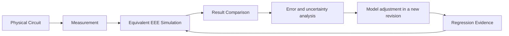

# Physical Benchmark and Correlation Contract

Status: Normative planning contract 1.0  
Fixture inventory: exactly 12 planned physical-correlation fixtures (`PBC-001` through `PBC-012`)  
Requirements: `REQ-039` through `REQ-047`  
Related: [Applied Physics and Real-World Fidelity](../architecture/APPLIED_PHYSICS_AND_REAL_WORLD_FIDELITY.md), [Model Registry](../catalog/model-registry.yaml), [Golden Reference Circuits](GOLDEN_REFERENCE_CIRCUITS.md), [Numerical Accuracy Targets](NUMERICAL_ACCURACY_TARGETS.md), and [Test and Validation Strategy](TEST_AND_VALIDATION_STRATEGY.md)

## 1. Purpose and evidence boundary

This contract defines how physical circuits and laboratory measurements become reproducible model-correlation evidence. It creates fixture identities and required metadata; it does not assert that fixtures have been built, measured, calibrated, or passed.

`PBC-*` identifies the immutable physical benchmark/evidence lineage. `GRC-055` through `GRC-066` and `VAL-GRC-055` through `VAL-GRC-066` identify the corresponding acceptance specifications and independent validation tasks; the older topology GRCs remain simulator-only baselines. Neither a GRC specification nor a simulator implementation substitutes for physical evidence.

**Repository decision — evidence before realism:** no component or model may use a physical-correlation claim until its immutable benchmark bundle, raw data, uncertainty budget, comparison result, and reviewer decision are retained. A visually plausible waveform is not correlation evidence.

## 2. Correlation loop



Raw data and the as-measured fixture manifest are immutable. Calibration/model fitting data MUST be separated from holdout validation data. A model adjustment creates a new model revision; it never rewrites the evidence used by an earlier revision.

## 3. Stable identity and lifecycle

Each fixture has a stable `PBC-###` ID and immutable evidence-bundle revisions. Its lifecycle is:

```text
Planned -> Procedure Ready -> Fixture Built -> Measured -> Correlated -> Reviewed -> Accepted
```

- `Planned` means only scope and expected evidence are documented.
- `Procedure Ready` requires exact schematic, BOM/order codes, safety review, measurement procedure, equipment plan, and acceptance policy.
- `Fixture Built` adds as-built serials/lots, substitutions, inspection, and photographs or diagrams.
- `Measured` adds immutable raw observations and calibration/environment evidence.
- `Correlated` adds exact simulation bundle and error/uncertainty calculation.
- `Reviewed` requires independent technical review.
- `Accepted` means the evidence may satisfy only the declared model/release envelope.

The 12 fixtures below are all `Planned`; no later state is implied.

## 4. Required evidence-bundle schema

Every fixture revision MUST contain every field below. `null` is permitted only while `Planned` and MUST carry a blocking reason. It is invalid at `Procedure Ready` or later unless the field is explicitly inapplicable with reviewed rationale.

| Record group | Mandatory fields and rules |
|---|---|
| Identity | stable fixture ID, immutable fixture revision ID, title, lifecycle status, owner, specimen count and selection rule, linked requirement/test/model/component IDs, linked GRC IDs, creation/review dates |
| Exact schematic | versioned schematic artifact, `.eesim` schema version when available, net/node IDs, reference designators, test points, grounding, protection, load, wiring/interconnect description, schematic digest |
| BOM | manufacturer, manufacturer part number, ordering code, package, quantity, nominal value, tolerance, voltage/current/power/temperature rating, lot/date code when available, substitution record, datasheet revision and digest |
| Package and construction | exact package details, socket/breadboard/PCB/point-to-point construction, connector/contact type, conductor material/length/cross-section, orientation, thermal interface, enclosure and photographs/diagrams |
| Power source | source model and serial, output mode, set point, measured output, current limit, startup/ramp, source impedance when relevant, cabling, grounding, calibration status, uncertainty |
| Test equipment | instrument and probe manufacturer/model, serial or asset ID, firmware, range, bandwidth, sample rate, resolution, input impedance/capacitance, connection mode, warm-up, calibration status/date/due date, uncertainty specification |
| Environment | ambient temperature, initial component temperature, airflow, cooling condition, enclosure, humidity metadata, air-pressure/altitude preset, external heat sources, stabilization duration, sensor location and uncertainty |
| Procedure | safety prerequisites, assembly/inspection steps, equipment setup, zero/compensation, operating point, sweep/stimulus, sample interval, repetitions, order/randomization, stabilization, stop conditions, shutdown, anomaly handling |
| Raw data | immutable original files, open format projection, column schema, units, timestamps, instrument settings, missing/invalid data markers, content digest, storage location, access/license, acquisition operator |
| Processing | immutable processing-plan revision, software/tool revision and digest, input digests, parsing and unit conversions, alignment, filters, excluded data, feature extraction, formulas, numeric precision, and output digests |
| Simulation | exact project revision/digest, model IDs and revisions, dependency lineage, engine/adapter and build digest, fidelity, analyses, tolerances, timestep, initial conditions, environment, probes, seed, determinism class, configuration digest |
| Outputs | declared expected output, measured output, simulated output, aligned waveform/features, valid sample window, exclusions with rationale, units, significant-digit policy |
| Error analysis | signed and absolute error, relative error where defined, waveform/feature metrics, conservation residuals, uncertainty model, sensitivity, confidence/coverage statement, acceptance criteria and decision |
| Limitations | fixture-specific omissions, range limits, equipment limits, construction variability, unresolved anomalies, transferability limits, prohibited claims |
| Regression | evidence ID/revision, raw and derived digests, comparison-tool revision, reviewer, result, execution date, environment fingerprint, retained artifacts, impacted models, superseded evidence link |
| Reproducibility | one manifest resolving every schematic, BOM/specimen, datasheet, procedure, raw/derived data, model, engine, environment, configuration, seed, tool, result, license, and content digest needed to repeat the comparison |

### 4.1 Calibration status vocabulary

Calibration status is one of `in_calibration`, `verification_only`, `expired`, `unknown`, or `not_applicable`. Only `in_calibration` equipment may support an absolute accuracy claim. `verification_only` may support functional or comparative evidence when the limitation is explicit. `expired` or `unknown` equipment cannot satisfy an R4 quantitative correlation gate.

### 4.2 Raw and derived data

Original instrument files are retained byte-for-byte. A normalized CSV or equivalent derivative MUST preserve source digest, parser/tool revision, unit conversion, excluded records, timestamp alignment, and numeric precision. A plot image alone is never raw data.

## 5. Confirmed planned fixture inventory

| ID | Physical fixture | Acceptance fixture and topology baseline | Initial scope | Primary observables | Status |
|---|---|---|---|---|---|
| `PBC-001` | Resistor divider | `GRC-055`; topology `GRC-002` | DC passive and instrument loading | node voltage, branch current, source/meter loading, power | Planned |
| `PBC-002` | RC charging and discharging | `GRC-056`; topology `GRC-006` | Linear transient with capacitor non-ideal effects | time constant, initial/final voltage, ESR-sensitive edge, leakage tail | Planned |
| `PBC-003` | RL transient | `GRC-057`; topology `GRC-007` | Inductor transient and source/interconnect loss | current rise/decay, inductive voltage, time constant, stored energy | Planned |
| `PBC-004` | RLC resonance | `GRC-058`; topology `GRC-008` | Frequency response and damping | resonant frequency, magnitude, phase, quality factor, bandwidth | Planned |
| `PBC-005` | Diode rectifier | `GRC-059`; topology `GRC-013` | Nonlinear rectification and source/load effects | conduction interval, forward drop, ripple, reverse stress, temperature | Planned |
| `PBC-006` | LED current and heating | `GRC-060`; topology `GRC-014` | Optoelectronic electrical/thermal correlation | current, forward voltage, electrical power, case/near-body temperature, relative light output | Planned |
| `PBC-007` | BJT switch | `GRC-061`; topology `GRC-015` | Cutoff/saturation switching | base/collector current, saturation voltage, delay, dissipation, temperature | Planned |
| `PBC-008` | MOSFET switch | `GRC-062`; topology `GRC-016` | Gate-driven switching and loss | gate/drain voltage, drain current, on loss, rise/fall, switching energy, temperature | Planned |
| `PBC-009` | Op-amp amplifier | `GRC-063`; topology `GRC-018` | Closed-loop gain and non-ideal limits | gain, offset, bandwidth, slew, clipping, input/output loading | Planned |
| `PBC-010` | Regulator load response | `GRC-064`; topology subset `GRC-023` | Source/regulator non-ideal response | output regulation, droop/overshoot, current limit, recovery, temperature | Planned |
| `PBC-011` | Oscillator | `GRC-065`; topology `GRC-020` | Startup and periodic steady state | startup time, frequency, duty cycle, amplitude, jitter/variation where supported | Planned |
| `PBC-012` | Thermal overload circuit | `GRC-066`; topology `GRC-021`/`GRC-022` | Electrothermal stress and threshold-driven failure | power, temperature trajectory, derating, threshold duration, transition and recovery/failure state | Planned |

The physical benchmark count is exactly 12 and maps one-to-one to the 12 new acceptance fixtures `GRC-055` through `GRC-066`. The complete golden/acceptance inventory is therefore 66; benchmark, model, component, package, and task counts remain separate inventories.

## 6. Fixture-specific minimum plans

### PBC-001 — Resistor divider

- The exact schematic MUST expose supply, midpoint, return, source-output sense, and meter/probe connection nodes.
- The BOM MUST record both resistor order codes, package, measured resistance before/after the run, tolerance, temperature coefficient when available, and power rating.
- Measurements cover unloaded midpoint and at least one declared instrument-loading configuration.
- Comparison includes analytical nominal value, as-measured-resistance value, source impedance, meter input impedance, current, power balance, and combined voltage uncertainty.

### PBC-002 — RC charging and discharging

- The procedure defines initial capacitor voltage, switching method, source rise/fall behavior, charge and discharge paths, repetition interval, and discharge safety.
- BOM and construction record capacitance, tolerance, voltage rating, dielectric/technology, ESR/leakage evidence, resistor properties, switch/contact, and interconnect.
- Comparison uses physical time alignment and evaluates time constant, 10–90% rise/fall, final value, initial edge, and leakage tail without using display decimation.

### PBC-003 — RL transient

- The fixture records winding resistance, nominal/measured inductance, current rating, core/material description when available, series/source/contact resistance, and flyback/clamp path.
- Current measurement loading and probe bandwidth are explicit.
- Comparison covers rise and decay time constants, initial/final slopes, voltage polarity, stored/dissipated energy, saturation evidence if intentionally approached, and safe shutdown.

### PBC-004 — RLC resonance

- The procedure declares series or parallel topology, sweep type, amplitude small enough for the declared linear envelope, settle cycles, and frequency points.
- Fixture parasitics, generator output impedance, probe loading, cable length, and reference plane are recorded.
- Correlation covers resonant frequency, -3 dB points where defined, quality factor, magnitude, phase, and energy/power residuals. Acceptance MUST separate frequency-location error from amplitude/phase error.

### PBC-005 — Diode rectifier

- Exact topology identifies half-wave or bridge, diode ordering code/package, source waveform and impedance, reservoir capacitor/load, polarity, and thermal measurement point.
- Measurements include source and rectified voltage, branch/load current where safely available, forward drop, ripple, conduction timing, and temperature.
- The model comparison declares diode model revision, reverse-recovery support or omission, junction-capacitance support or omission, and valid source-frequency/current/temperature range.

### PBC-006 — LED current and heating

- BOM records LED ordering code, package, color/wavelength class, bin information when available, resistor/source, ratings, and datasheet revision.
- Electrical and thermal sensor location are defined; relative optical measurement requires sensor geometry, distance, spectral suitability, ambient-light handling, and calibration/verification status.
- Correlation covers I–V, power, temperature rise, temperature coefficient, and relative optical change. It MUST NOT claim absolute luminous or lifetime accuracy without calibrated optical and aging evidence.

### PBC-007 — BJT switch

- Exact schematic and BOM record transistor ordering code/package, base drive network, collector load, source impedances, clamping, and thermal path.
- Procedure samples cutoff, active transition, and saturation without exceeding safe operating limits.
- Comparison covers base and collector current, saturation voltage, switching delay/features within instrument bandwidth, dissipation, temperature, and declared compact-model region validity.

### PBC-008 — MOSFET switch

- BOM records MOSFET ordering code/package, gate network, load, freewheel/clamp path, supply, and thermal interface.
- Measurement loop area, probe reference, current-sense method, bandwidth, and timing deskew are explicit.
- Comparison covers gate/drain/current waveforms, on-state loss, rise/fall, switching energy over a declared integration window, temperature dependence, and omitted package/interconnect parasitics.

### PBC-009 — Op-amp amplifier

- The fixture identifies topology, gain-setting components, supply rails/decoupling, source and load, common-mode range, and output reference.
- Measurements include DC offset/gain, small-signal frequency response, step/slew response, clipping/output swing, and loading where safe and supported.
- Correlation states whether the model is ideal, macro, compact, or vendor-sourced and separates model limits from instrument bandwidth and source/load uncertainty.

### PBC-010 — Regulator load response

- The record identifies regulator ordering code/package, input supply/cabling, required input/output capacitors and ESR, load instrument, thermal conditions, and protection configuration.
- Procedure defines line voltage, initial/final load, edge rate, pulse duration, repetition, current-limit test boundary, stabilization, and safe stop.
- Comparison covers DC line/load regulation, droop, overshoot, recovery time, ripple/noise bandwidth, current limiting, dropout where applicable, and temperature.

### PBC-011 — Oscillator

- Exact topology, startup initial condition, timing components, active-device order codes, supply/decoupling, load, and probe point are fixed.
- Measurement duration and sampling support startup and stable-cycle statistics; trigger policy and alias checks are recorded.
- Correlation covers startup time, frequency, duty cycle, amplitude, cycle variation supported by the model, temperature/supply sensitivity, and the model's noise/jitter omissions.

### PBC-012 — Thermal overload circuit

- The overload component, package, mounting, thermal sensor/contact, ambient control, enclosure/airflow, power path, protection, and emergency cutoff are specified and safety-reviewed.
- Procedure includes below-threshold control, near-threshold, and reviewed above-threshold duration without uncontrolled hazardous failure.
- Correlation covers signed power, stored/dissipated energy, temperature trajectory, thermal time constant, derating, threshold and duration, reversible shutdown or irreversible transition, visual/diagnostic event, and post-event electrical/thermal state.
- Manual fault injection is not evidence for threshold-driven failure physics.

## 7. Measurement and simulation equivalence

The physical and simulated circuits MUST be equivalent at the declared boundary, not merely similar in appearance. The correlation manifest maps every physical part, net, test point, package, interconnect, source, load, instrument, environment value, and initial condition to an exact simulated entity or to an explicit omission.

Instrument effects are represented in one of two visible modes:

- `loaded_measurement`: input impedance, capacitance, bandwidth, sampling, quantization, error, noise, and trigger behavior are active model inputs;
- `ideal_observer`: no loading is modeled and the limitation is explicit.

At R4, any fixture used to validate instrument loading MUST use `loaded_measurement`.

## 8. Error and uncertainty calculation

For a scalar quantity with nonzero reference value:

```text
signed_error = simulated - measured
absolute_error = abs(signed_error)
relative_error = absolute_error / abs(measured)
```

Relative error is invalid near zero; the fixture MUST use an absolute or interval criterion. Waveforms are aligned on physical time and event boundaries. The record includes relevant feature error (time constant, rise/fall, overshoot, frequency, duty, RMS, energy, phase, temperature rise) plus a declared normalized waveform metric when useful.

The uncertainty budget identifies at least component tolerance/measurement, source uncertainty, instrument/probe calibration and resolution, environment, repeatability, construction/interconnect, time alignment, model-form uncertainty, numerical error, and reference-data uncertainty. Correlations and coverage factors are explicit. Root-sum-square combination is allowed only when independence and distribution assumptions are justified; otherwise interval, Monte Carlo, or another reviewed method is used.

The acceptance rule MUST state whether it compares raw error, error after calibration, normalized error, or agreement within combined uncertainty. Fitted data cannot also be treated as independent pass evidence.

## 9. Category-specific acceptance policy

No single percentage applies to all 12 fixtures.

| Fixture category | Mandatory acceptance dimensions |
|---|---|
| DC passive (`PBC-001`) | voltage/current/power residuals and agreement with as-measured component/instrument values |
| Linear transient (`PBC-002`, `PBC-003`) | amplitude, initial/final state, time constant, energy, and physical-time waveform metric |
| Frequency response (`PBC-004`) | resonant/edge frequency, magnitude, phase, bandwidth/Q, and fixture-loading uncertainty |
| Semiconductor switching (`PBC-005`, `PBC-007`, `PBC-008`) | operating-region DC values, timing features, energy/loss, temperature trend, and convergence envelope |
| Optoelectronic/thermal (`PBC-006`) | electrical, temperature, and calibrated or explicitly relative optical quantities |
| Analog subsystem (`PBC-009`, `PBC-010`, `PBC-011`) | DC transfer, dynamic features, operating limits, source/load/instrument effects, and stability/startup behavior |
| Thermal/failure (`PBC-012`) | energy balance, temperature trajectory/time constant, threshold duration, state transition, and repeatability/safety limits |

Each fixture revision publishes numeric criteria only after the exact BOM, instruments, procedure, model revision, and uncertainty budget are reviewed. Until then, `acceptance_status` is `unresolved` and the fixture cannot be promoted beyond `Planned`.

## 10. Model adjustment and regression

If correlation fails:

1. preserve the failed result and raw data;
2. classify likely source as fixture, measurement, mapping, numerical configuration, model parameter, model form, or validity-envelope error without claiming certainty prematurely;
3. correct fixture/measurement metadata only with an auditable revision;
4. create a new model revision for equation, parameter-meaning, dependency, numerical-method, or validity changes;
5. rerun calibration data and independent holdout evidence;
6. run all impacted GRC, PBC, unit, boundary, and failure regressions;
7. publish dependency-impact, compatibility, uncertainty, and reviewer decisions.

Regression evidence records both passes and failures. A newer pass does not erase an older result.

## 11. R4 evidence gate

For the applicable R4 release profile:

- `GRC-021` through `GRC-026` remain required legacy evidence under [ADR-0012](../decisions/ADR-0012.md), alongside the selected physical fixtures;
- all 12 initial fixtures, `PBC-001` through `PBC-012`, and their `TEST-GRC-055` through `TEST-GRC-066` evidence must reach `Accepted`; removing one requires release-scope change control rather than a silent not-applicable marker;
- at least one Accepted benchmark must exist for every additional released model category that requires physical correlation;
- every selected PBC must have exact schematic, BOM, order codes/packages, source, instruments/calibration, environment, procedure, raw data, model revisions, simulation configuration, outputs, error/uncertainty, acceptance, limitations, and retained regression evidence;
- electrothermal evidence must include power/energy balance and scheduler-coupled temperature state;
- tolerance evidence must show observable, deterministic variation with recorded seeds;
- failure evidence must use declared physical thresholds and duration or accumulated stress;
- instrument-loading evidence must include the physical and simulated measurement path;
- no `Planned`, `Measured` without correlation, or failed/unreviewed fixture can satisfy the gate.

R5 and R6 may reuse accepted R4 evidence but cannot bypass it for behavior that claims R4 realism.

## 12. Safety, provenance, and privacy

Physical procedures require hazard review for mains, stored energy, hot surfaces, batteries, optical sources, rotating machinery, and destructive tests. The benchmark contract does not authorize a test. A fixture MUST define voltage/current/temperature/energy boundaries, personal protective controls where applicable, emergency stop, supervision, and disposal.

Evidence records may contain equipment asset IDs and lab operator roles, but MUST NOT include credentials, secrets, private account data, or unnecessary personal information. Datasheets, instrument files, photographs, and vendor models retain their licenses and redistribution restrictions.

## 13. Unresolved planning inputs

The following are intentionally unresolved and block promotion from `Planned`:

- exact schematics and `.eesim` fixture artifacts;
- manufacturer part numbers, packages, lots, tolerances, and allowed substitutions;
- laboratory power sources, instruments, probes, serial/asset IDs, calibration status, and uncertainty specifications;
- construction method, interconnect geometry, thermal mounting, environment controls, and safety approvals;
- exact procedures, repetitions, raw-data schemas, storage locations, and evidence owners;
- model implementations/artifact hashes and category-specific numeric acceptance values;
- regulator and oscillator GRC extensions where existing GRC scope is not equivalent;
- independent reviewers and final release-gate evidence selection.

These are evidence gaps, not permission to invent values. They must be resolved by atomic implementation/validation tasks before an R4 release claim.
