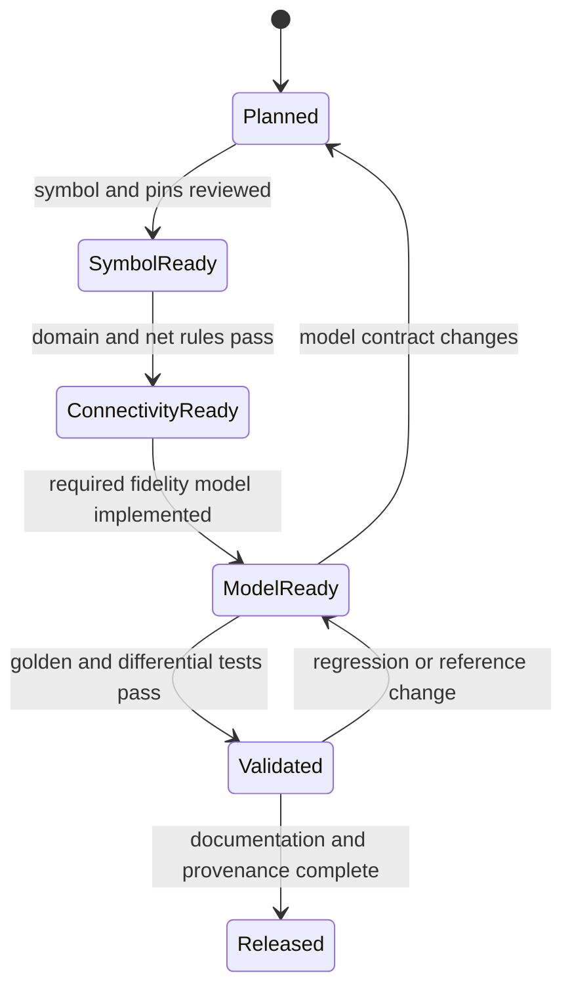

# Test and Validation Strategy

## Purpose

This document defines the evidence required before any component, solver, interface, or release can be called correct. It turns the feasibility brief into a repeatable validation program rather than relying on visually plausible waveforms. The source brief explicitly identifies model accuracy, nonlinear convergence, browser memory, UI performance, and mixed-simulator synchronization as primary risks (PDF pp. 39-40).

## Quality principles

1. A symbol is not a simulation model.
2. A converged answer is not automatically a correct answer.
3. Every result must identify its engine, engine version, model version, fidelity level, settings, seed, and limitations.
4. Every released component must have a golden circuit, expected results, tolerance, and failure cases.
5. Local and cloud execution must use the same normative request and result contracts.
6. Randomized analyses must be reproducible from a stored seed.
7. Accuracy claims apply only inside a documented operating envelope.

## Evidence layers

| Layer | Purpose | Required evidence |
|---|---|---|
| Documentation conformance | Ensure the specification is complete | Links, schema examples, requirement/task/test traceability, registry counts |
| Unit and property testing | Verify equations and invariants | Analytical values, dimensional consistency, conservation checks, truth tables |
| Golden-circuit testing | Verify models in known topologies | Expected voltages, currents, timing, power, and temperature |
| Differential testing | Compare independent engines | Rust/WASM versus ngspice or another declared reference |
| Import conformance | Verify external formats | Valid, invalid, edge, and round-trip fixtures |
| Integration testing | Verify editor-to-engine behavior | Schematic -> netlist -> engine -> stream -> visualization |
| System testing | Verify complete workflows | Local, offline, cloud, collaboration, cancellation, and recovery |
| Performance testing | Enforce budgets | Latency, throughput, memory, frame rate, and main-thread responsiveness |
| Security testing | Contain untrusted content | Sandbox, quotas, parser abuse, authorization, and tenant isolation |
| Accessibility testing | Make the laboratory operable without pointer/color dependence | Keyboard, focus, screen-reader, contrast, and nonvisual waveform summaries |

## Component release workflow

Every family and variant follows this state machine:

`Released` requires all fields in the component registry, coverage matrix, family specification, task cards, and validation records. Deferred research families remain visible but cannot be marked released.

## Model validation matrix

| Fidelity | Minimum validation |
|---|---|
| F0 Connectivity | Pin count/order, legal domains, net merging, disconnected and incompatible-domain diagnostics |
| F1 Ideal/equation | Analytical result, dimensional check, limiting cases, zero/extreme parameter behavior |
| F2 Behavioral/timing | Truth table or transfer function, delay and state transition tests, X/Z/contention behavior where digital |
| F3 Compact/macro | DC sweep, transient, AC where applicable, reference-engine comparison, convergence envelope |
| F4 Electrothermal/failure | Power balance, temperature transient, limit crossing, derating, each documented failure state |
| F5 Physical/research | Published or independently reproduced reference dataset and explicit research-only limitations |

## Mandatory failure suites

The regression corpus must include:

- Missing reference ground, floating input, isolated subcircuit, ideal voltage-source loop, ideal current-source cut set, shorted source, singular matrix, and inconsistent initial conditions.
- Non-convergence, iteration limit, timestep underflow, rejected step loop, NaN, infinity, numeric overflow, and waveform storage exhaustion.
- Digital X and Z propagation, multiple drivers, contention, fan-out overload, glitches, setup/hold violations, metastability indication, and clock-domain boundary errors.
- Analog-to-digital threshold ambiguity, hysteresis, supply collapse, output-current limit, loading, and scheduler events occurring at the same timestamp.
- Over-power, over-voltage, over-current, breakdown, thermal runaway, open, short, degraded, leakage-increase, and intermittent failures.
- Malformed archives, unsupported schema versions, failed migrations, missing model assets, storage quota exhaustion, and corrupted checkpoints.
- Worker timeout, cancellation, retry, worker crash, duplicate event delivery, out-of-order stream chunk, expired authorization, and cross-tenant access attempts.

## Test artifact requirements

Each test case records:

- Stable `TEST-*` ID and linked requirement/task/component IDs.
- Circuit or system fixture and `.eesim` schema version.
- Engine, model, and reference versions.
- Analysis settings, probes, tolerances, initial conditions, environment, and seed.
- Expected scalar values, waveform features, event ordering, thermal/failure outcomes, and permitted error.
- Human-readable reason for the tolerance and the source of reference data.
- Result status, execution date, environment fingerprint, and regression owner.

## Review gates

- Numerical-model changes require electronics/numerical review and regenerated golden evidence.
- Public contract changes require schema compatibility review and migration documentation.
- Third-party model updates require provenance and license review.
- Security-boundary changes require threat-model and sandbox review.
- Release candidates require the checklist in [Release Acceptance Checklists](./RELEASE_ACCEPTANCE_CHECKLISTS.md).

## Source basis

- Circuit equation and non-ideal model discussion: PDF pp. 3-11.
- Hybrid fidelity and abstraction switching: PDF pp. 13-28.
- Performance and validation risks: PDF pp. 29-30 and 39-40.
- Staged demonstrations and roadmap: PDF pp. 32-37.

